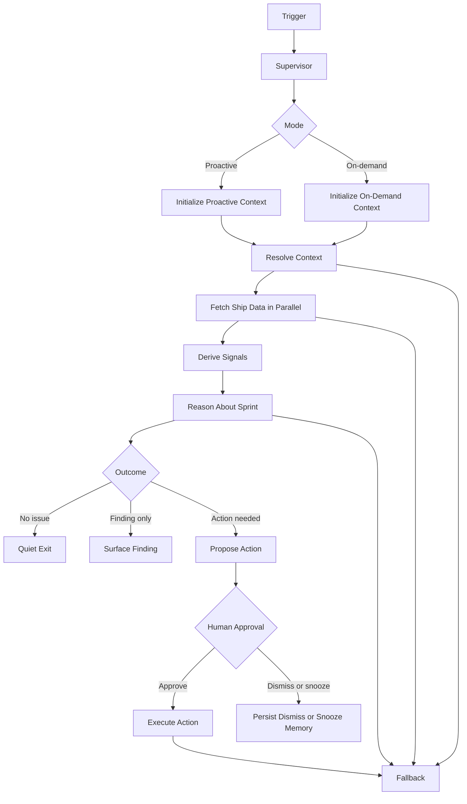

# FLEETGRAPH

Working design and implementation document for FleetGraph.

This file is the source of truth for:

- what FleetGraph is responsible for
- what the MVP will implement first
- how the graph is structured
- how proactive and on-demand mode share the same graph

Fast current-state summary:

- [FLEETGRAPH-STATUS.md](/Users/stefanocaruso/Desktop/Gauntlet/ShipShape/FLEETGRAPH-STATUS.md)

## Current MVP Scope

The MVP is intentionally narrow.

- **Proactive MVP use case**: sprint is drifting before anyone asks
- **On-demand MVP question**: why is this sprint at risk?
- **First human-in-the-loop boundary**: FleetGraph may draft an escalation or follow-up recommendation, but it must pause before notifying or persisting that action

Current MVP implementation of that boundary:

- FleetGraph prepares a draft sprint comment
- the human can approve, dismiss, or snooze
- only approval allows the comment mutation to execute

This is the smallest slice that still proves:

- two modes
- one shared graph
- real reasoning
- conditional edges
- HITL
- real Ship data

## Agent Responsibility

FleetGraph is responsible for:

- monitoring execution drift in Ship
- identifying conditions worth surfacing
- explaining why a scope matters now
- identifying the right human to act
- making the next action obvious in context

For MVP, FleetGraph focuses on:

- sprint drift
- stale or blocked sprint work
- low recent activity in active work
- approval or review bottlenecks that increase sprint risk

FleetGraph is not responsible for:

- acting as a standalone chatbot
- replacing Ship dashboards
- mutating project state without review
- becoming a second source of truth outside Ship

### Responsibility Answers

| Question | Answer |
|---|---|
| What does this agent monitor proactively? | Active sprint drift. In MVP that means low or missing recent activity, stale or blocked work, missing standups, no completed work, work not started, missing review, and approval or review friction that puts sprint delivery at risk. |
| What does it reason about when invoked on demand? | Why the sprint in the current view is at risk right now, which signals matter most, who should act next, and whether FleetGraph should prepare a follow-up or escalation draft. |
| What can it do autonomously? | Resolve scope from the current view, fetch Ship REST data, derive and rank findings, explain likely causes, surface in-app findings, prepare a bounded draft action, and manage dedupe, snooze, and cooldown memory. |
| What must it always ask a human about before acting? | Any consequential action: posting a persistent comment, notifying people beyond the directly responsible chain, changing issue or sprint state, or creating follow-up work. |
| Who does it notify, and under what conditions? | Responsible owner first when a real sprint-risk finding is worth surfacing. Accountable person next if the risk is severe or unresolved. Manager or director only if the chain has stalled or the impact is cross-project. Informed roles only for high-signal summaries. |
| How does it know who is on a project and what their role is? | From Ship REST data and the authenticated actor context. The graph uses sprint, project, program, and people context such as owner, assignee, accountable, and workspace role fields returned by Ship APIs. |
| How does the on-demand mode use context from the current view? | The UI sends typed Active View Context: current route, surface, entity id, entity type, tab, and project scope. The graph uses that as the starting point, resolves it to the current sprint when needed, then reasons over fetched Ship evidence for that scope. |

## How the Two Modes Work

FleetGraph operates in two modes through the **same graph architecture**.

### Proactive

The graph runs:

- after high-signal Ship events
- on a 5-minute scheduled backstop for time-based drift

It decides whether to:

- stay quiet
- surface an insight
- prepare an action proposal

### On-Demand

The graph runs when a user invokes it from the current Ship view.

The on-demand mode uses **Active View Context**, which means the graph receives the current Ship page or tab as structured context, such as:

- issue
- week / sprint
- project
- program
- person / My Week

That Active View Context becomes the starting point for graph reasoning.

Current MVP implementation:

- embedded FleetGraph panel on week document tabs
- fixed on-demand question:
  - why is this sprint at risk?

## Who FleetGraph Notifies

FleetGraph should notify in this order:

1. responsible person first
2. accountable person if risk crosses a threshold or sits unresolved
3. manager or director only when the accountable chain has stalled or the impact is cross-project
4. informed roles only for high-signal summaries

## Autonomy vs Human Approval

FleetGraph can autonomously:

- detect and rank findings
- expand scope from the current context
- fetch Ship data
- explain the likely cause of risk
- surface in-app findings
- prepare a draft action for review
- manage dedupe, snooze, and cooldown memory

FleetGraph must always ask for human approval before:

- changing issue state, sprint, assignee, or priority
- creating persistent comments or follow-up work
- notifying people beyond the directly responsible chain
- approving or requesting changes on formal review workflows

## Skills, Tools, and Actions

FleetGraph uses three layers:

1. graph state and rules
2. a bounded action catalog
3. runtime-owned executors

The model should never see raw backend freedom.

Current bounded action catalog:

- `draft_follow_up_comment`
- `draft_escalation_comment`

Current design rules:

- reasoning skills help the model interpret sprint evidence
- action definitions stay typed and schema-first
- runtime executors own real mutations
- consequential actions stay behind HITL

Current references:

- [fleetgraph-skills-and-tools.md](/Users/stefanocaruso/Desktop/Gauntlet/ShipShape/artifacts-documentation/fleetgraph-skills-and-tools.md)
- [catalog.ts](/Users/stefanocaruso/Desktop/Gauntlet/ShipShape/fleetgraph/src/actions/catalog.ts)
- [.agents/skills/fleetgraph-reasoning/SKILL.md](/Users/stefanocaruso/Desktop/Gauntlet/ShipShape/.agents/skills/fleetgraph-reasoning/SKILL.md)
- [.agents/skills/fleetgraph-action-catalog/SKILL.md](/Users/stefanocaruso/Desktop/Gauntlet/ShipShape/.agents/skills/fleetgraph-action-catalog/SKILL.md)

## Trigger Model

FleetGraph uses a **hybrid trigger model**.

### Why hybrid

Some problems appear because of a fresh mutation in Ship. Others appear because time passed and nobody acted.

That means:

- **event-driven triggers** are best for fresh mutations
- **scheduled sweeps** are best for time-based drift and silence failures

### Trigger decision

- event-triggered for high-signal Ship mutations
- scheduled sweep every 5 minutes for time-based drift
- current MVP implementation uses:
  - an env-gated proactive worker in the API process
  - a manual `/api/fleetgraph/proactive/run` sweep route for objective verification
  - the same graph and deterministic signal path used by on-demand mode

### Tradeoffs

**Event-only**
- fast and cheaper for explicit changes
- misses problems caused by silence

**Poll-only**
- catches silent drift
- noisier and more expensive

**Hybrid**
- catches both mutation-based and time-based problems
- slightly more operational complexity
- most defensible choice for this project

### Current trigger vs future trigger

**Current trigger**

- manual sweep route:
  - `POST /api/fleetgraph/proactive/run`
- env-gated timed sweep worker:
  - `FLEETGRAPH_ENABLE_PROACTIVE_WORKER=true`

**Future trigger**

- high-signal Ship mutation trigger
- webhook or pub/sub style delivery
- direct event-to-graph invocation for important changes

## Runtime Guardrails and Telemetry

FleetGraph now tracks runtime durability explicitly in graph state.

Current hardening fields include:

- attempt counters for reasoning, resume, and action execution
- transition budget and retry budget
- run start time, last-node time, and deadline time
- last-node and compact node history
- reasoning source:
  - `deterministic`
  - `model`
- suppression reason:
  - `approved_before`
  - `dismissed_before`
  - `snoozed`
- terminal outcomes:
  - `quiet`
  - `finding_only`
  - `waiting_on_human`
  - `action_executed`
  - `suppressed`
  - `failed_retryable`
  - `failed_terminal`

Current guardrail behavior:

- hard stop if transition count exceeds budget
- hard stop if resume count exceeds budget
- deterministic fallback when reasoning retries exceed budget
- retry classification only for retryable failures
- deadline-based timeout classification

Current telemetry model:

- one top-level Braintrust span per FleetGraph invoke or resume
- child spans for:
  - fetch
  - signal derivation
  - reasoning
  - HITL pause / resume
  - action execution
- per-node latency tracked in compact node history

Current telemetry references:

- [fleetgraph-telemetry.ts](/Users/stefanocaruso/Desktop/Gauntlet/ShipShape/api/src/services/fleetgraph-telemetry.ts)
- [node-runtime.ts](/Users/stefanocaruso/Desktop/Gauntlet/ShipShape/fleetgraph/src/node-runtime.ts)
- [outcomes.ts](/Users/stefanocaruso/Desktop/Gauntlet/ShipShape/fleetgraph/src/outcomes.ts)

## Use Cases

The MVP use cases below are intentionally limited to the paths that are implemented and evidenced today.

| Use Case | Role | Mode | Trigger | What FleetGraph detects or produces | What the human decides |
|---|---|---|---|---|---|
| Stable sprint check from the current sprint tab | PM or engineer | On-demand | User opens an active sprint and invokes FleetGraph | Context-aware stable answer with no proposed action | Whether to keep the current plan |
| Explain why an active sprint is at risk | PM | On-demand | User opens a sprint / week with missing ritual evidence and invokes FleetGraph | Grounded explanation of the current risk and likely next step | Which action to take now |
| Propose a follow-up and pause for approval | PM | On-demand | User invokes FleetGraph on a risky sprint where a same-day owner follow-up is warranted | Draft follow-up comment plus HITL approval gate | Whether to approve, dismiss, or snooze |
| Remember a human dismissal and stop repeating the same draft | PM | On-demand | User dismisses the proposed draft and later re-checks the same sprint pattern | Suppressed duplicate action proposal with recorded decision memory | Whether to revisit the issue later |
| Surface sprint drift without being asked | PM | Proactive | Scheduled or manual sweep sees an active sprint with missing standup and warning-level drift | Stored finding and push-style notification candidate for the sprint owner | Whether to follow up, defer, or ignore |

## Graph Diagram



Useful flow diagrams:

- [fleetgraph-shared-graph-end-to-end-flow.mmd](/Users/stefanocaruso/Desktop/Gauntlet/ShipShape/artifacts-diagrams/fleetgraph-shared-graph-end-to-end-flow.mmd)
- [fleetgraph-on-demand-active-view-flow.mmd](/Users/stefanocaruso/Desktop/Gauntlet/ShipShape/artifacts-diagrams/fleetgraph-on-demand-active-view-flow.mmd)
- [fleetgraph-proactive-trigger-delivery-flow.mmd](/Users/stefanocaruso/Desktop/Gauntlet/ShipShape/artifacts-diagrams/fleetgraph-proactive-trigger-delivery-flow.mmd)
- [fleetgraph-hitl-interrupt-resume-flow.mmd](/Users/stefanocaruso/Desktop/Gauntlet/ShipShape/artifacts-diagrams/fleetgraph-hitl-interrupt-resume-flow.mmd)

## Graph Outline

### Node Types

| Node Type | MVP role |
|---|---|
| Context nodes | establish mode, actor, workspace, current entity, and Active View Context |
| Fetch nodes | pull sprint, issue, activity, accountability, and people data from Ship |
| Reasoning nodes | analyze relationships, gaps, risk, and relevance |
| Conditional edges | separate quiet runs from problem-detected runs and action-proposal runs |
| Action nodes | prepare a draft escalation or follow-up recommendation |
| Human-in-the-loop gate | pause before any consequential action |
| Error / fallback nodes | handle missing context, API failure, and invalid run state |

### MVP graph nodes

| Node | Purpose |
|---|---|
| `supervisorEntry` | choose proactive vs on-demand entry path |
| `initializeProactiveContext` | initialize service-driven run context |
| `initializeOnDemandContext` | validate Active View Context from the UI |
| `resolveContext` | expand the current scope |
| `fetchEntityContext` | load the current sprint or issue context |
| `fetchActivitySignals` | load recent activity |
| `fetchAccountabilitySignals` | load review and accountability state |
| `fetchPeopleRoles` | load owner / accountable relationships |
| `deriveSignals` | compute deterministic sprint-risk signals |
| `reasonAboutState` | explain why the sprint is at risk |
| `prepareAction` | draft escalation or follow-up recommendation |
| `humanGate` | wait for approval before acting |
| `executeAction` | execute the approved action |
| `fallback` | fail safely |

### Branching conditions

The graph must produce visibly different execution paths.

At minimum, MVP branching should support:

- no risk found -> quiet exit
- risk found but no action needed -> insight only
- risk found and action is warranted -> action proposal -> HITL
- missing context or failed fetch -> fallback

## Architecture Decisions

### 1. Use LangGraph in TypeScript

FleetGraph should stay inside Ship’s existing TypeScript monorepo so it can reuse:

- shared contracts
- existing API patterns
- existing UI integration patterns

### 2. Use one shared graph

Proactive and on-demand mode should use the same graph. Only the trigger changes.

### 3. Use supervisor-style orchestration

FleetGraph uses a LangGraph-native supervisor model to control:

- routing
- intervention
- pause / resume
- failure classification
- checkpoint-aware continuation

### 4. Use deterministic signals before LLM reasoning

The LLM should analyze suspicious scopes, not act as the first filter for every run.

### 5. Keep context tied to the current Ship surface

On-demand mode must use **Active View Context**, not a generic chat prompt with no page awareness.

### 6. Use app-native page awareness, not browser vision

FleetGraph should know where the user is from the Ship app itself.

Primary runtime technique:

- route path
- current entity id
- current entity type
- current tab
- current workspace
- current user role

Implementation pattern:

- use typed **Active View Context** from the UI
- add route-to-context adapters per surface:
  - document
  - My Week
  - dashboard
  - issue
  - project
  - program
  - person
- expand that context with Ship REST fetches after the graph receives it

Do not use these as the primary runtime mechanism:

- Playwright or browser vision
- code/spec scanning
- direct database reads for current page state

Those are useful for testing, validation, or data expansion, but not for determining what page or tab the user is on right now.

### 7. Use Ship REST APIs only

Ship remains the source of truth. FleetGraph should not read the database directly.

## Test Cases

The table below maps each MVP use case to the exact test state, expected output, and trace evidence.

| Use case | Ship state that triggers the agent | Expected detection or output | LangSmith trace |
|---|---|---|---|
| Stable sprint check from the current sprint tab | Active sprint `Week 14` on the current sprint tab, recent activity visible, `3/9` issues complete, `3` in progress, and no warning signals derived | Quiet on-demand path with a stable explanation and no proposed action | [Quiet shared trace](https://smith.langchain.com/public/8c5e90a5-3299-47ab-90d5-c7a16583ea13/r) |
| Explain why an active sprint is at risk | Active sprint `Week 14` with no standups logged for the sprint and warning-level derived signals | Grounded risk explanation from the current sprint view with the missing-standup signal called out | [Flagged shared trace](https://smith.langchain.com/public/9f059196-346f-492d-8672-27d4400cf48b/r) |
| Propose a follow-up and pause for approval | Same missing-standup sprint state, but action memory allows a new draft follow-up to be proposed | `waiting_on_human` outcome with a draft follow-up comment and approve / dismiss / snooze options | [HITL run](https://smith.langchain.com/o/091fa5fb-a5d2-47b3-8af0-488a46a7424b/projects/p/b09fa7c9-c536-481f-b9c9-1b95ef04b40e/r/019cfee2-b2ed-74eb-a463-70482d76af12?poll=true) and [local evidence](/Users/stefanocaruso/Desktop/Gauntlet/ShipShape/audit-results/fleetgraph-evidence/hitl-run.json) |
| Remember a human dismissal and stop repeating the same draft | Same risky sprint after the human dismisses the draft follow-up and the graph is resumed on the saved thread | Completed run with `action_dismissed`, stored memory, and no executed mutation | [Resume run](https://smith.langchain.com/o/091fa5fb-a5d2-47b3-8af0-488a46a7424b/projects/p/b09fa7c9-c536-481f-b9c9-1b95ef04b40e/r/019cfee2-d1ce-706e-9dbb-e313189af39a?poll=true) and [local evidence](/Users/stefanocaruso/Desktop/Gauntlet/ShipShape/audit-results/fleetgraph-evidence/resume-run.json) |
| Surface sprint drift without being asked | Manual or scheduled proactive sweep processes the same warning-level sprint state with no standups logged | Proactive sweep stores a warning finding for the sprint and targets it for push delivery | [Flagged shared trace for the same sprint-risk state](https://smith.langchain.com/public/9f059196-346f-492d-8672-27d4400cf48b/r) and [proactive evidence](/Users/stefanocaruso/Desktop/Gauntlet/ShipShape/audit-results/fleetgraph-evidence/proactive-run.json) |

Notes:

- The proactive row intentionally reuses the flagged sprint trace because proactive and on-demand mode run through the same graph; the difference is the trigger, not the graph state being analyzed.
- The HITL and resume rows use exact LangSmith run URLs reconstructed from the captured run IDs in the local evidence bundle because only the quiet and flagged runs were persisted with public share URLs.

## Observability

LangSmith tracing is required from day one.

Environment:

```bash
LANGCHAIN_TRACING_V2=true
LANGCHAIN_API_KEY=your_key
```

The MVP must produce at least two shared trace links showing:

- a clean / quiet path
- a problem-detected path

Current evidence harness:

- [collect-fleetgraph-evidence.ts](/Users/stefanocaruso/Desktop/Gauntlet/ShipShape/scripts/collect-fleetgraph-evidence.ts)
- [summary.md](/Users/stefanocaruso/Desktop/Gauntlet/ShipShape/audit-results/fleetgraph-evidence/summary.md)
- [verify-fleetgraph-requirements.ts](/Users/stefanocaruso/Desktop/Gauntlet/ShipShape/scripts/verify-fleetgraph-requirements.ts)
- [summary.md](/Users/stefanocaruso/Desktop/Gauntlet/ShipShape/audit-results/fleetgraph-requirements/summary.md)

Current evidence status:

- two shared LangSmith traces are already captured
- HITL and resume evidence are captured locally and tied to exact LangSmith run IDs
- public FleetGraph routes are verified as mounted in the deployed environment

## Cost Analysis

This section will be completed in the final submission.

It will include:

- cost per graph run
- estimated runs per day
- development and testing spend
- monthly projections for 100, 1,000, and 10,000 users

## Current status

- `PRESEARCH.md` completed
- `FLEETGRAPH.md` completed for MVP scope, graph outline, and test-case documentation
- shared LangSmith traces captured for quiet and flagged paths
- deployed FleetGraph routes verified as mounted
