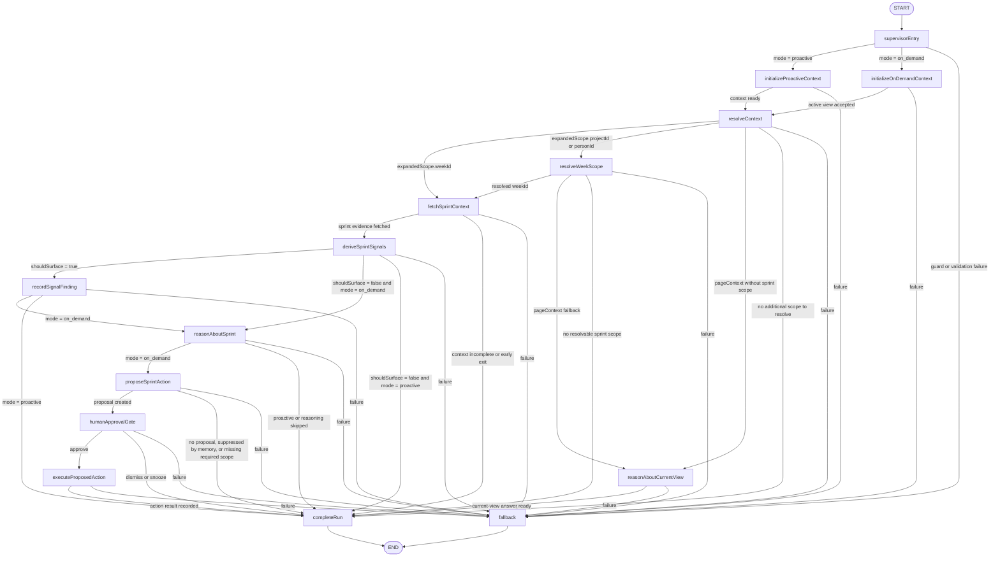

# FLEETGRAPH

Working design and implementation document for FleetGraph.

This file is the source of truth for:

- what FleetGraph is responsible for
- what the MVP will implement first
- how the graph is structured
- how proactive and on-demand mode share the same graph

Fast current-state summary:

- [FLEETGRAPH-STATUS.md](/Users/stefanocaruso/Desktop/Gauntlet/ShipShape/FLEETGRAPH-STATUS.md)

## Current MVP Scope

The MVP is intentionally narrow.

- **Proactive MVP use case**: sprint is drifting before anyone asks
- **On-demand MVP question**: why is this sprint at risk?
- **First human-in-the-loop boundary**: FleetGraph may draft an escalation or follow-up recommendation, but it must pause before notifying or persisting that action

Current MVP implementation of that boundary:

- FleetGraph prepares a draft sprint comment
- the human can approve, dismiss, or snooze
- only approval allows the comment mutation to execute

This is the smallest slice that still proves:

- two modes
- one shared graph
- real reasoning
- conditional edges
- HITL
- real Ship data

## Agent Responsibility

FleetGraph is responsible for:

- monitoring execution drift in Ship
- identifying conditions worth surfacing
- explaining why a scope matters now
- identifying the right human to act
- making the next action obvious in context

For MVP, FleetGraph focuses on:

- sprint drift
- stale or blocked sprint work
- low recent activity in active work
- approval or review bottlenecks that increase sprint risk

FleetGraph is not responsible for:

- acting as a standalone chatbot
- replacing Ship dashboards
- mutating project state without review
- becoming a second source of truth outside Ship

### Responsibility Answers

| Question | Answer |
|---|---|
| What does this agent monitor proactively? | Active sprint drift. In MVP that means low or missing recent activity, stale or blocked work, missing standups, no completed work, work not started, missing review, and approval or review friction that puts sprint delivery at risk. |
| What does it reason about when invoked on demand? | Why the sprint in the current view is at risk right now, which signals matter most, who should act next, and whether FleetGraph should prepare a follow-up or escalation draft. |
| What can it do autonomously? | Resolve scope from the current view, fetch Ship REST data, derive and rank findings, explain likely causes, surface in-app findings, prepare a bounded draft action, and manage dedupe, snooze, and cooldown memory. |
| What must it always ask a human about before acting? | Any consequential action: posting a persistent comment, notifying people beyond the directly responsible chain, changing issue or sprint state, or creating follow-up work. |
| Who does it notify, and under what conditions? | Responsible owner first when a real sprint-risk finding is worth surfacing. Accountable person next if the risk is severe or unresolved. Manager or director only if the chain has stalled or the impact is cross-project. Informed roles only for high-signal summaries. |
| How does it know who is on a project and what their role is? | From Ship REST data and the authenticated actor context. The graph uses sprint, project, program, and people context such as owner, assignee, accountable, and workspace role fields returned by Ship APIs. |
| How does the on-demand mode use context from the current view? | The UI sends typed Active View Context: current route, surface, entity id, entity type, tab, and project scope. The graph uses that as the starting point, resolves it to the current sprint when needed, then reasons over fetched Ship evidence for that scope. |

## How the Two Modes Work

FleetGraph operates in two modes through the **same graph architecture**.

### Proactive

The graph runs:

- after high-signal Ship events
- on a 5-minute scheduled backstop for time-based drift

It decides whether to:

- stay quiet
- surface an insight
- prepare an action proposal

### On-Demand

The graph runs when a user invokes it from the current Ship view.

The on-demand mode uses **Active View Context**, which means the graph receives the current Ship page or tab as structured context, such as:

- issue
- week / sprint
- project
- program
- person / My Week

That Active View Context becomes the starting point for graph reasoning.

Current MVP implementation:

- embedded FleetGraph panel on week document tabs
- fixed on-demand question:
  - why is this sprint at risk?

## Who FleetGraph Notifies

FleetGraph should notify in this order:

1. responsible person first
2. accountable person if risk crosses a threshold or sits unresolved
3. manager or director only when the accountable chain has stalled or the impact is cross-project
4. informed roles only for high-signal summaries

## Autonomy vs Human Approval

FleetGraph can autonomously:

- detect and rank findings
- expand scope from the current context
- fetch Ship data
- explain the likely cause of risk
- surface in-app findings
- prepare a draft action for review
- manage dedupe, snooze, and cooldown memory

FleetGraph must always ask for human approval before:

- changing issue state, sprint, assignee, or priority
- creating persistent comments or follow-up work
- notifying people beyond the directly responsible chain
- approving or requesting changes on formal review workflows

## Skills, Tools, and Actions

FleetGraph uses three layers:

1. graph state and rules
2. a bounded action catalog
3. runtime-owned executors

The model should never see raw backend freedom.

Current bounded action catalog:

- `draft_follow_up_comment`
- `draft_escalation_comment`

Current design rules:

- reasoning skills help the model interpret sprint evidence
- action definitions stay typed and schema-first
- runtime executors own real mutations
- consequential actions stay behind HITL

Current references:

- [fleetgraph-skills-and-tools.md](/Users/stefanocaruso/Desktop/Gauntlet/ShipShape/artifacts-documentation/fleetgraph-skills-and-tools.md)
- [catalog.ts](/Users/stefanocaruso/Desktop/Gauntlet/ShipShape/fleetgraph/src/actions/catalog.ts)
- [.agents/skills/fleetgraph-reasoning/SKILL.md](/Users/stefanocaruso/Desktop/Gauntlet/ShipShape/.agents/skills/fleetgraph-reasoning/SKILL.md)
- [.agents/skills/fleetgraph-action-catalog/SKILL.md](/Users/stefanocaruso/Desktop/Gauntlet/ShipShape/.agents/skills/fleetgraph-action-catalog/SKILL.md)

## Trigger Model

FleetGraph uses a **hybrid trigger model**.

### Why hybrid

Some problems appear because of a fresh mutation in Ship. Others appear because time passed and nobody acted.

That means:

- **event-driven triggers** are best for fresh mutations
- **scheduled sweeps** are best for time-based drift and silence failures

### Trigger decision

- event-triggered for high-signal Ship mutations
- scheduled sweep every 5 minutes for time-based drift
- current MVP implementation uses:
  - an env-gated proactive worker in the API process
  - a manual `/api/fleetgraph/proactive/run` sweep route for objective verification
  - the same graph and deterministic signal path used by on-demand mode

### Tradeoffs

**Event-only**
- fast and cheaper for explicit changes
- misses problems caused by silence

**Poll-only**
- catches silent drift
- noisier and more expensive

**Hybrid**
- catches both mutation-based and time-based problems
- slightly more operational complexity
- most defensible choice for this project

### Current trigger vs future trigger

**Current trigger**

- manual sweep route:
  - `POST /api/fleetgraph/proactive/run`
- env-gated timed sweep worker:
  - `FLEETGRAPH_ENABLE_PROACTIVE_WORKER=true`

**Future trigger**

- high-signal Ship mutation trigger
- webhook or pub/sub style delivery
- direct event-to-graph invocation for important changes

## Runtime Guardrails and Telemetry

FleetGraph now tracks runtime durability explicitly in graph state.

Current hardening fields include:

- attempt counters for reasoning, resume, and action execution
- transition budget and retry budget
- run start time, last-node time, and deadline time
- last-node and compact node history
- reasoning source:
  - `deterministic`
  - `model`
- suppression reason:
  - `approved_before`
  - `dismissed_before`
  - `snoozed`
- terminal outcomes:
  - `quiet`
  - `finding_only`
  - `waiting_on_human`
  - `action_executed`
  - `suppressed`
  - `failed_retryable`
  - `failed_terminal`

Current guardrail behavior:

- hard stop if transition count exceeds budget
- hard stop if resume count exceeds budget
- deterministic fallback when reasoning retries exceed budget
- retry classification only for retryable failures
- deadline-based timeout classification

Current telemetry model:

- one top-level Braintrust span per FleetGraph invoke or resume
- child spans for:
  - fetch
  - signal derivation
  - reasoning
  - HITL pause / resume
  - action execution
- per-node latency tracked in compact node history

Current telemetry references:

- [fleetgraph-telemetry.ts](/Users/stefanocaruso/Desktop/Gauntlet/ShipShape/api/src/services/fleetgraph-telemetry.ts)
- [node-runtime.ts](/Users/stefanocaruso/Desktop/Gauntlet/ShipShape/fleetgraph/src/node-runtime.ts)
- [outcomes.ts](/Users/stefanocaruso/Desktop/Gauntlet/ShipShape/fleetgraph/src/outcomes.ts)

## Use Cases

The MVP use cases below are intentionally limited to the paths that are implemented and evidenced today.

| Use Case | Role | Mode | Trigger | What FleetGraph detects or produces | What the human decides |
|---|---|---|---|---|---|
| Stable sprint check from the current sprint tab | PM or engineer | On-demand | User opens an active sprint and invokes FleetGraph | Context-aware stable answer with no proposed action | Whether to keep the current plan |
| Explain why an active sprint is at risk | PM | On-demand | User opens a sprint / week with missing ritual evidence and invokes FleetGraph | Grounded explanation of the current risk and likely next step | Which action to take now |
| Propose a follow-up and pause for approval | PM | On-demand | User invokes FleetGraph on a risky sprint where a same-day owner follow-up is warranted | Draft follow-up comment plus HITL approval gate | Whether to approve, dismiss, or snooze |
| Remember a human dismissal and stop repeating the same draft | PM | On-demand | User dismisses the proposed draft and later re-checks the same sprint pattern | Suppressed duplicate action proposal with recorded decision memory | Whether to revisit the issue later |
| Surface sprint drift without being asked | PM | Proactive | Scheduled or manual sweep sees an active sprint with missing standup and warning-level drift | Stored finding and push-style notification candidate for the sprint owner | Whether to follow up, defer, or ignore |

## Graph Diagram

The diagram below matches the current compiled graph in [graph.ts](/Users/stefanocaruso/Desktop/Gauntlet/ShipShape/fleetgraph/src/graph.ts).



Useful flow diagrams:

- [fleetgraph-shared-graph-end-to-end-flow.mmd](/Users/stefanocaruso/Desktop/Gauntlet/ShipShape/artifacts-diagrams/fleetgraph-shared-graph-end-to-end-flow.mmd)
- [fleetgraph-on-demand-active-view-flow.mmd](/Users/stefanocaruso/Desktop/Gauntlet/ShipShape/artifacts-diagrams/fleetgraph-on-demand-active-view-flow.mmd)
- [fleetgraph-proactive-trigger-delivery-flow.mmd](/Users/stefanocaruso/Desktop/Gauntlet/ShipShape/artifacts-diagrams/fleetgraph-proactive-trigger-delivery-flow.mmd)
- [fleetgraph-hitl-interrupt-resume-flow.mmd](/Users/stefanocaruso/Desktop/Gauntlet/ShipShape/artifacts-diagrams/fleetgraph-hitl-interrupt-resume-flow.mmd)

## Graph Outline

### Exact node inventory

| Node | Phase | Current purpose | Possible next nodes |
|---|---|---|---|
| `supervisorEntry` | control | Choose the proactive or on-demand entry path | `initializeProactiveContext`, `initializeOnDemandContext`, `fallback` |
| `initializeProactiveContext` | context | Normalize a service-driven proactive run before shared graph work begins | `resolveContext`, `fallback` |
| `initializeOnDemandContext` | context | Validate typed Active View Context and page context from the UI | `resolveContext`, `fallback` |
| `resolveContext` | context | Expand `contextEntity` into `expandedScope` and choose sprint fetch, week lookup, current-view reasoning, or early completion | `fetchSprintContext`, `resolveWeekScope`, `reasonAboutCurrentView`, `completeRun`, `fallback` |
| `resolveWeekScope` | context | Resolve project or My Week scope into the current sprint when possible | `fetchSprintContext`, `reasonAboutCurrentView`, `completeRun`, `fallback` |
| `fetchSprintContext` | fetch | Fetch sprint entity, supporting context, activity, accountability, and planning evidence in parallel | `deriveSprintSignals`, `completeRun`, `fallback` |
| `deriveSprintSignals` | signals | Compute deterministic sprint-risk signals and merge injected proactive signals | `recordSignalFinding`, `reasonAboutSprint`, `completeRun`, `fallback` |
| `recordSignalFinding` | signals | Attach a surfaced finding summary before proactive output or on-demand reasoning continues | `reasonAboutSprint`, `completeRun`, `fallback` |
| `reasonAboutCurrentView` | reasoning | Answer directly from current-page context when there is no sprint scope to fetch | `completeRun`, `fallback` |
| `reasonAboutSprint` | reasoning | Build a grounded sprint explanation from fetched Ship evidence and derived signals | `proposeSprintAction`, `completeRun`, `fallback` |
| `proposeSprintAction` | action | Draft a bounded follow-up action and suppress duplicates from stored human decisions | `humanApprovalGate`, `completeRun`, `fallback` |
| `humanApprovalGate` | hitl | Pause for approve / dismiss / snooze and record the human decision on resume | `executeProposedAction`, `completeRun`, `fallback` |
| `executeProposedAction` | action | Execute the approved bounded action and record the outcome | `completeRun`, `fallback` |
| `completeRun` | control | Finalize `status`, `terminalOutcome`, `lastNode`, `nodeHistory`, and trace metadata | `END` |
| `fallback` | control | Exit safely on invalid state, missing data, or runtime failure | `END` |

### Exact branching behavior

- `resolveContext` is the first major branch point:
  - week scope goes to `fetchSprintContext`
  - project or person scope goes to `resolveWeekScope`
  - page-only context goes to `reasonAboutCurrentView`
  - missing scope exits through `completeRun`
- `resolveWeekScope` only fetches sprint evidence when it can resolve a concrete `weekId`; otherwise it falls back to page reasoning or exits cleanly.
- `deriveSprintSignals` creates the first visibly different proactive vs on-demand paths:
  - surfaced signals go to `recordSignalFinding`
  - quiet on-demand runs still go to `reasonAboutSprint`
  - quiet proactive runs end at `completeRun`
- `recordSignalFinding` also splits by mode:
  - on-demand continues to `reasonAboutSprint`
  - proactive exits through `completeRun` because the finding is already enough for downstream delivery
- `proposeSprintAction` only enters HITL when a bounded action exists and is not suppressed by memory.
- `humanApprovalGate` is the explicit pause / resume boundary:
  - approve resumes into `executeProposedAction`
  - dismiss or snooze completes without mutation
- Every node with a guarded failure path can route to `fallback`.

At minimum, MVP branching should support:

- no risk found -> quiet exit
- risk found but no action needed -> insight only
- risk found and action is warranted -> action proposal -> HITL
- missing context or failed fetch -> fallback

## Architecture Decisions

### 1. Use LangGraph in TypeScript

FleetGraph should stay inside Ship’s existing TypeScript monorepo so it can reuse:

- shared contracts
- existing API patterns
- existing UI integration patterns

### 2. Use one shared graph

Proactive and on-demand mode should use the same graph. Only the trigger changes.

### 3. Use supervisor-style orchestration

FleetGraph uses a LangGraph-native supervisor model to control:

- routing
- intervention
- pause / resume
- failure classification
- checkpoint-aware continuation

### 4. Use deterministic signals before LLM reasoning

The LLM should analyze suspicious scopes, not act as the first filter for every run.

### 5. Keep context tied to the current Ship surface

On-demand mode must use **Active View Context**, not a generic chat prompt with no page awareness.

### 6. Use app-native page awareness, not browser vision

FleetGraph should know where the user is from the Ship app itself.

Primary runtime technique:

- route path
- current entity id
- current entity type
- current tab
- current workspace
- current user role

Implementation pattern:

- use typed **Active View Context** from the UI
- add route-to-context adapters per surface:
  - document
  - My Week
  - dashboard
  - issue
  - project
  - program
  - person
- expand that context with Ship REST fetches after the graph receives it

Do not use these as the primary runtime mechanism:

- Playwright or browser vision
- code/spec scanning
- direct database reads for current page state

Those are useful for testing, validation, or data expansion, but not for determining what page or tab the user is on right now.

### 7. Use Ship REST APIs only

Ship remains the source of truth. FleetGraph should not read the database directly.

## Test Cases

The table below maps each MVP use case to the strongest trace proof currently captured in the repo.

| # | Ship State | Expected Output | Trace Link |
|---:|---|---|---|
| 1 | Active sprint `Week 14` on the issues tab, recent activity visible, `3/9` issues complete, `3` in progress, and no warning signals derived | Quiet on-demand explanation with no proposed action | [Quiet shared trace](https://smith.langchain.com/public/8c5e90a5-3299-47ab-90d5-c7a16583ea13/r)<br>[quiet-run.json](/Users/stefanocaruso/Desktop/Gauntlet/ShipShape/audit-results/fleetgraph-evidence/quiet-run.json) |
| 2 | Active sprint `Week 14` with no standups logged and warning-level deterministic signals | Grounded risk explanation from the sprint view with a recorded warning finding | [Flagged shared trace](https://smith.langchain.com/public/9f059196-346f-492d-8672-27d4400cf48b/r)<br>[flagged-run.json](/Users/stefanocaruso/Desktop/Gauntlet/ShipShape/audit-results/fleetgraph-evidence/flagged-run.json) |
| 3 | Same risky sprint state, but action memory allows a fresh follow-up draft to be proposed | `waiting_on_human` outcome with a drafted follow-up comment and approve / dismiss / snooze controls | [HITL LangSmith run](https://smith.langchain.com/o/091fa5fb-a5d2-47b3-8af0-488a46a7424b/projects/p/b09fa7c9-c536-481f-b9c9-1b95ef04b40e/r/019cfee2-b2ed-74eb-a463-70482d76af12?poll=true)<br>[hitl-run.json](/Users/stefanocaruso/Desktop/Gauntlet/ShipShape/audit-results/fleetgraph-evidence/hitl-run.json) |
| 4 | Same risky sprint after the human dismisses the proposed follow-up and the saved thread is resumed | Completed run with `action_dismissed`, stored dismissal memory, and no executed mutation | [Resume LangSmith run](https://smith.langchain.com/o/091fa5fb-a5d2-47b3-8af0-488a46a7424b/projects/p/b09fa7c9-c536-481f-b9c9-1b95ef04b40e/r/019cfee2-d1ce-706e-9dbb-e313189af39a?poll=true)<br>[resume-run.json](/Users/stefanocaruso/Desktop/Gauntlet/ShipShape/audit-results/fleetgraph-evidence/resume-run.json) |
| 5 | Manual or scheduled proactive sweep processes the same warning-level sprint state | Proactive run persists a warning finding for the sprint and prepares downstream delivery data for push-style output | [proactive-run.json](/Users/stefanocaruso/Desktop/Gauntlet/ShipShape/audit-results/fleetgraph-evidence/proactive-run.json)<br>[Flagged shared trace for the same sprint-risk reasoning state](https://smith.langchain.com/public/9f059196-346f-492d-8672-27d4400cf48b/r) |

Notes:

- Rows `1` and `2` use public shared LangSmith traces plus exported run snapshots.
- Rows `3` and `4` use the exact LangSmith run URLs plus exported run snapshots because the current captured bundle did not persist public share URLs for HITL and resume.
- Row `5` intentionally uses two artifacts:
  - [proactive-run.json](/Users/stefanocaruso/Desktop/Gauntlet/ShipShape/audit-results/fleetgraph-evidence/proactive-run.json) proves the proactive trigger and persisted finding output
  - the flagged shared trace proves the exact sprint-risk reasoning path for that same state, because proactive and on-demand converge on the same shared graph after entry routing
- The current evidence bundle is summarized in [summary.md](/Users/stefanocaruso/Desktop/Gauntlet/ShipShape/audit-results/fleetgraph-evidence/summary.md).
- If `LANGCHAIN_TRACING_V2`, `LANGCHAIN_API_KEY`, and `FLEETGRAPH_LANGSMITH_SHARE_TRACES=true` are set during a fresh evidence run, [collect-fleetgraph-evidence.ts](/Users/stefanocaruso/Desktop/Gauntlet/ShipShape/scripts/collect-fleetgraph-evidence.ts) can backfill public share URLs for HITL and resume as well.

### Recent Public LangSmith Traces

The links below were supplied after the original evidence bundle and were verified against the public LangSmith run API. They are additional recent public traces, not replacements for the original five MVP proof rows above.

| Surface | Outcome | Notes | Public Trace |
|---|---|---|---|
| Week document on-demand run | `quiet` | `Week 15` on-demand sprint/week path, `action_not_proposed` | [Recent week trace](https://smith.langchain.com/public/682269f7-324a-4375-a938-7580552f91fb/r) |
| Issue document current-view run | `quiet` | issue-document current-view answer, `current_view_reasoned`, `answerMode=context` | [Recent issue trace](https://smith.langchain.com/public/3ba63dd1-6fa0-491f-b517-6c41fcee282b/r) |
| Team Allocation current-view run | `quiet` | generic current-view answer on the Team Allocation page, `answerMode=context` | [Recent team-allocation trace](https://smith.langchain.com/public/fbd826eb-9407-4560-a6d2-ce7160d9b068/r) |
| Projects current-view run | `quiet` | projects launcher-style answer, `answerMode=launcher` | [Recent projects trace](https://smith.langchain.com/public/4cfb2a90-8bd8-4230-bf37-28ddfdde8843/r) |

Additional note:

- the week trace link above was supplied twice in the most recent update, so it is documented once here as a single unique trace
- all four recent public traces above are on-demand deterministic/current-view or quiet runs, so they do not add billable LLM token or cost totals to the captured evidence bundle

Current verification for this repo state:

- `pnpm --filter @ship/fleetgraph test` passed
- `pnpm --filter @ship/web test -- src/lib/fleetgraph.test.ts src/pages/Dashboard.test.tsx src/components/fleetgraph/FleetGraphOnDemandPanel.test.tsx src/hooks/useFleetGraphPageContext.test.ts` passed
- `pnpm --filter @ship/fleetgraph build`, `pnpm --filter @ship/web build`, and `pnpm --filter @ship/api build` passed
- `pnpm fleetgraph:verify-requirements` passed and refreshed the requirement audit
- A fresh local manual FleetGraph trace capture was not rerun in this workspace because no local Ship API was listening on `http://localhost:3000` and the API test harness had no reachable PostgreSQL on `127.0.0.1:5432`; the trace links above are the captured evidence bundle currently recorded in [summary.md](/Users/stefanocaruso/Desktop/Gauntlet/ShipShape/audit-results/fleetgraph-evidence/summary.md).
- Public deployment verification should be rerun after merge/deploy; see the latest status in [summary.md](/Users/stefanocaruso/Desktop/Gauntlet/ShipShape/audit-results/fleetgraph-requirements/summary.md).

## Observability

LangSmith tracing is required from day one.

Environment:

```bash
LANGCHAIN_TRACING_V2=true
LANGCHAIN_API_KEY=your_key
```

The MVP must produce at least two shared trace links showing:

- a clean / quiet path
- a problem-detected path

Current evidence harness:

- [collect-fleetgraph-evidence.ts](/Users/stefanocaruso/Desktop/Gauntlet/ShipShape/scripts/collect-fleetgraph-evidence.ts)
- [summary.md](/Users/stefanocaruso/Desktop/Gauntlet/ShipShape/audit-results/fleetgraph-evidence/summary.md)
- [verify-fleetgraph-requirements.ts](/Users/stefanocaruso/Desktop/Gauntlet/ShipShape/scripts/verify-fleetgraph-requirements.ts)
- [summary.md](/Users/stefanocaruso/Desktop/Gauntlet/ShipShape/audit-results/fleetgraph-requirements/summary.md)

Current evidence status:

- two shared LangSmith traces are already captured
- HITL and resume evidence are captured locally and tied to exact LangSmith run IDs
- public FleetGraph routes are verified as mounted in the deployed environment

## Cost Analysis

FleetGraph currently has two cost classes:

- deterministic graph runs, which do not call a model and therefore consume `0` tokens and `$0` API spend
- OpenAI-backed sprint reasoning calls, which emit LangSmith `llm` child runs with token and cost metadata

The current exported FleetGraph evidence bundle is entirely deterministic, so the measured FleetGraph totals below are all zero. This is why current-view issue traces in LangSmith can show blank cost and `0` tokens: those runs never invoked the model.

### OpenAI Pricing and Formulas

Current shipped FleetGraph pricing source:

- provider: `OpenAI`
- model: `gpt-4.1-mini`
- input price: `$0.40 / 1M` tokens
- output price: `$1.60 / 1M` tokens

Current cost formula, matching [estimateAiCost()](/Users/stefanocaruso/Desktop/Gauntlet/ShipShape/api/src/services/ai-telemetry.ts):

```text
billable_input_tokens = prompt_tokens + prompt_cached_tokens + prompt_cache_creation_tokens
billable_output_tokens = completion_tokens
total_tokens = billable_input_tokens + billable_output_tokens
estimated_cost_usd =
  (billable_input_tokens / 1_000_000 * 0.40) +
  (billable_output_tokens / 1_000_000 * 1.60)
```

Current LangSmith child-run payload for model-backed sprint reasoning:

- `usage_metadata.input_tokens`
- `usage_metadata.output_tokens`
- `usage_metadata.total_tokens`
- `usage_metadata.input_token_details.cache_read`
- `usage_metadata.output_token_details.reasoning`
- `usage_metadata.total_cost`

Sanity-check example from the shipped LangSmith test:

- input tokens: `100`
- output tokens: `20`
- total tokens: `120`
- estimated cost: `(100 / 1,000,000 * 0.40) + (20 / 1,000,000 * 1.60) = $0.000072`

### Captured FleetGraph Trace Totals

Evidence bundle: [summary.md](/Users/stefanocaruso/Desktop/Gauntlet/ShipShape/audit-results/fleetgraph-evidence/summary.md), generated `2026-03-22T21:20:00.000Z`.

| Trace | Evidence | Reasoning source | Model invocations | Input tokens | Output tokens | Cost |
|---|---|---|---:|---:|---:|---:|
| `quietRun` | [quiet-run.json](/Users/stefanocaruso/Desktop/Gauntlet/ShipShape/audit-results/fleetgraph-evidence/quiet-run.json) | `deterministic` | 0 | 0 | 0 | `$0.000000` |
| `flaggedRun` | [flagged-run.json](/Users/stefanocaruso/Desktop/Gauntlet/ShipShape/audit-results/fleetgraph-evidence/flagged-run.json) | `deterministic` | 0 | 0 | 0 | `$0.000000` |
| `hitlRun` | [hitl-run.json](/Users/stefanocaruso/Desktop/Gauntlet/ShipShape/audit-results/fleetgraph-evidence/hitl-run.json) | `deterministic` | 0 | 0 | 0 | `$0.000000` |
| `resumeRun` | [resume-run.json](/Users/stefanocaruso/Desktop/Gauntlet/ShipShape/audit-results/fleetgraph-evidence/resume-run.json) | `deterministic` | 0 | 0 | 0 | `$0.000000` |
| `proactiveRun` | [proactive-run.json](/Users/stefanocaruso/Desktop/Gauntlet/ShipShape/audit-results/fleetgraph-evidence/proactive-run.json) | `rules-only summary captured` | 0 measured in bundle | 0 | 0 | `$0.000000` |
| **Total captured FleetGraph evidence** | [summary.json](/Users/stefanocaruso/Desktop/Gauntlet/ShipShape/audit-results/fleetgraph-evidence/summary.json) |  | **0** | **0** | **0** | **`$0.000000`** |

### Development and Testing Costs

| Item | Amount |
|---|---|
| OpenAI API - input tokens from captured FleetGraph evidence | `0` |
| OpenAI API - output tokens from captured FleetGraph evidence | `0` |
| Total FleetGraph model invocations in captured evidence | `0` |
| Total captured FleetGraph spend | `$0.000000` |

### Production Cost Projections

Current production interpretation:

- current-view issue guidance, quiet paths, HITL-only pauses, resume flows, and rules-only sweeps cost `$0` while they remain deterministic
- only model-backed sprint reasoning creates billable FleetGraph OpenAI usage today
- a representative monthly estimate should be based on actual LangSmith `llm` child runs from the sprint reasoner, not on deterministic current-view traces

Current monthly formula once those billable sprint traces exist:

```text
monthly_spend_usd =
  average_cost_per_model_backed_run_usd *
  model_backed_runs_per_day *
  30
```

Until a representative billable FleetGraph sprint-reasoning trace bundle is captured, any stronger monthly projection would be made up.

## Current status

- `PRESEARCH.md` completed
- `FLEETGRAPH.md` completed for MVP scope, exact graph outline, and evidence-linked test-case documentation
- shared LangSmith traces captured for quiet and flagged paths
- deployed FleetGraph routes verified as mounted
- FleetGraph OpenAI pricing formulas are documented
- captured FleetGraph evidence bundle totals are documented as `0` tokens / `$0` spend because the current exported traces are deterministic
