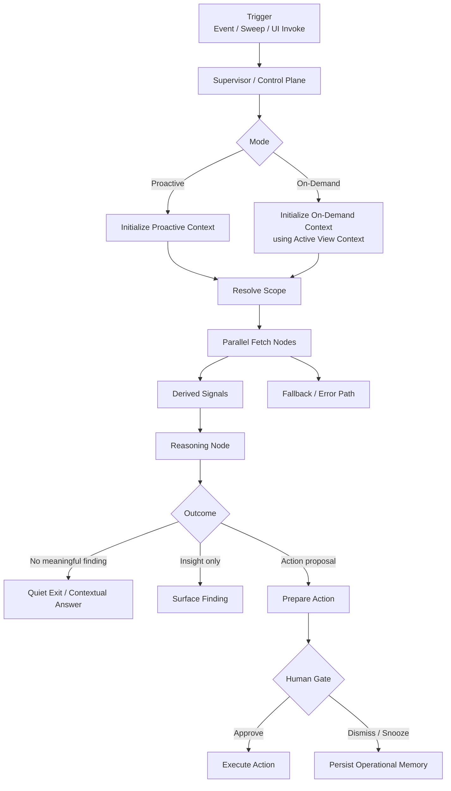

# FLEETGRAPH

Working design and implementation document for FleetGraph.

This file is the source of truth for:

- what FleetGraph is responsible for
- what the MVP will implement first
- how the graph is structured
- how proactive and on-demand mode share the same graph

## Current MVP Scope

The MVP is intentionally narrow.

- **Proactive MVP use case**: sprint is drifting before anyone asks
- **On-demand MVP question**: why is this sprint at risk?
- **First human-in-the-loop boundary**: FleetGraph may draft an escalation or follow-up recommendation, but it must pause before notifying or persisting that action

This is the smallest slice that still proves:

- two modes
- one shared graph
- real reasoning
- conditional edges
- HITL
- real Ship data

## Agent Responsibility

FleetGraph is responsible for:

- monitoring execution drift in Ship
- identifying conditions worth surfacing
- explaining why a scope matters now
- identifying the right human to act
- making the next action obvious in context

For MVP, FleetGraph focuses on:

- sprint drift
- stale or blocked sprint work
- low recent activity in active work
- approval or review bottlenecks that increase sprint risk

FleetGraph is not responsible for:

- acting as a standalone chatbot
- replacing Ship dashboards
- mutating project state without review
- becoming a second source of truth outside Ship

## How the Two Modes Work

FleetGraph operates in two modes through the **same graph architecture**.

### Proactive

The graph runs:

- after high-signal Ship events
- on a 5-minute scheduled backstop for time-based drift

It decides whether to:

- stay quiet
- surface an insight
- prepare an action proposal

### On-Demand

The graph runs when a user invokes it from the current Ship view.

The on-demand mode uses **Active View Context**, which means the graph receives the current Ship page or tab as structured context, such as:

- issue
- week / sprint
- project
- program
- person / My Week

That Active View Context becomes the starting point for graph reasoning.

## Who FleetGraph Notifies

FleetGraph should notify in this order:

1. responsible person first
2. accountable person if risk crosses a threshold or sits unresolved
3. manager or director only when the accountable chain has stalled or the impact is cross-project
4. informed roles only for high-signal summaries

## Autonomy vs Human Approval

FleetGraph can autonomously:

- detect and rank findings
- expand scope from the current context
- fetch Ship data
- explain the likely cause of risk
- surface in-app findings
- prepare a draft action for review
- manage dedupe, snooze, and cooldown memory

FleetGraph must always ask for human approval before:

- changing issue state, sprint, assignee, or priority
- creating persistent comments or follow-up work
- notifying people beyond the directly responsible chain
- approving or requesting changes on formal review workflows

## Trigger Model

FleetGraph uses a **hybrid trigger model**.

### Why hybrid

Some problems appear because of a fresh mutation in Ship. Others appear because time passed and nobody acted.

That means:

- **event-driven triggers** are best for fresh mutations
- **scheduled sweeps** are best for time-based drift and silence failures

### Trigger decision

- event-triggered for high-signal Ship mutations
- scheduled sweep every 5 minutes for time-based drift
- current MVP implementation uses:
  - an env-gated proactive worker in the API process
  - a manual `/api/fleetgraph/proactive/run` sweep route for objective verification
  - the same graph and deterministic signal path used by on-demand mode

### Tradeoffs

**Event-only**
- fast and cheaper for explicit changes
- misses problems caused by silence

**Poll-only**
- catches silent drift
- noisier and more expensive

**Hybrid**
- catches both mutation-based and time-based problems
- slightly more operational complexity
- most defensible choice for this project

## Use Cases

The MVP starts narrow, but FleetGraph is designed to support a broader set of useful project workflows.

| Use Case | Role | Mode | Trigger | What FleetGraph detects or produces | What the human decides |
|---|---|---|---|---|---|
| Sprint is drifting before anyone asks | PM | Proactive | Sprint has open work, low activity, stale issues, or unresolved review friction | Sprint risk summary with top causes and recommended intervention | Whether to message owner, rebalance, escalate, or defer |
| Explain why a sprint is at risk | PM | On-demand | User opens a sprint / week and invokes FleetGraph | Context-aware explanation of risk, blockers, and next steps | Which action to take now |
| Missing ritual with active work | Engineer | Proactive | Business day passes with active sprint work and missing standup or weekly artifact | Missing-ritual alert with direct path to the required artifact | Whether to act now or snooze |
| Turn a stale issue into a next step | Engineer or PM | On-demand | User opens an issue and asks what is blocking it | Likely blockers plus a concrete follow-up draft | Whether to post or edit the draft |
| Identify where director attention is needed | Director | Proactive | Program has multiple active projects and one exceeds the risk threshold | Ranked intervention brief with ownership and likely blocked decision | Whether to escalate, reassign, or ask for review |
| Escalate intake sitting too long | PM | Proactive | Feedback remains in triage too long with no owner | Triage recommendation with likely owning scope and disposition | Whether to accept, reject, assign, or create follow-up work |

## Graph Diagram



## Graph Outline

### Node Types

| Node Type | MVP role |
|---|---|
| Context nodes | establish mode, actor, workspace, current entity, and Active View Context |
| Fetch nodes | pull sprint, issue, activity, accountability, and people data from Ship |
| Reasoning nodes | analyze relationships, gaps, risk, and relevance |
| Conditional edges | separate quiet runs from problem-detected runs and action-proposal runs |
| Action nodes | prepare a draft escalation or follow-up recommendation |
| Human-in-the-loop gate | pause before any consequential action |
| Error / fallback nodes | handle missing context, API failure, and invalid run state |

### MVP graph nodes

| Node | Purpose |
|---|---|
| `supervisorEntry` | choose proactive vs on-demand entry path |
| `initializeProactiveContext` | initialize service-driven run context |
| `initializeOnDemandContext` | validate Active View Context from the UI |
| `resolveContext` | expand the current scope |
| `fetchEntityContext` | load the current sprint or issue context |
| `fetchActivitySignals` | load recent activity |
| `fetchAccountabilitySignals` | load review and accountability state |
| `fetchPeopleRoles` | load owner / accountable relationships |
| `deriveSignals` | compute deterministic sprint-risk signals |
| `reasonAboutState` | explain why the sprint is at risk |
| `prepareAction` | draft escalation or follow-up recommendation |
| `humanGate` | wait for approval before acting |
| `executeAction` | execute the approved action |
| `fallback` | fail safely |

### Branching conditions

The graph must produce visibly different execution paths.

At minimum, MVP branching should support:

- no risk found -> quiet exit
- risk found but no action needed -> insight only
- risk found and action is warranted -> action proposal -> HITL
- missing context or failed fetch -> fallback

## Architecture Decisions

### 1. Use LangGraph in TypeScript

FleetGraph should stay inside Ship’s existing TypeScript monorepo so it can reuse:

- shared contracts
- existing API patterns
- existing UI integration patterns

### 2. Use one shared graph

Proactive and on-demand mode should use the same graph. Only the trigger changes.

### 3. Use supervisor-style orchestration

FleetGraph uses a LangGraph-native supervisor model to control:

- routing
- intervention
- pause / resume
- failure classification
- checkpoint-aware continuation

### 4. Use deterministic signals before LLM reasoning

The LLM should analyze suspicious scopes, not act as the first filter for every run.

### 5. Keep context tied to the current Ship surface

On-demand mode must use **Active View Context**, not a generic chat prompt with no page awareness.

### 6. Use Ship REST APIs only

Ship remains the source of truth. FleetGraph should not read the database directly.

## Initial Test Cases

These are the first MVP test cases we should prove.

| Test Case | Ship state | Expected result |
|---|---|---|
| Clean proactive run | Active sprint with healthy activity and no risk condition | Graph exits quietly |
| Sprint drift proactive run | Active sprint with stale issues and low activity | Graph surfaces sprint-risk finding |
| On-demand sprint question | User invokes FleetGraph from a sprint view | Graph explains why the sprint is at risk using current view context |
| Missing context failure | On-demand invocation without Active View Context | Graph fails safely through fallback |
| HITL action proposal | Risk is high enough to suggest escalation | Graph pauses for approval before action |

## Observability

LangSmith tracing is required from day one.

Environment:

```bash
LANGCHAIN_TRACING_V2=true
LANGCHAIN_API_KEY=your_key
```

The MVP must produce at least two shared trace links showing:

- a clean / quiet path
- a problem-detected path

## Cost Analysis

This section will be completed in the final submission.

It will include:

- cost per graph run
- estimated runs per day
- development and testing spend
- monthly projections for 100, 1,000, and 10,000 users

## Current status

- `PRESEARCH.md` completed
- Phase 1 graph foundation implemented
- `FLEETGRAPH.md` created
- next step: wire Phase 2 real Ship context and fetch nodes for the sprint-risk MVP
