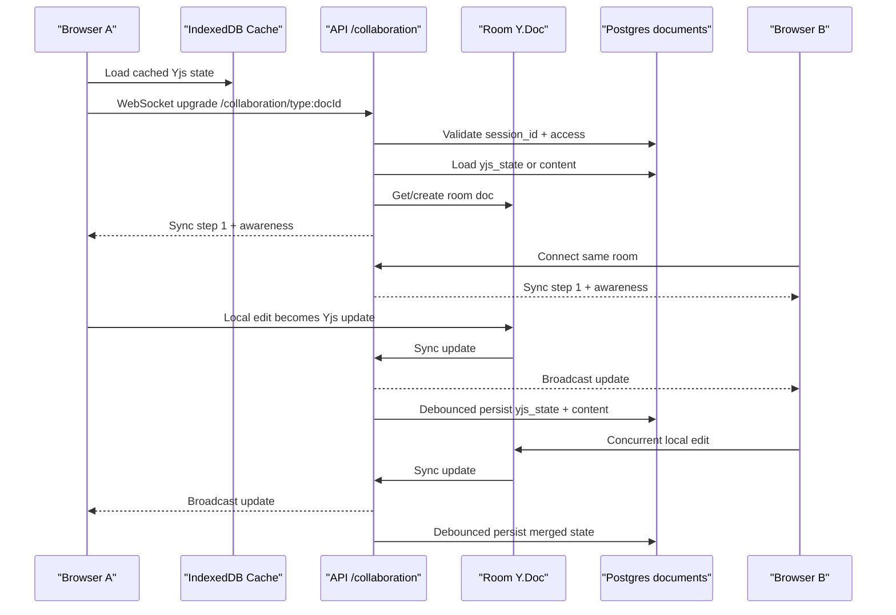

# Task 10: Real-Time Collaboration

Assumption: the last bullet appears truncated. I am answering it as:

- **What happens when two users edit the same document at the same time?**

## Short answer

- The browser editor creates a fresh `Y.Doc`, restores any local IndexedDB cache, then opens a `y-websocket` connection to `/collaboration/{roomPrefix}:{documentId}`.
- The API server intercepts the HTTP upgrade, validates the `session_id` cookie, checks document visibility/workspace access, upgrades to WebSocket, loads or reuses the room’s `Y.Doc`, and starts the Yjs sync protocol.
- Rich-text body content is synced through Yjs CRDT updates and awareness messages. Updates are broadcast to other users in the same room and persisted to `documents.yjs_state` and `documents.content` after a 2-second debounce.
- When two users edit the same rich-text document at once, the system relies on Yjs CRDT merge behavior. There is no app-level locking or “choose a version” dialog; both clients converge on the same merged state.

## How the WebSocket connection gets established

### Frontend setup

The editor’s collaboration path starts in [Editor.tsx](/Users/stefanocaruso/Desktop/Gauntlet/ShipShape/web/src/components/Editor.tsx#L194).

Key steps:

1. Create a **new `Y.Doc` per `documentId`**.
   Source: [Editor.tsx](/Users/stefanocaruso/Desktop/Gauntlet/ShipShape/web/src/components/Editor.tsx#L194)

2. Create an IndexedDB cache for that room first:
   - room key: ``ship-${roomPrefix}-${documentId}``
   Source: [Editor.tsx](/Users/stefanocaruso/Desktop/Gauntlet/ShipShape/web/src/components/Editor.tsx#L293)

3. Wait briefly for IndexedDB to hydrate cached editor content before connecting WebSocket.
   Source: [Editor.tsx](/Users/stefanocaruso/Desktop/Gauntlet/ShipShape/web/src/components/Editor.tsx#L297)

4. Build the WebSocket base URL:
   - if `VITE_API_URL` exists, convert it from `http` to `ws`
   - otherwise use the current browser host with `ws:` or `wss:`
   Source: [Editor.tsx](/Users/stefanocaruso/Desktop/Gauntlet/ShipShape/web/src/components/Editor.tsx#L328)

5. Create a `WebsocketProvider` for room:
   - ``${roomPrefix}:${documentId}``
   Source: [Editor.tsx](/Users/stefanocaruso/Desktop/Gauntlet/ShipShape/web/src/components/Editor.tsx#L366)

6. Connect the provider and attach TipTap’s collaboration extensions:
   - `Collaboration.configure({ document: ydoc })`
   - `CollaborationCursor.configure({ provider, user })`
   Source: [Editor.tsx](/Users/stefanocaruso/Desktop/Gauntlet/ShipShape/web/src/components/Editor.tsx#L541)

### Local dev vs production transport

- In local dev, Vite proxies `/collaboration` and `/events` to the API server with WebSocket proxying enabled.
  Source: [web/vite.config.ts](/Users/stefanocaruso/Desktop/Gauntlet/ShipShape/web/vite.config.ts#L28)

- In production, the editor connects to the current host or the configured API base using `wss://`.
  Source: [Editor.tsx](/Users/stefanocaruso/Desktop/Gauntlet/ShipShape/web/src/components/Editor.tsx#L328)

### Server upgrade path

The backend attaches the collaboration server to the same HTTP server that serves Express.

Source: [api/src/index.ts](/Users/stefanocaruso/Desktop/Gauntlet/ShipShape/api/src/index.ts#L27)

On HTTP upgrade:

1. Check the path starts with `/collaboration/`.
2. Apply IP-based connection rate limiting.
3. Validate the `session_id` cookie by looking up the `sessions` table and enforcing inactivity/absolute timeouts.
4. Parse the room name and document ID.
5. Check whether the user may access that document for collaboration.
6. If valid, call `wss.handleUpgrade(...)`.

Sources:

- upgrade handler: [api/src/collaboration/index.ts](/Users/stefanocaruso/Desktop/Gauntlet/ShipShape/api/src/collaboration/index.ts#L606)
- session validation: [api/src/collaboration/index.ts](/Users/stefanocaruso/Desktop/Gauntlet/ShipShape/api/src/collaboration/index.ts#L346)
- access check: [api/src/collaboration/index.ts](/Users/stefanocaruso/Desktop/Gauntlet/ShipShape/api/src/collaboration/index.ts#L395)

If validation fails, the server rejects the upgrade:

- `401 Unauthorized` for missing/invalid/expired session
- `403 Forbidden` for document access failure
- `429 Too Many Requests` for connection rate limiting

Sources:

- unauthorized upgrade rejection: [api/src/collaboration/index.ts](/Users/stefanocaruso/Desktop/Gauntlet/ShipShape/api/src/collaboration/index.ts#L659)
- forbidden upgrade rejection: [api/src/collaboration/index.ts](/Users/stefanocaruso/Desktop/Gauntlet/ShipShape/api/src/collaboration/index.ts#L670)
- rate limit rejection: [api/src/collaboration/index.ts](/Users/stefanocaruso/Desktop/Gauntlet/ShipShape/api/src/collaboration/index.ts#L647)

## How Yjs syncs document state between users

### Room model

The server keeps one in-memory `Y.Doc` per room name in the `docs` map, plus one awareness object per room.

Source: [api/src/collaboration/index.ts](/Users/stefanocaruso/Desktop/Gauntlet/ShipShape/api/src/collaboration/index.ts#L88)

Room names look like:

- `wiki:<uuid>`
- `issue:<uuid>`
- `project:<uuid>`
- `sprint:<uuid>`
- `person:<uuid>`

The prefix is mainly for routing/room naming. The actual database lookup uses the UUID part and reads from the unified `documents` table.

Source:

- parse room/document ID: [api/src/collaboration/index.ts](/Users/stefanocaruso/Desktop/Gauntlet/ShipShape/api/src/collaboration/index.ts#L100)
- room prefix passed from unified editor: [web/src/components/UnifiedEditor.tsx](/Users/stefanocaruso/Desktop/Gauntlet/ShipShape/web/src/components/UnifiedEditor.tsx#L268)

### Initial load

When the first connection for a room arrives, the server calls `getOrCreateDoc(docName)`.

Source: [api/src/collaboration/index.ts](/Users/stefanocaruso/Desktop/Gauntlet/ShipShape/api/src/collaboration/index.ts#L195)

Load order:

1. Reuse the in-memory `Y.Doc` if already cached.
2. Otherwise create a new `Y.Doc`.
3. Load from `documents.yjs_state` if present.
4. If no `yjs_state` exists, fall back to `documents.content` JSON and convert it into Yjs via `jsonToYjs(...)`.
5. If loaded from JSON, mark the doc as “fresh from JSON” and schedule persistence so future loads use `yjs_state`.

Sources:

- load from `yjs_state` vs `content`: [api/src/collaboration/index.ts](/Users/stefanocaruso/Desktop/Gauntlet/ShipShape/api/src/collaboration/index.ts#L205)
- JSON -> Yjs conversion: [api/src/utils/yjsConverter.ts](/Users/stefanocaruso/Desktop/Gauntlet/ShipShape/api/src/utils/yjsConverter.ts#L164)

### Handshake and sync

Once connected, the server:

1. stores the connection in `conns`
2. optionally sends a custom “clear cache” message if the room was freshly rebuilt from JSON
3. sends **Yjs sync step 1**
4. sends current awareness state (other users/presence)

Source: [api/src/collaboration/index.ts](/Users/stefanocaruso/Desktop/Gauntlet/ShipShape/api/src/collaboration/index.ts#L683)

Incoming WebSocket messages are parsed by `handleMessage(...)`:

- `messageSync` (`0`) goes through `syncProtocol.readSyncMessage(...)`
- `messageAwareness` (`1`) goes through `awarenessProtocol.applyAwarenessUpdate(...)`

Source: [api/src/collaboration/index.ts](/Users/stefanocaruso/Desktop/Gauntlet/ShipShape/api/src/collaboration/index.ts#L306)

This means Ship is using the standard Yjs sync protocol rather than inventing its own document diffing layer.

### Broadcasting updates

When the room’s `Y.Doc` changes:

1. the server schedules persistence after 2 seconds
2. encodes the update as a Yjs sync message
3. broadcasts that update to every other WebSocket in the same room except the origin connection

Source: [api/src/collaboration/index.ts](/Users/stefanocaruso/Desktop/Gauntlet/ShipShape/api/src/collaboration/index.ts#L261)

Awareness changes follow a similar path:

1. encode awareness update
2. broadcast to all sockets in the room

Source: [api/src/collaboration/index.ts](/Users/stefanocaruso/Desktop/Gauntlet/ShipShape/api/src/collaboration/index.ts#L281)

### Persistence

Persistence is debounced by 2 seconds per room.

Source: [api/src/collaboration/index.ts](/Users/stefanocaruso/Desktop/Gauntlet/ShipShape/api/src/collaboration/index.ts#L181)

When the timer fires, the server:

1. encodes the Yjs document to binary with `Y.encodeStateAsUpdate(doc)`
2. converts the Yjs XML fragment back to TipTap JSON with `yjsToJson(...)`
3. extracts structured properties like plan/success criteria/vision/goals
4. writes:
   - `documents.yjs_state`
   - `documents.content`
   - `documents.properties`
   - `documents.updated_at`

Source: [api/src/collaboration/index.ts](/Users/stefanocaruso/Desktop/Gauntlet/ShipShape/api/src/collaboration/index.ts#L111)

That dual-write is important: `yjs_state` is the canonical CRDT collaboration state, while `content` remains a JSON fallback and REST-friendly representation.

## What happens when two users edit the same document at the same time

### For the rich-text body

For the document body, both users edit a shared CRDT-backed structure.

What the code shows:

- each browser has its own local `Y.Doc`
- the server keeps one room `Y.Doc`
- updates are exchanged with Yjs sync messages
- no app-level locking is added on top
- no “last writer wins” rule is implemented for collaborative rich text

Relevant sources:

- client Y.Doc + provider: [Editor.tsx](/Users/stefanocaruso/Desktop/Gauntlet/ShipShape/web/src/components/Editor.tsx#L194)
- server room doc and broadcast: [api/src/collaboration/index.ts](/Users/stefanocaruso/Desktop/Gauntlet/ShipShape/api/src/collaboration/index.ts#L195)
- sync message handling: [api/src/collaboration/index.ts](/Users/stefanocaruso/Desktop/Gauntlet/ShipShape/api/src/collaboration/index.ts#L306)

The clearest code-level evidence is the collaboration test:

- two separate `Y.Doc` instances make concurrent edits
- each applies the other’s update
- both converge to a document containing both edits

Source: [api/src/collaboration/__tests__/collaboration.test.ts](/Users/stefanocaruso/Desktop/Gauntlet/ShipShape/api/src/collaboration/__tests__/collaboration.test.ts#L144)

So the practical behavior is:

- both users see live updates
- concurrent body edits are merged automatically by Yjs
- after sync, all clients converge on the same document state

### If they edit the exact same spot

I do **not** see any app-specific conflict-resolution code for “same character range” or “ask user which version wins.”

That means Ship is relying on **default Yjs CRDT semantics** for those collisions. In other words:

- the system still converges automatically
- the ordering/merge behavior comes from Yjs, not from custom Ship logic

This is an inference from:

- the use of Yjs sync protocol
- the absence of any custom conflict UI or custom merge code in the collaboration server

### Presence and cursors

While two users edit together, the app also syncs awareness/presence:

- the editor publishes local user name/color
- the provider broadcasts awareness states
- the cursor extension renders other users’ cursors

Sources:

- local awareness state: [Editor.tsx](/Users/stefanocaruso/Desktop/Gauntlet/ShipShape/web/src/components/Editor.tsx#L448)
- awareness broadcast on server: [api/src/collaboration/index.ts](/Users/stefanocaruso/Desktop/Gauntlet/ShipShape/api/src/collaboration/index.ts#L288)
- cursor extension: [Editor.tsx](/Users/stefanocaruso/Desktop/Gauntlet/ShipShape/web/src/components/Editor.tsx#L610)

### Important caveat: not every field is collaborative in the same way

The **rich-text body** is what goes through Yjs.

But fields like **title** are not part of the Yjs editor document in this component. Title changes go through a throttled `onTitleChange` save path, not the WebSocket CRDT path.

Sources:

- title state and callback path: [Editor.tsx](/Users/stefanocaruso/Desktop/Gauntlet/ShipShape/web/src/components/Editor.tsx#L187)
- title change callback: [Editor.tsx](/Users/stefanocaruso/Desktop/Gauntlet/ShipShape/web/src/components/Editor.tsx#L812)
- throttled REST save: [UnifiedEditor.tsx](/Users/stefanocaruso/Desktop/Gauntlet/ShipShape/web/src/components/UnifiedEditor.tsx#L229)

So if two users change the title or other REST-saved metadata at once, that is **not** the same CRDT merge path as collaborative body editing.

## Sequence diagram

## Conclusion

Ship’s real-time editing is a standard but carefully integrated Yjs architecture:

- TipTap edits the local `Y.Doc`
- `y-indexeddb` makes navigation/offline behavior fast
- `y-websocket` carries Yjs sync messages to `/collaboration/:room`
- the server authenticates the socket, reuses one in-memory room doc, broadcasts updates, and persists the merged state back to PostgreSQL

For simultaneous rich-text edits, the application trusts **Yjs CRDT merging** rather than locks or manual conflict dialogs. The repo’s tests prove convergence for concurrent edits, and I do not see any custom merge policy layered on top of that.
