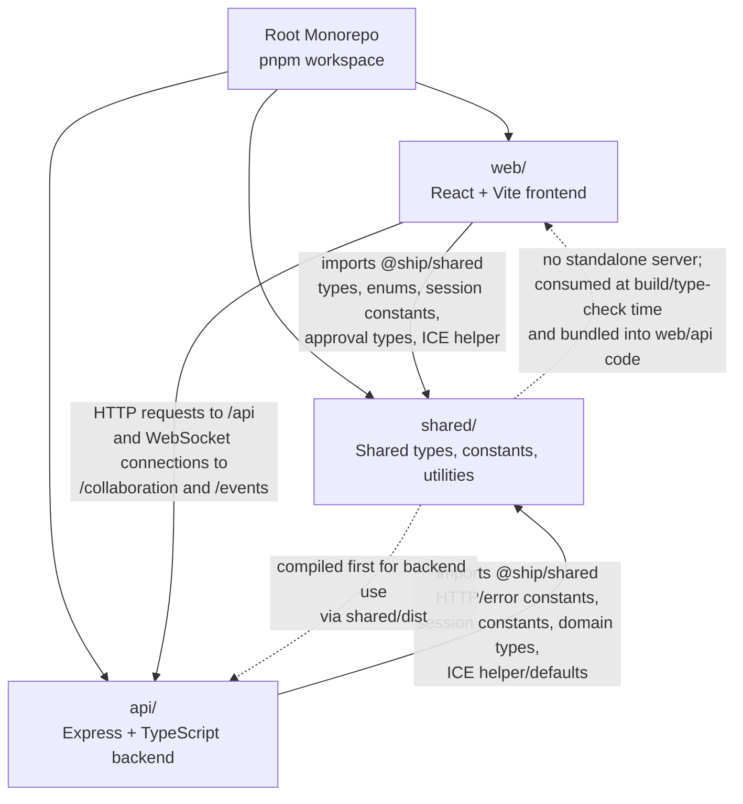

# Task 2: Package Relationship Diagram

## Diagram

## What the Diagram Means

- `web/` and `api/` are separate application packages in the same pnpm workspace.
- `shared/` is not a running service. It is a library package both sides import.
- `web/` depends on `shared/` for selected shared types and utilities, then talks to `api/` over network boundaries.
- `api/` depends on `shared/` for constants, some domain types, and helper logic, then serves HTTP and WebSocket endpoints to `web/`.
- The root workspace scripts coordinate all three packages.

## Important Distinction

There are two different relationships in play:

1. Code dependency

- `web/` imports `shared/`
- `api/` imports `shared/`

2. Runtime communication

- `web/` calls `api/`
- `shared/` does not receive runtime requests directly

## Notes From the Repo

- `pnpm-workspace.yaml` registers `api`, `web`, and `shared` as workspace packages.
- Both `api/package.json` and `web/package.json` declare `@ship/shared` as a workspace dependency.
- Root build scripts explicitly build `shared` before `api` and `web`.
- `web/vite.config.ts` proxies `/api`, `/collaboration`, and `/events` to the backend during local development.
- `api/tsconfig.json` resolves `@ship/shared` from `../shared/dist`, which is why the shared package needs to be built for backend compilation.
