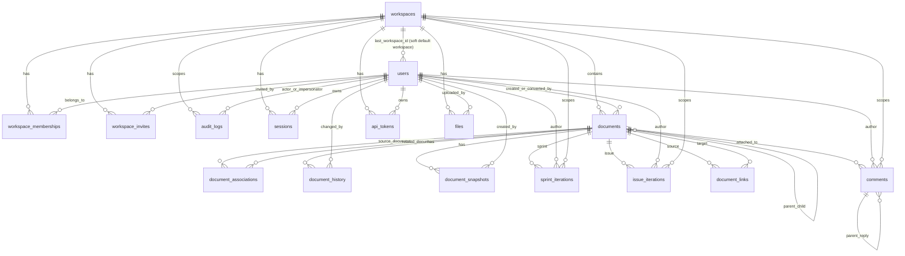

# Task 3: Data Model - Schema and Relationships

## Where the Schema Lives

The database schema is primarily defined in:

- `api/src/db/schema.sql`
- `api/src/db/migrations/*.sql`
- `api/src/db/migrate.ts`

The seed file that shows how the model is actually populated is:

- `api/src/db/seed.ts`

Important detail:

- `schema.sql` contains the current baseline schema for a fresh database.
- `migrate.ts` applies `schema.sql`, then runs numbered migrations, and also creates the `schema_migrations` table used to track applied migrations.
- Several migrations are historical backfills or cleanup steps, but some of them also explain the intended relationship model, especially the move from direct columns to `document_associations`.

## High-Level Model

This database is built around one central idea:

- most product entities are stored in the `documents` table

That means programs, projects, weeks, issues, people, wiki pages, standups, weekly plans, weekly retros, and weekly reviews are not separate tables. They are rows in `documents`, distinguished by `document_type` and typed `properties` JSONB.

There are two kinds of relationships in the model:

1. Hard relational links

- actual foreign keys between tables

2. Soft document-model links

- references stored in `documents.properties`
- many-to-many links stored in `document_associations`

## Final Table Inventory

### 1. `workspaces`

Purpose:

- top-level tenant boundary

Key columns:

- `id`
- `name`
- `sprint_start_date`
- `archived_at`

Referenced by:

- `users.last_workspace_id`
- `workspace_memberships.workspace_id`
- `workspace_invites.workspace_id`
- `audit_logs.workspace_id`
- `sessions.workspace_id`
- `documents.workspace_id`
- `api_tokens.workspace_id`
- `sprint_iterations.workspace_id`
- `issue_iterations.workspace_id`
- `files.workspace_id`
- `comments.workspace_id`

### 2. `users`

Purpose:

- global identity and authentication record

Key columns:

- `id`
- `email`
- `password_hash`
- `name`
- `is_super_admin`
- `last_workspace_id`
- `x509_subject_dn`
- `last_auth_provider`

Referenced by:

- `workspace_memberships.user_id`
- `workspace_invites.invited_by_user_id`
- `audit_logs.actor_user_id`
- `audit_logs.impersonating_user_id`
- `sessions.user_id`
- `documents.created_by`
- `documents.converted_by`
- `document_history.changed_by`
- `document_snapshots.created_by`
- `api_tokens.user_id`
- `sprint_iterations.author_id`
- `issue_iterations.author_id`
- `files.uploaded_by`
- `comments.author_id`

### 3. `workspace_memberships`

Purpose:

- authorization table linking users to workspaces with a role

Key columns:

- `workspace_id`
- `user_id`
- `role`

Constraints:

- unique `(workspace_id, user_id)`

Important note:

- migrations explicitly decoupled this table from person documents
- it is for auth/access, not the content model

### 4. `workspace_invites`

Purpose:

- pending invites into a workspace

Key columns:

- `workspace_id`
- `email`
- `token`
- `role`
- `invited_by_user_id`
- `x509_subject_dn`
- `expires_at`
- `used_at`

Important note:

- supports both email/token invites and PIV/X.509 invite flows

### 5. `audit_logs`

Purpose:

- compliance and security audit trail

Key columns:

- `workspace_id`
- `actor_user_id`
- `impersonating_user_id`
- `action`
- `resource_type`
- `resource_id`
- `details`

Important relationship behavior:

- `actor_user_id` uses `ON DELETE SET NULL`
- this preserves audit history even if a user is later deleted

### 6. `sessions`

Purpose:

- active authenticated browser sessions

Key columns:

- `id` (text, not UUID)
- `user_id`
- `workspace_id`
- `expires_at`
- `last_activity`
- `created_at`

### 7. `oauth_state`

Purpose:

- temporary PKCE/OAuth state between auth redirect and callback

Key columns:

- `state_id`
- `nonce`
- `code_verifier`
- `expires_at`

### 8. `documents`

Purpose:

- the core polymorphic content table

Key columns:

- `id`
- `workspace_id`
- `document_type`
- `title`
- `content` (TipTap JSONB)
- `yjs_state` (collaboration state)
- `parent_id`
- `position`
- `properties` (type-specific JSONB)
- `ticket_number`
- `archived_at`
- `deleted_at`
- `started_at`
- `completed_at`
- `cancelled_at`
- `reopened_at`
- `converted_to_id`
- `converted_from_id`
- `converted_at`
- `converted_by`
- `original_type`
- `conversion_count`
- `created_by`
- `visibility`

Document types stored here:

- `wiki`
- `issue`
- `program`
- `project`
- `sprint`
- `person`
- `weekly_plan`
- `weekly_retro`
- `standup`
- `weekly_review`

Hard relationships:

- `workspace_id -> workspaces.id`
- `parent_id -> documents.id`
- `converted_to_id -> documents.id`
- `converted_from_id -> documents.id`
- `converted_by -> users.id`
- `created_by -> users.id`

Important note:

- old direct columns like `program_id`, `project_id`, and `sprint_id` were removed
- those relationships now live in `document_associations`

### 9. `document_associations`

Purpose:

- junction table for many-to-many document relationships

Key columns:

- `document_id`
- `related_id`
- `relationship_type`
- `metadata`

Relationship types:

- `parent`
- `project`
- `sprint`
- `program`

Hard relationships:

- `document_id -> documents.id`
- `related_id -> documents.id`

Constraints:

- unique `(document_id, related_id, relationship_type)`
- no self-reference

This is now the main way the app models:

- issue belongs to program
- issue belongs to project
- issue belongs to week
- week belongs to project
- week belongs to program
- standup belongs to week
- weekly review belongs to week

### 10. `document_history`

Purpose:

- audit trail for field-level document changes

Key columns:

- `document_id`
- `field`
- `old_value`
- `new_value`
- `changed_by`

Hard relationships:

- `document_id -> documents.id`
- `changed_by -> users.id`

### 11. `document_snapshots`

Purpose:

- preserves document state before type conversion for undo/history

Key columns:

- `document_id`
- `document_type`
- `title`
- `properties`
- `ticket_number`
- `snapshot_reason`
- `created_by`

Hard relationships:

- `document_id -> documents.id`
- `created_by -> users.id`

### 12. `api_tokens`

Purpose:

- long-lived programmatic auth tokens for CLI/external tooling

Key columns:

- `user_id`
- `workspace_id`
- `name`
- `token_hash`
- `token_prefix`
- `last_used_at`
- `expires_at`
- `revoked_at`

Hard relationships:

- `user_id -> users.id`
- `workspace_id -> workspaces.id`

Constraints:

- unique `(user_id, workspace_id, name)`

### 13. `sprint_iterations`

Purpose:

- tracks iteration attempts at the week/sprint level

Key columns:

- `sprint_id`
- `workspace_id`
- `story_id`
- `story_title`
- `status`
- `author_id`

Hard relationships:

- `sprint_id -> documents.id`
- `workspace_id -> workspaces.id`
- `author_id -> users.id`

Important note:

- `sprint_id` points to a `documents` row whose `document_type = 'sprint'`

### 14. `issue_iterations`

Purpose:

- tracks iteration attempts at the issue level

Key columns:

- `issue_id`
- `workspace_id`
- `status`
- `author_id`

Hard relationships:

- `issue_id -> documents.id`
- `workspace_id -> workspaces.id`
- `author_id -> users.id`

Important note:

- `issue_id` points to a `documents` row whose `document_type = 'issue'`

### 15. `files`

Purpose:

- uploaded file metadata

Key columns:

- `workspace_id`
- `uploaded_by`
- `filename`
- `mime_type`
- `size_bytes`
- `s3_key`
- `cdn_url`
- `status`

Hard relationships:

- `workspace_id -> workspaces.id`
- `uploaded_by -> users.id`

### 16. `document_links`

Purpose:

- backlinks / explicit document-to-document links

Key columns:

- `source_id`
- `target_id`

Hard relationships:

- `source_id -> documents.id`
- `target_id -> documents.id`

Constraints:

- unique `(source_id, target_id)`

### 17. `comments`

Purpose:

- inline document comments with threads/replies

Key columns:

- `document_id`
- `comment_id`
- `parent_id`
- `author_id`
- `workspace_id`
- `content`
- `resolved_at`

Hard relationships:

- `document_id -> documents.id`
- `parent_id -> comments.id`
- `author_id -> users.id`
- `workspace_id -> workspaces.id`

Important relationship behavior:

- `parent_id` supports threaded replies
- later migration changed `author_id` to nullable with `ON DELETE SET NULL`
- later migration changed `workspace_id` to `ON DELETE CASCADE`

### 18. `schema_migrations`

Purpose:

- migration bookkeeping table created by `api/src/db/migrate.ts`

Key columns:

- `version`
- `applied_at`

Important note:

- this is not declared in `schema.sql`
- it still exists in a migrated database and should be treated as part of the operational schema

## Core Hard Relationships

The strongest FK-driven structure looks like this:

- one `workspace` has many `workspace_memberships`
- one `workspace` has many `workspace_invites`
- one `workspace` has many `sessions`
- one `workspace` has many `documents`
- one `workspace` has many `api_tokens`
- one `workspace` has many `files`
- one `workspace` has many `comments`

- one `user` has many `workspace_memberships`
- one `user` can invite many `workspace_invites`
- one `user` has many `sessions`
- one `user` can create many `documents`
- one `user` can own many `api_tokens`
- one `user` can author many iterations, files, comments, and audit log entries

- one `document` can have many child `documents` via `parent_id`
- one `document` can have many outgoing and incoming `document_associations`
- one `document` can have many `document_history` rows
- one `document` can have many `document_snapshots`
- one `document` can have many `document_links`
- one `document` can have many `comments`

## Soft Relationships Stored in `documents.properties`

This is the most important non-obvious part of the schema.

Many domain relationships are not foreign keys. They are JSON references inside `documents.properties`.

Examples:

- person documents store `properties.user_id`, linking a `person` document to a `users.id`
- person documents store `properties.reports_to`, pointing to a manager user id
- issue documents store `properties.assignee_id`, pointing to a user id
- week documents store `properties.owner_id`, pointing to a user id
- week documents may store `properties.assignee_ids`, which are person document ids
- weekly plan documents store `properties.person_id` and `properties.week_number`
- weekly retro documents store `properties.person_id` and `properties.week_number`
- weekly review documents store `properties.sprint_id` and `properties.owner_id`
- standup documents store `properties.author_id` and `properties.date`

These are application-level references, not enforced foreign keys.

## Relationship Patterns Confirmed by the Seed

`api/src/db/seed.ts` shows the intended live model very clearly:

- programs are inserted as `documents` with `document_type = 'program'`
- projects are inserted as `documents` and linked to programs through `document_associations` with `relationship_type = 'program'`
- weeks are inserted as `documents` with `document_type = 'sprint'`
- weeks are linked to both projects and programs through `document_associations`
- issues are inserted as `documents` and linked to program/project/week through `document_associations`
- standups are inserted as `documents` and linked to a week through `document_associations`
- weekly reviews are inserted as `documents` and linked to a week through `document_associations`
- person records are inserted as `documents` with `document_type = 'person'` and `properties.user_id`
- weekly plans and retros are inserted as `documents`; their per-person/per-week identity is stored in properties rather than a separate join table

This confirms that the app's real domain graph is:

- partly relational
- partly document-based
- heavily centered on `documents` plus `document_associations`

## ER-Style Diagram

## Bottom Line

The schema is best understood as three layers:

1. workspace/auth layer

- `workspaces`
- `users`
- `workspace_memberships`
- `workspace_invites`
- `sessions`
- `oauth_state`
- `api_tokens`
- `audit_logs`

2. unified content layer

- `documents`
- `document_associations`
- `document_history`
- `document_snapshots`
- `document_links`
- `comments`

3. supporting operational tables

- `sprint_iterations`
- `issue_iterations`
- `files`
- `schema_migrations`

The key architectural decision in the data model is that most business entities are collapsed into `documents`, and most organizational relationships are modeled through `document_associations` plus JSONB properties rather than many specialized relational tables.
