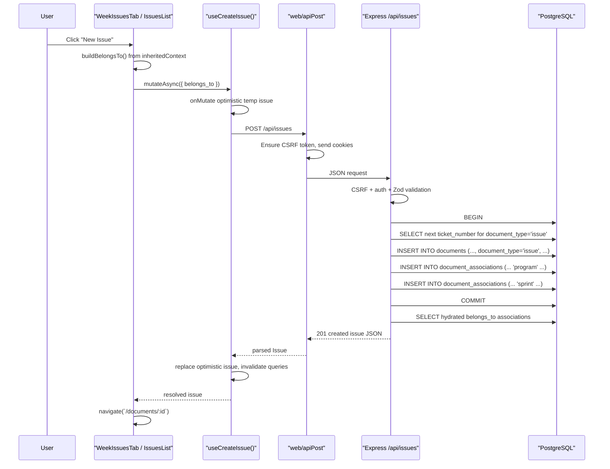

# Task 7: Request Flow Trace - Creating an Issue

## Chosen Action

I traced this concrete user action:

- user clicks `New Issue` from a week-scoped issue list

Specifically, this is the `IssuesList` rendered inside:

- `web/src/components/document-tabs/WeekIssuesTab.tsx`

I chose this path because it shows:

- the React click handler
- the frontend mutation hook
- the POST `/api/issues` route
- the `documents` insert
- the `document_associations` inserts for context
- the response path back to the UI

## End-to-End Summary

At a high level, the flow is:

1. React renders a week-scoped `IssuesList`
2. user clicks `New Issue`
3. `IssuesList` builds `belongs_to` from inherited week context
4. `useCreateIssue()` posts to `/api/issues`
5. Express validates and authenticates the request
6. backend inserts a new `documents` row with `document_type = 'issue'`
7. backend inserts `document_associations` rows for the inherited context
8. backend returns the created issue plus hydrated `belongs_to`
9. frontend replaces its optimistic temp row, invalidates issue queries, and navigates to the new document page

## Step-by-Step Trace

## 1. React entry point: week tab configures issue creation context

In `web/src/components/document-tabs/WeekIssuesTab.tsx`, the tab renders `IssuesList` with:

- `lockedSprintId={documentId}`
- `lockedProgramId={programId}`
- `inheritedContext={{ programId, sprintId: documentId }}`
- `showCreateButton={true}`

That means this list is not a generic issues list. It is scoped to one week and one program.

Important consequence:

- new issues created from this list automatically inherit week/program associations

## 2. Visible UI action: the `New Issue` button

In `web/src/components/IssuesList.tsx`, the toolbar renders a create button:

- button label comes from `createButtonLabel`
- click handler is `handleCreateIssue`

So the user action is literally:

- click toolbar button
- `handleCreateIssue()` runs

## 3. React handler chooses the self-fetch branch

In this week-tab configuration, `IssuesList` computes:

- `shouldSelfFetch = Boolean(lockedProgramId || lockedProjectId || lockedSprintId)`

Because `lockedSprintId` is set, `shouldSelfFetch` is `true`.

That makes `handleCreateIssue()` take this branch:

- call `buildBelongsTo()`
- call `createIssueMutation.mutateAsync({ belongs_to })`
- navigate to `/documents/${issue.id}` after success

For this specific week-tab path, `buildBelongsTo()` produces:

- `{ id: programId, type: 'program' }`
- `{ id: documentId, type: 'sprint' }`

So the frontend request already includes the relationship context.

## 4. Frontend mutation hook sends the POST request

The create mutation is implemented in:

- `web/src/hooks/useIssuesQuery.ts`

Flow inside the hook:

### `useCreateIssue()`

- wraps `createIssueApi()`
- performs optimistic cache update in `onMutate`
- replaces temp row in `onSuccess`
- invalidates list queries in `onSettled`

### `createIssueApi(data)`

Builds request body:

- `title: data.title ?? 'Untitled'`
- `belongs_to` if provided

Then sends:

- `apiPost('/api/issues', apiData)`

## 5. Network layer adds CSRF and credentials

In `web/src/lib/api.ts`:

- `apiPost()` delegates to `fetchWithCsrf()`
- `fetchWithCsrf()` ensures a CSRF token exists
- sends `Content-Type: application/json`
- sends `X-CSRF-Token`
- sends cookies via `credentials: 'include'`

So the actual browser request is a credentialed JSON POST to:

- `/api/issues`

In local development, Vite proxies `/api` to the backend.

## 6. Express route registration receives the request

In `api/src/app.ts`, the app mounts:

- `app.use('/api/issues', conditionalCsrf, issuesRoutes);`

So the request passes through:

- CSRF protection middleware
- then the `issues` router

Inside `api/src/routes/issues.ts`, the create route is:

- `router.post('/', authMiddleware, async ...)`

So before business logic runs, the request also passes through:

- `authMiddleware`

That ensures a valid authenticated user and workspace are present on the request.

## 7. Backend validates request body with Zod

The POST route uses `createIssueSchema`, which allows:

- `title`
- `state`
- `priority`
- `assignee_id`
- `belongs_to`
- `source`
- `due_date`
- accountability fields

For this UI path, the meaningful payload is typically:

```json
{
  "title": "Untitled",
  "belongs_to": [
    { "id": "<program-id>", "type": "program" },
    { "id": "<sprint-id>", "type": "sprint" }
  ]
}
```

If validation fails, the route returns `400`.

## 8. Backend starts a transaction and generates the next ticket number

Inside the POST `/api/issues` route:

- the backend opens a DB client
- starts a transaction with `BEGIN`
- acquires a workspace-scoped advisory lock

Then it runs:

```sql
SELECT COALESCE(MAX(ticket_number), 0) + 1 as next_number
FROM documents
WHERE workspace_id = $1 AND document_type = 'issue'
```

This gives the next issue number for that workspace.

Why this matters:

- issues are not stored in a separate `issues` table
- the backend identifies issue rows inside `documents` by `document_type = 'issue'`

## 9. Backend inserts the new issue into `documents`

The route builds `properties` like:

- `state`
- `priority`
- `source`
- `assignee_id`
- `rejection_reason`
- optional accountability fields

Then inserts:

```sql
INSERT INTO documents (workspace_id, document_type, title, properties, ticket_number, created_by)
VALUES ($1, 'issue', $2, $3, $4, $5)
RETURNING *
```

This is the core write.

The new issue is not stored in a special issue table. It is a row in `documents` whose discriminator is:

- `document_type = 'issue'`

## 10. Backend inserts relationship rows into `document_associations`

After the `documents` insert, the route loops over `belongs_to` and runs:

```sql
INSERT INTO document_associations (document_id, related_id, relationship_type)
VALUES ($1, $2, $3)
ON CONFLICT (document_id, related_id, relationship_type) DO NOTHING
```

For the week-tab path, this creates:

- one `program` association
- one `sprint` association

So the newly created issue is immediately linked into the right context.

## 11. Backend commits and hydrates the response

After inserts succeed:

- the transaction commits

Then the route calls `getBelongsToAssociations(newIssueId)`.

That helper queries:

```sql
SELECT da.related_id as id, da.relationship_type as type,
       d.title, d.properties->>'color' as color
FROM document_associations da
LEFT JOIN documents d ON da.related_id = d.id
WHERE da.document_id = $1
ORDER BY da.relationship_type, da.created_at
```

This turns the raw association rows into the UI-friendly `belongs_to` response shape.

Finally the route returns:

- issue fields extracted from `documents`
- `display_id: #<ticket_number>`
- hydrated `belongs_to`

with HTTP `201`.

## 12. Frontend receives response and updates cache

Back in `web/src/hooks/useIssuesQuery.ts`:

- `createIssueApi()` parses JSON
- `transformIssue()` ensures `belongs_to` is present
- mutation `onSuccess` replaces the optimistic temp issue with the real one
- mutation `onSettled` invalidates `issueKeys.lists()`

That means the list view ends up consistent even if the optimistic row did not exactly match the server response.

## 13. UI navigates to the created document

Back in `IssuesList.handleCreateIssue()`:

- after `mutateAsync()` resolves
- it calls `navigate(`/documents/${issue.id}`)`

So the user is immediately taken to the new issue’s document view.

This is the final “back to UI” step for the action.

## Sequence Diagram



## What Gets Written to the Database

For this specific week-scoped create flow, the database changes are:

### 1. One row in `documents`

- `document_type = 'issue'`
- `title = 'Untitled'` unless caller provided a title
- `properties.state = 'backlog'` by default
- `properties.priority = 'medium'` by default
- `properties.source = 'internal'` by default
- `ticket_number = next per-workspace issue number`

### 2. Two rows in `document_associations`

Usually:

- `(newIssueId, programId, 'program')`
- `(newIssueId, sprintId, 'sprint')`

If the same component were used in a project-scoped list, a `project` association would also be included.

## Why This Flow Matters Architecturally

This trace shows several core design choices of the codebase:

- React lists can inject context into creation through `inheritedContext`
- the frontend API contract uses `belongs_to` instead of separate `program_id` / `project_id` / `sprint_id` fields
- the backend stores issues in the unified `documents` table
- organizational placement is stored in `document_associations`
- the response is re-hydrated back into the same `belongs_to` shape the frontend uses

That makes the request flow consistent with the unified document model.

## Bottom Line

Creating an issue from a week-scoped React list works like this:

- the UI builds contextual `belongs_to`
- the frontend posts to `/api/issues`
- the backend inserts a new `documents` row with `document_type = 'issue'`
- the backend inserts matching `document_associations` rows
- the server returns the hydrated issue
- React replaces the optimistic row and navigates to the new document

So the full request path is not just “create an issue.” It is really:

- create a new document row
- classify it as an issue
- attach it to the current context
- return it in UI-ready shape
