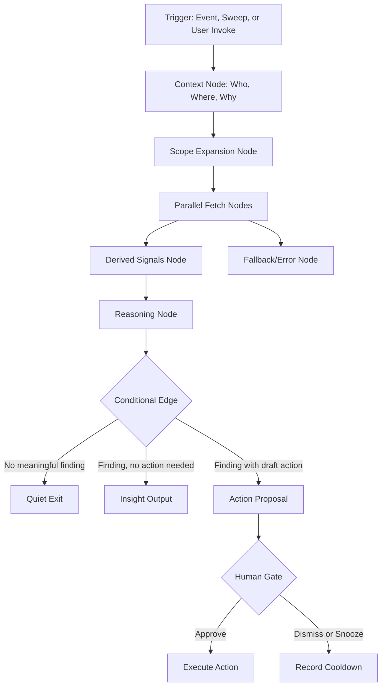

# PRESEARCH

Pre-code design document for FleetGraph, grounded in the current Ship codebase and product model.

## Working Thesis

FleetGraph should be a project intelligence agent for **execution drift and next-action clarity**.

It should not be a generic chatbot, a second dashboard, or a duplicate of Ship's existing accountability engine. Ship already detects some missing rituals and shows status. FleetGraph should sit one level above that: it should combine graph context, activity, ownership, approvals, and accountability signals to answer:

- What is drifting?
- Why does it matter?
- Who should act?
- What is the best next action?

That is the right MVP boundary. The broader product opportunity is larger: once Ship captures stronger planning primitives, FleetGraph should also become a **planning and portfolio intelligence layer** that can reason about capacity, velocity, scope creep, roadmap confidence, and staffing pressure. The LLM should not be asked to invent those signals from thin air; it should reason on top of a stronger product and planning foundation.

## Repo-Grounded Observations

These decisions are based on what Ship already exposes:

- Ship is a unified-document system. Programs, projects, weeks, issues, people, standups, weekly plans, and retros are all documents connected through associations.
- Ship already has inferred accountability signals at [`/api/accountability/action-items`](/Users/stefanocaruso/Desktop/Gauntlet/ShipShape/api/src/routes/accountability.ts).
- Ship already has urgency and owned-work views at [`/api/dashboard/my-work`](/Users/stefanocaruso/Desktop/Gauntlet/ShipShape/api/src/routes/dashboard.ts).
- Ship already has relationship-scoped activity at [`/api/activity/:entityType/:entityId`](/Users/stefanocaruso/Desktop/Gauntlet/ShipShape/api/src/routes/activity.ts).
- Ship already has team allocation and accountability surfaces at [`/api/team/grid`](/Users/stefanocaruso/Desktop/Gauntlet/ShipShape/api/src/routes/team.ts).
- Ship already has context-specific Claude data at [`/api/claude/context`](/Users/stefanocaruso/Desktop/Gauntlet/ShipShape/api/src/routes/claude.ts).
- Ship already has AI quality assistants for weekly plans and retros at [`/api/ai/*`](/Users/stefanocaruso/Desktop/Gauntlet/ShipShape/api/src/routes/ai.ts) and [`QualityAssistant.tsx`](/Users/stefanocaruso/Desktop/Gauntlet/ShipShape/web/src/components/sidebars/QualityAssistant.tsx).
- Ship already has realtime in-app notification plumbing through `accountability:updated` events in [`App.tsx`](/Users/stefanocaruso/Desktop/Gauntlet/ShipShape/web/src/pages/App.tsx) and [`useRealtimeEvents.tsx`](/Users/stefanocaruso/Desktop/Gauntlet/ShipShape/web/src/hooks/useRealtimeEvents.tsx).

Ship also already has the beginning of a product operating model that FleetGraph can build on:

- owner/accountable/consulted/informed fields that can support a RACI-like responsibility model
- team allocation data that can support future capacity reasoning
- weekly plans, retros, and accountability views that can support delivery-pattern analysis
- scoring and prioritization concepts that can evolve toward stronger product prioritization inputs

What Ship does **not** yet have in a strong, explicit form are the planning primitives needed for higher-order product intelligence:

- historical velocity and throughput snapshots by team and sprint
- committed vs added scope snapshots for scope-creep analysis
- roadmap and milestone entities with confidence and dependency structure
- metric-tree linkage from goals to team scope
- explicit RICE-style prioritization inputs
- initiative and PRD linkage from strategy to execution

The implication is simple:

**FleetGraph should reuse Ship's existing context surfaces and notification patterns, not invent a parallel product model.**

## Non-Goals

- Not a standalone chatbot page
- Not a replacement for dashboards, accountability action items, or AI writing assistance
- Not a direct database reader
- Not an auto-pilot that changes project state without review
- Not a generalized knowledge bot for every document in the workspace

## Phase 1: Define the Agent

### 1. Agent Responsibility Scoping

FleetGraph should be defined by the problems it owns, not by the existence of an LLM or a chat box. In Ship, the highest-value problems are not “find me information” problems; they are “something is drifting and the right person is about to miss it” problems. That means the agent’s job is to monitor execution, accountability, approvals, ownership, and intake, then decide when a situation is meaningful enough to surface and who should see it.

That is the first layer. The second layer, which should be designed now even if not fully implemented in MVP, is **planning intelligence**: helping PMs and directors understand whether missed dates are caused by poor execution, growing scope, weak prioritization, or insufficient capacity. That is the same class of reasoning teams rely on in Jira, and it becomes much more valuable once the product captures the right historical planning data.

This section directly answers:

- What events in Ship should the agent monitor proactively?
- What constitutes a condition worth surfacing?
- What is the agent allowed to do without human approval?
- What must always require confirmation?
- How does the agent know who is on a project?
- How does the agent know who to notify?
- How does the on-demand mode use context from the current view?

#### What events in Ship should the agent monitor proactively?

FleetGraph should monitor two kinds of proactive triggers:

1. **Mutation events**
   - issue created or updated
   - issue moved into or out of a sprint
   - weekly plan or retro created, submitted, or changed
   - week started, approved, or sent back for changes
   - project plan or retro changed
   - public feedback created or triaged

2. **Time-based conditions discovered by scheduled sweeps**
   - missing standups
   - missing weekly plans or retros
   - active sprint with low activity and open work
   - blocked or stale issues
   - approval pending too long
   - changes requested but not addressed
   - feedback sitting in triage too long

The main proactive monitoring areas are:

1. **Execution drift**
   - active sprint with low activity and open work
   - issues blocked or stale for too long
   - project target at risk because child work is not moving

2. **Accountability gaps**
   - missing standups
   - missing weekly plans or retros
   - sprint started but not actually started in Ship
   - sprint started with no issues
   - project missing plan or retro

3. **Approval bottlenecks**
   - plan approval pending too long
   - retro approval pending too long
   - changes requested but not addressed

4. **Ownership and role gaps**
   - project or program missing responsible/accountable owners
   - work has assignees but no clear accountable reviewer
   - escalation path exists but is not being used

5. **Coordination imbalance**
   - one person overloaded across active sprint work
   - project owner is carrying risk that should be redistributed
   - PM or director attention is needed on a small set of scopes

6. **Intake and triage gaps**
   - external feedback enters the system and sits in triage too long
   - useful learnings exist but are not connected to active work

#### What constitutes a condition worth surfacing?

A condition is worth surfacing only if it meets all of these:

- it affects near-term execution, accountability, or decision-making
- it has a clear owner, reviewer, or escalation target
- it implies a specific next step
- it is not a duplicate of a recently surfaced finding
- the agent has enough evidence to explain why it matters

#### What is the agent allowed to do without human approval?

FleetGraph can autonomously:

- detect and rank findings
- send in-app proactive nudges to the most relevant user
- generate a concise explanation and recommended next step
- prefill draft actions for review
- dedupe, snooze, and cool down repeated alerts
- maintain its own run and alert memory

#### What must always require confirmation?

FleetGraph must always pause before:

- creating or editing Ship documents
- changing issue state, assignee, sprint, or priority
- approving or requesting changes on plans, reviews, or retros
- notifying people beyond the directly responsible chain
- creating persistent comments, follow-up issues, or external messages

#### How does the agent know who is on a project?

FleetGraph should derive project membership from Ship's graph, not from a separate membership table:

- `owner_id` and `accountable_id` on program/project/week documents
- `consulted_ids` and `informed_ids` on program/project documents
- sprint owner from sprint properties
- issue assignees from issue properties
- person documents and `reports_to` for management chain
- team allocation and accountability views for who is active in a sprint or project

#### How does the agent know who to notify?

Notification order should be:

1. **Responsible** person first
2. **Accountable** person if the issue crosses a risk threshold or sits unresolved
3. **Manager/director** only when the accountable chain has stalled or the impact is cross-project
4. **Informed** roles only for high-signal summaries, not raw alert spam

#### How does the on-demand mode use context from the current view?

The current view is the graph entry point:

- **Issue view**: start with the issue, then expand to sprint, project, program, assignee, activity, and blockers
- **Week view**: start with the week, then expand to issues, standups, plan/review state, owner, and approvals
- **Project view**: start with the project, then expand to child weeks, issues, target date, approvals, and relevant learnings/feedback
- **Program view**: start with the program, then rank child project and week risk
- **My Week / person context**: start with the person, then expand to current accountability items, allocations, and due work

#### Design conclusion: Agent Responsibility Statement

FleetGraph is responsible for:

> detecting execution drift in Ship's document graph, explaining why it matters, identifying the right human to act, and making the next action obvious in context.

FleetGraph is not responsible for:

- replacing human ownership
- replacing Ship's existing accountability engine
- acting as a workspace-wide open-ended chatbot

### 2. Use Case Discovery

The strongest use cases are already implied by how Ship works today. These are discovered from the current Ship product model: accountability gaps, approval workflows, sprint drift, ownership, and intake/triage state.

This section directly answers:

- Think about the roles: Director, PM, Engineer
- For each use case define: role, trigger, what the agent detects or produces, what the human decides
- Do not invent use cases - discover pain points first

| Use Case | Role | Mode | Trigger | What FleetGraph detects or produces | What the human decides |
|---|---|---|---|---|---|
| Missing ritual with active work | Engineer | Proactive | Business day passes with active sprint issues and no standup or weekly doc | Surfaces the missing item, why it is due, and a deep link to the exact document to complete | Whether to act now or snooze |
| Sprint is drifting before anyone asks | PM | Proactive | Sprint has open work, low recent activity, missing review state, or unresolved changes requested | Produces a sprint risk summary with the top 3 causes and the most effective intervention | Whether to message owner, approve, request changes, or rebalance work |
| Explain why a sprint is at risk | PM | On-demand | User opens a week and invokes FleetGraph | Explains scope drift, stale issues, approval bottlenecks, missing rituals, and recommended next steps | Which action to take and whether to apply a suggested draft |
| Identify where director attention is needed | Director | Proactive | Program has multiple active projects and one or more exceed risk threshold | Produces a ranked intervention brief: which project, why now, who owns it, and what decision is blocked | Whether to escalate, reassign, or ask for a review |
| Prioritize director intervention in context | Director | On-demand | User opens a program or dashboard and asks where to focus | Produces a ranked list of projects/weeks by risk and names the required intervention | Which scope to drill into and who to contact |
| Turn a stale issue into an actionable next step | Engineer or PM | On-demand | User opens an issue and asks what is blocking it | Explains likely blockers from surrounding sprint/project context and drafts a concrete next-step comment or plan | Whether to post or edit the draft |
| Escalate intake that is sitting too long | PM | Proactive | External feedback remains in triage too long or matches active work but has no owner | Produces a triage recommendation with likely owning project/program and suggested disposition | Whether to accept, reject, assign, or create follow-up work |
| Distinguish scope creep from capacity shortfall | PM | On-demand | User opens a sprint or project and asks why delivery is slipping | Produces an explanation of whether the problem is added scope, low throughput, poor prioritization, or insufficient staffing | Whether to cut scope, rebalance, or request more capacity |
| Quantify staffing pressure before deadlines slip further | Director | Proactive | A project or program repeatedly misses projected delivery based on rolling capacity and throughput | Produces a staffing-risk brief that estimates whether the current team can meet target dates and what additional capacity would be required | Whether to hire, reassign, or reset commitments |
| Generate roadmap recommendations from execution history | PM or Director | On-demand | User opens a project/program and asks for a roadmap or sequencing recommendation | Produces a proposed roadmap view using sprint history, delivery patterns, dependencies, priorities, and ownership context | Whether to adopt, edit, or reject the proposed roadmap |

### 3. Trigger Model Decision

The trigger model has to match the nature of the failures we care about. Some FleetGraph findings should surface immediately because they are caused by a fresh mutation in Ship. Others only become meaningful because time passed and nobody acted. That is why the trigger decision is architectural, not incidental.

This section directly answers:

- When does the proactive agent run without a user present?
- Poll vs. webhook vs. hybrid - what are the tradeoffs?
- How stale is too stale for your use cases?
- What does your choice cost at 100 projects? At 1,000?

#### When does the proactive agent run without a user present?

The proactive agent should run without a user present in two cases:

- immediately after high-signal Ship mutations
- every 5 minutes as a scheduled backstop for time-based drift

That means the design uses a **hybrid trigger model**:

- **event-triggered** for mutation-based conditions
- **scheduled sweeps** for time-based and quiet-failure conditions

#### Poll vs. webhook vs. hybrid - what are the tradeoffs?

**Event-only / webhook-only**
- pro: fast and cheap for explicit changes
- con: misses failures caused by silence and time passing

**Poll-only**
- pro: simpler mental model and catches silent drift
- con: noisier, more expensive, and less timely for fresh mutations

**Hybrid**
- pro: combines fast mutation response with reliable time-based detection
- con: slightly more operational complexity

Hybrid is the defensible choice because important failures in Ship are caused by both mutations and silence:

- nobody posted the standup yet
- no activity has happened for 3 days
- an approval has been waiting too long

Hybrid gives:

- fast detection for explicit state changes
- reliable backstop for time-based drift
- lower LLM cost because not every sweep becomes a reasoning run

For the longer-term planning layer, FleetGraph should also support lower-frequency scheduled runs after:

- sprint close
- sprint planning
- major scope changes
- roadmap updates

Those runs are not about catching today's missing standup. They are about producing higher-order insights such as velocity shifts, scope growth, forecast confidence, and staffing pressure.

#### How stale is too stale for your use cases?

Initial thresholds:

- standup missing: same business day
- weekly plan due: by the configured pre-start window or due day
- approval pending: 2 business days
- changes requested unresolved: 1 business day
- blocked/stale issue in active sprint: 2 days with no relevant movement
- active sprint/project with low activity: 3 days with open work
- triage feedback untouched: 2 days

#### What does your choice cost at 100 projects? At 1,000?

Assumptions:

- roughly 1 active workspace per 5 projects
- 20 active workspaces at 100 projects
- 200 active workspaces at 1,000 projects
- 288 scheduled sweeps per workspace per day at a 5-minute interval

Rough sweep counts:

- 100 projects: `20 * 288 = 5,760` scheduled sweeps per day
- 1,000 projects: `200 * 288 = 57,600` scheduled sweeps per day

This is only viable if:

- scheduled sweeps are **rules-first**
- most sweeps terminate without an LLM call
- the LLM only runs when a detector already found a meaningful anomaly

That is the key cost control decision in this architecture.

## Phase 2: Graph Architecture

### 4. Node Design

The graph should stay the same across proactive and on-demand mode so that the agent reasons consistently. The difference between modes should be the trigger and the initial context, not a completely different workflow. That keeps observability, behavior, and maintenance simpler.

This section directly answers:

- What are your context, fetch, reasoning, action, and output nodes?
- Which fetch nodes run in parallel?
- Where are your conditional edges and what triggers each branch?

Both proactive and on-demand mode should use the same graph. The difference is how the run starts.

#### What are your context, fetch, reasoning, action, and output nodes?

| Node | Purpose | Notes |
|---|---|---|
| `init_context` | Identify mode, trigger, viewer/service actor, workspace, current entity | Same node for proactive and on-demand |
| `expand_scope` | Resolve relevant program/project/week/person/issue scope from current entity or event | Graph-first, not page-first |
| `fetch_entity_context` | Load the current entity and core relationships | REST-only |
| `fetch_accountability_signals` | Pull accountability items, approval state, weekly doc state | Runs in parallel |
| `fetch_activity_signals` | Pull recent activity, status changes, stale patterns | Runs in parallel |
| `fetch_people_roles` | Resolve responsible, accountable, manager chain, and active participants | Runs in parallel |
| `fetch_supporting_context` | Pull learnings, search hits, feedback, or related docs when needed | Runs in parallel and only when relevant |
| `derive_metrics` | Turn raw API data into deterministic signals | No LLM here |
| `reason_about_state` | Claude reasons about risk, causality, and next action | Actual analysis node |
| `route_by_outcome` | Branch based on whether there is a meaningful finding | Must produce visibly different paths |
| `compose_insight` | Build proactive card or on-demand answer | Context-aware output |
| `prepare_action` | Draft a comment, follow-up item, assignment suggestion, or escalation | Proposal, not execution |
| `human_gate` | Present evidence and wait for confirmation | Required before consequential mutations |
| `execute_action` | Perform the approved API call | Revalidate state immediately before mutate |
| `persist_memory` | Store dedupe key, snooze, cooldown, and trace metadata | Agent-side state |
| `fallback` | Handle API failure, missing data, or reasoning uncertainty | Must degrade gracefully |

Grouped by type:

- **Context nodes**
  - `init_context`
  - `expand_scope`
- **Fetch nodes**
  - `fetch_entity_context`
  - `fetch_accountability_signals`
  - `fetch_activity_signals`
  - `fetch_people_roles`
  - `fetch_supporting_context`
- **Reasoning nodes**
  - `derive_metrics`
  - `reason_about_state`
- **Action nodes**
  - `prepare_action`
  - `execute_action`
  - `persist_memory`
- **Output nodes**
  - `compose_insight`
  - `fallback`

For the planning-and-portfolio layer, the graph should eventually add future fetch and reasoning nodes for:

- capacity history
- sprint velocity history
- committed vs added scope analysis
- roadmap and milestone context
- RICE-style prioritization inputs
- metric-tree and outcome linkage
- initiative or PRD context

#### Which fetch nodes run in parallel?

These should run in parallel whenever they are all needed:

- entity context
- accountability signals
- activity signals
- people/role resolution
- supporting context search

#### Where are your conditional edges and what triggers each branch?

The graph should branch at least on:

- no issue found -> quiet exit
- issue found but low severity -> insight only
- issue found with draftable action -> human gate
- insufficient confidence -> explain uncertainty and ask narrower question
- API/data failure -> fallback path

### 5. State Management

FleetGraph needs enough state to reason coherently within a run, but it should not become a second source of truth for project data. Ship remains the source of truth. FleetGraph should only persist operational memory: dedupe, cooldowns, snoozes, and run metadata.

This section directly answers:

- What state does the graph carry across a session?
- What state persists between proactive runs?
- How do you avoid redundant API calls?

#### What state does the graph carry across a session?

The graph should carry:

- mode: proactive or on-demand
- trigger type: event, sweep, or user invoke
- workspace ID
- actor identity: user session or service account
- current entity type and ID
- expanded scope IDs
- fetched API payloads
- derived metrics
- reasoning result
- proposed actions
- notification targets
- human approval status
- trace metadata and error state

#### What state persists between proactive runs?

Persist only operational state, not Ship domain truth:

- last finding signature per scope
- last surfaced timestamp
- snooze state
- cooldown window
- last successful run timestamp
- cached role/entity maps
- trace IDs and run summaries

This should live in a small FleetGraph-owned state store, not in Ship's domain model.

If FleetGraph expands into planning intelligence, it will also need access to persistent historical planning signals such as:

- sprint commitment snapshots
- delivered scope history
- scope added after sprint start
- rolling team throughput
- staffing and allocation assumptions

Those are not necessary to deliver the execution-intelligence MVP, but they are necessary if FleetGraph is expected to reason credibly about capacity, velocity, forecast risk, and staffing needs.

#### How do you avoid redundant API calls?

- resolve scope first, then fetch only relevant subgraphs
- parallelize fetches instead of chaining them
- cache stable relationship lookups briefly
- keep scheduled sweeps rules-first and only invoke Claude on suspicious scopes
- revalidate only the mutation target before action execution

### 6. Human-in-the-Loop Design

The human-in-the-loop layer is what keeps FleetGraph useful without making it reckless. The agent should be proactive and opinionated, but anything that changes project state or escalates people needs an explicit pause point. In other words, FleetGraph should be strong on detection and recommendation, conservative on mutation.

This section directly answers:

- Which actions require confirmation?
- What does the confirmation experience look like in Ship?
- What happens if the human dismisses or snoozes?

#### Which actions require confirmation?

- create comment or document draft in Ship
- create follow-up issue
- change assignee, sprint, or state
- request changes or approve
- escalate to manager or broader audience

#### What does the confirmation experience look like in Ship?

The confirmation should appear in existing context surfaces, not a new chatbot page:

- right-side properties/context panel for document views
- dashboard sidebar or action item modal for dashboard/program contexts

Each confirmation should show:

- the finding
- the evidence
- the exact proposed action
- the exact target object
- approve / edit / snooze / dismiss controls

#### What happens if the human dismisses or snoozes?

- `dismiss`: close the current proposal and record that it was reviewed
- `snooze`: suppress the same finding key until either the snooze expires or the underlying state changes materially

### 7. Error and Failure Handling

Error handling matters more here than in a normal feature because FleetGraph will run when no user is present and will often make decisions under incomplete context. The goal is not just to avoid crashing. The goal is to degrade in a way that stays trustworthy: admit uncertainty, reduce scope, and avoid confident bad actions.

This section directly answers:

- What does the agent do when Ship API is down?
- How does it degrade gracefully?
- What gets cached and for how long?

#### What does the agent do when Ship API is down?

FleetGraph should:

- fail the run gracefully
- record the failure in LangSmith and run logs
- retry with backoff
- only surface an operator-facing alert after repeated failures

#### How does it degrade gracefully?

FleetGraph should:

- say what context is missing
- avoid confident recommendations based on partial evidence
- fall back to a narrower insight instead of hallucinating a full diagnosis

#### What gets cached and for how long?

Short-lived caches only:

- role and person lookups: 10 to 15 minutes
- entity payloads for active scopes: 30 to 60 seconds
- activity and accountability rollups: up to 5 minutes
- learnings/search results: 5 to 10 minutes

Never trust cached state when mutating Ship. Re-fetch the exact mutation target before execution.

## Phase 3: Stack and Deployment

### 8. Deployment Model

The deployment model should reflect the fact that FleetGraph has two different entry paths. Proactive runs need an always-available runtime that is not tied to a browser session. On-demand runs need to inherit the current user’s context and permissions. The cleanest design is a shared graph implementation with two invocation surfaces.

This section directly answers:

- Where does the proactive agent run when no user is present?
- How is it kept alive?
- How does it authenticate with Ship without a user session?

#### Where does the proactive agent run when no user is present?

FleetGraph should run as a **dedicated worker service**, not inside a user request handler.

Why:

- proactive runs must happen without a user present
- retries, cooldowns, and sweeps should not live on the request path
- scaled API instances make in-process schedulers harder to reason about

#### How is it kept alive?

- always-on worker process
- internal scheduler for 5-minute sweeps
- event queue or internal enqueue path for high-signal mutation events

#### How does it authenticate with Ship without a user session?

The proactive worker should authenticate to Ship using a service account or API token with least-privilege workspace access.

This is important:

- proactive mode should not impersonate random users
- on-demand mode should still use the invoking user's session and permissions

#### Supporting design detail: how on-demand mode runs

On-demand mode should run through a Ship API endpoint that invokes the same graph code, but with:

- the current user session
- the current view context
- the user's role and visibility constraints

### 9. Performance

FleetGraph only works as a project intelligence tool if it is timely enough to matter and cheap enough to keep running. That means the performance story is not only about latency. It is also about when Claude is invoked, how much context is passed, and how often the same unchanged condition is re-analyzed.

This section directly answers:

- How does your trigger model achieve the < 5 minute detection latency goal?
- What is your token budget per invocation?
- Where are the cost cliffs in your architecture?

#### How does your trigger model achieve the `< 5 minute` detection latency goal?

- mutation-based detections are event-triggered and should surface near immediately
- time-based detections use a 5-minute sweep backstop
- sweeps stay fast because they are deterministic-first and scoped to active work

#### What is your token budget per invocation?

Initial target budgets:

- proactive anomaly run: `6k to 10k` input tokens, `500 to 1.2k` output tokens
- on-demand scoped analysis: `8k to 15k` input tokens, `800 to 1.5k` output tokens

Rules-first passes should consume **zero LLM tokens**.

#### Where are the cost cliffs in your architecture?

The main cost cliffs are:

- invoking Claude on every scheduled sweep
- fetching and passing entire project histories into the prompt
- repeated alerts on unchanged findings
- broad program analysis without first narrowing to suspicious projects

Mitigations:

- deterministic prefilter before reasoning
- dedupe and cooldown memory
- aggressive scope trimming
- cached summaries for repeated on-demand questions

Planning and portfolio intelligence should be treated as a separate cost profile:

- it should run less frequently than execution monitoring
- it will need more historical context per invocation
- it is better suited to periodic summary runs than every mutation event

That keeps the MVP affordable while still leaving room for richer forecasting and roadmap analysis later.

## Preliminary Architecture Decisions

These are the decisions I would carry into implementation:

1. **Use LangGraph**
   - It fits the requirement directly and gives branching plus LangSmith tracing with less custom work.

2. **Use a hybrid trigger model**
   - Event-triggered for mutations, scheduled sweeps for time-based drift.

3. **Keep the agent focused on execution drift**
   - Not broad “ask me anything” chat.

4. **Use deterministic detectors before Claude**
   - The LLM should reason about flagged contexts, not act as the detector for every run.

5. **Embed chat in existing context surfaces**
   - right-side context/properties panels
   - dashboard or action-item surfaces
   - no standalone chatbot route

6. **Do not auto-mutate Ship state without approval**
   - FleetGraph can surface and draft, but consequential changes stay human-approved.

7. **Use Ship REST APIs only for Ship data**
   - any persistence for FleetGraph should be operational state only.

8. **Design for a second intelligence layer without bloating MVP**
   - MVP should solve execution drift first, while leaving room for future capacity, forecast, and roadmap reasoning.

## Product Foundation Required for Advanced FleetGraph

FleetGraph can only be as strong as the planning structure underneath it. An LLM can explain and compare signals, but it cannot reliably compensate for missing operational data. If Ship wants FleetGraph to grow from execution intelligence into planning and portfolio intelligence, the application needs stronger first-class planning primitives.

### Capacity model

Ship should make team capacity explicit:

- engineer availability by sprint
- allocation across projects
- planned capacity vs actual available capacity
- time off and partial participation

Without this, FleetGraph cannot distinguish overload from poor execution.

### Velocity and throughput history

Ship should persist historical delivery patterns:

- committed work per sprint
- completed work per sprint
- carryover
- rolling averages by team or scope

Without this, FleetGraph cannot produce credible delivery forecasts.

### Burn-up and burn-down charts

Ship should support first-class burn-up and burn-down data for sprints, projects, and roadmap scopes:

- planned scope over time
- completed scope over time
- scope added after start
- remaining work over time
- expected vs actual trajectory

These views are important because they make scope growth and delivery slippage visible at a glance. They also give FleetGraph a much stronger base for distinguishing between normal execution variance, true scope creep, and structural under-capacity.

### Scope snapshots and scope-creep tracking

Ship should capture scope at sprint start and then track what changes:

- committed scope at start
- added scope after start
- removed scope
- why the change happened

Without this, FleetGraph cannot tell whether missed dates are caused by weak execution or expanding scope.

### Roadmap and milestone objects

Ship should support explicit planning objects for:

- roadmap items
- milestones
- target dates
- dependencies
- confidence levels

Without this, roadmap generation remains too implicit and difficult to reason about consistently.

### Stronger RACI model

Ship already has partial responsibility structure through owner/accountable/consulted/informed fields. That should become easier to inspect and more consistently applied across planning and execution objects so FleetGraph can reason about ownership and escalation with more precision.

### RICE-style prioritization inputs

Ship should capture structured prioritization inputs such as:

- reach
- impact
- confidence
- effort

Without this, FleetGraph can comment on urgency but not on whether the work is actually the best use of scarce capacity.

### Metric-tree and outcome linkage

Ship should link:

- business goals
- metrics
- teams
- initiatives
- execution work

Without this, FleetGraph can reason about delivery risk, but not about whether the work is driving the right outcomes.

### Initiative and PRD linkage

Ship should connect product requirements and initiatives to the execution graph:

- problem statement
- target user
- success metric
- scope definition
- linked roadmap item
- linked sprint and issue work

Without this, FleetGraph will have weak context for roadmap generation and prioritization guidance.

## Phase 2 Opportunity: Planning and Portfolio Intelligence

Once Ship has the stronger planning foundation above, FleetGraph should expand beyond execution drift into planning and portfolio intelligence.

That second layer should support:

- capacity and velocity analysis across past sprints
- burn-up and burn-down analysis across sprint and project history
- scope-creep detection and explanation
- forecasted delivery risk at project and program level
- staffing-gap identification and quantified resourcing recommendations
- roadmap generation from sprint, project, and dependency history
- prioritization guidance using RICE-style inputs and outcome linkage

This is the same family of operating-model intelligence that mature Jira workflows try to provide. The difference is that in Ship, FleetGraph can reason directly over the document graph, ownership structure, accountability signals, and planning context in one place.

## Open Risks to Validate at MVP

- Which Ship routes are the cleanest event hooks for proactive enqueueing
- Whether a service account/API token path is already sufficient for worker auth
- How much context can be sent before on-demand answers become too slow or too expensive
- Which notification surface feels most native in the existing 4-panel layout
- Whether program-level proactive summaries should be direct notifications or only appear in a director-facing dashboard/sidebar
- Which planning primitives should be added first to support capacity and forecast intelligence without bloating the product model too early

## Summary

FleetGraph should be built as a **context-aware execution intelligence agent** for Ship.

It should:

- monitor execution drift proactively
- reason from the current view on demand
- explain why a scope matters now
- identify the right human to act
- make the next action obvious

Over time, it should also grow into a planning and portfolio intelligence layer that can reason about capacity, velocity, scope growth, roadmap confidence, and staffing pressure. That second layer depends on Ship evolving the product foundation underneath it.

It should not:

- become a generic chatbot
- duplicate Ship's existing accountability engine
- mutate project state without review

That is the smallest version of FleetGraph that is both useful and defensible.
