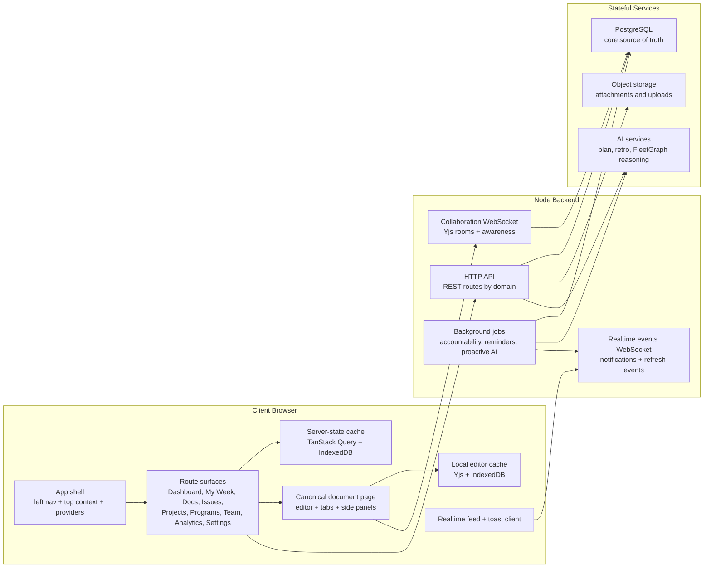
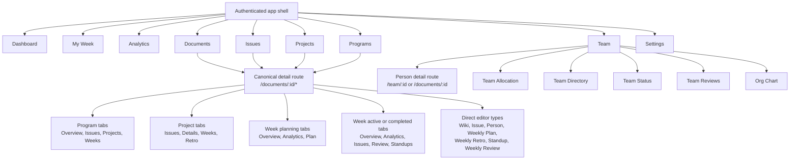
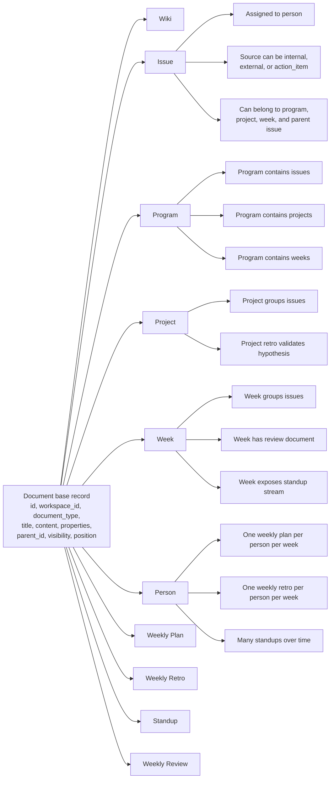
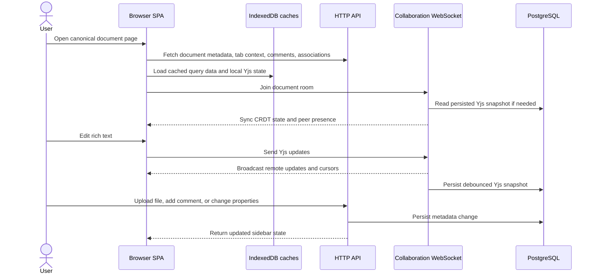
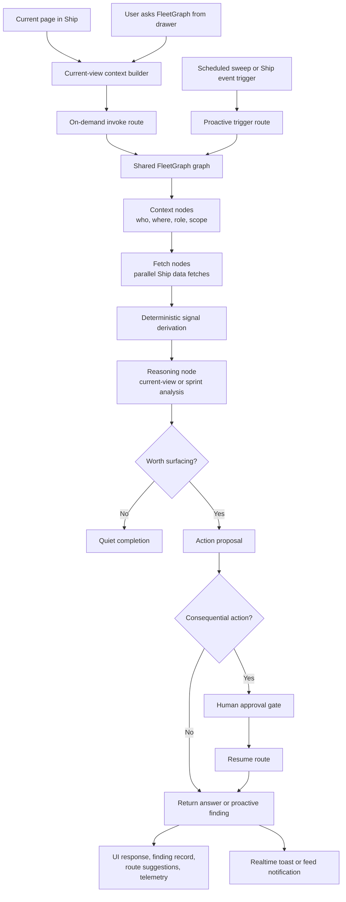
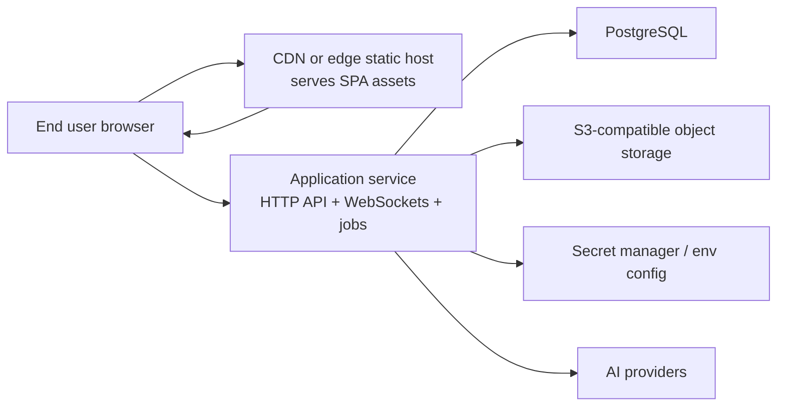
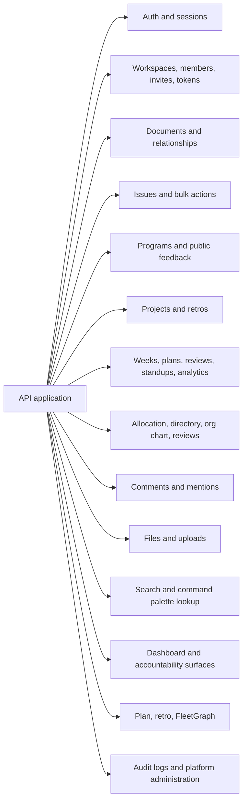

# ShipShape Clone System Architecture Diagrams

## Purpose

This companion document gives the application factory an accurate visual model of ShipShape's architecture.

Use it together with:

- `SHIPSHAPE_CLONE_PRODUCT_VISION.md`
- `SHIPSHAPE_CLONE_PRD.md`
- `SHIPSHAPE_CLONE_TECHNICAL_SPEC.md`

The factory output should not resemble a generic work-queue app. It should resemble a unified execution workspace with canonical document pages, collaborative editing, weekly operating rhythms, accountability workflows, and bounded AI assistance.

## How To Use This Document

1. Use the diagrams here to define the major subsystems before generating screens.
2. Use the user-flow diagrams in `SHIPSHAPE_CLONE_USER_FLOW_DIAGRAMS.md` to derive wireframes and route transitions.
3. Preserve the unified document model. Do not split wiki, issue, project, and week into unrelated page systems.

## Diagram 1: End-To-End Runtime Architecture

**Implementation implications**

- The product is a single-page app, not a collection of unrelated static pages.
- Collaborative editing and general notifications are separate realtime channels.
- The backend is a modular monolith that owns HTTP, collaboration, background work, and AI orchestration.

## Diagram 2: Frontend Information Architecture

**Wireframe implications**

- The navigation shell needs persistent primary navigation and route-aware context.
- Most entity detail views should reuse one document-page frame rather than bespoke pages.
- The document page needs a shared editor area plus type-specific tabs and context sidebars.

## Diagram 3: Unified Document Model And Typed Relationships

**Implementation implications**

- All core content types must share the same storage and editor model.
- Program, project, week, and issue associations are relationships inside one document system.
- Weekly plans, weekly retros, standups, and reviews are first-class documents, not ad hoc text fields.

## Diagram 4: Document Collaboration Lifecycle

**Wireframe implications**

- The document page needs an editor region, presence affordances, and metadata surfaces that can update independently.
- Comments, files, relationships, and properties are not editor plugins alone; they are adjacent document systems.
- The clone should feel realtime and collaborative even before adding advanced AI.

## Diagram 5: FleetGraph And AI Runtime Architecture

**Implementation implications**

- On-demand and proactive modes share one graph architecture.
- AI is contextual and bounded, not a separate chat product.
- Human approval must interrupt consequential actions before execution.

## Diagram 6: Deployment Topology

**Implementation implications**

- The first release can be a single backend service plus PostgreSQL and object storage.
- The collaboration WebSocket and events WebSocket can run inside the same application process initially.
- This is a pragmatic modular monolith, not a microservices-first system.

## Diagram 7: Recommended Backend Module Boundaries

**Implementation implications**

- Keep API boundaries explicit by domain.
- Preserve the distinction between execution workflows, people workflows, and AI workflows.
- Resist collapsing everything into a single generic "tasks" module.
