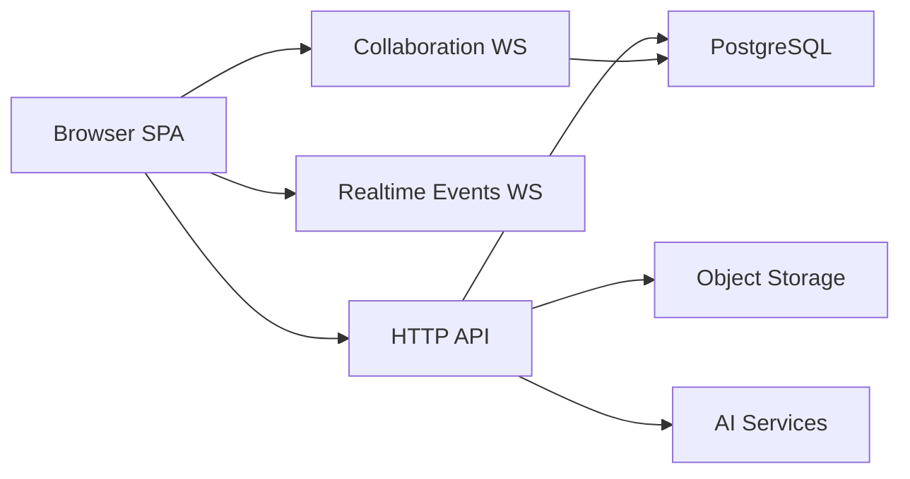

# ShipShape Clone Technical Specification

## Purpose

This document defines the recommended architecture, data model, APIs, realtime systems, infrastructure, and delivery plan for implementing a clone of ShipShape without referencing repository source code.

Companion diagram docs:

- `SHIPSHAPE_CLONE_SYSTEM_ARCHITECTURE_DIAGRAMS.md`
- `SHIPSHAPE_CLONE_USER_FLOW_DIAGRAMS.md`

## Technical Goals

1. Preserve the unified document architecture.
2. Preserve collaborative editing and realtime notifications.
3. Preserve the weekly operating cadence and review workflows.
4. Keep the implementation boring, explicit, and maintainable.
5. Support AI extensions without coupling the whole product to one model vendor.

## Recommended Architecture

### Architecture style

Use a modular monolith with three code packages:

- `web`: frontend SPA
- `api`: backend application and realtime server
- `shared`: shared types, enums, and response contracts

This mirrors the product’s existing architecture and is the lowest-risk way to preserve behavior.

### Recommended stack

| Layer | Recommendation |
| --- | --- |
| Frontend | React with Vite |
| UI | Tailwind plus a lightweight component system |
| Data fetching | TanStack Query |
| Rich text editor | TipTap |
| Realtime collaboration | Yjs plus WebSocket |
| Backend | Node.js plus Express |
| Database | PostgreSQL |
| DB access | Hand-written SQL or a very thin query layer |
| File storage | S3-compatible object storage |
| Caching | IndexedDB for local client persistence |
| Tests | Vitest plus Playwright |

## High-Level System Diagram

## Product Runtime Model

### 1. Frontend SPA

Responsibilities:

- route handling
- authenticated session awareness
- cached server state
- unified document rendering
- collaborative editor shell
- realtime notification consumption

### 2. API server

Responsibilities:

- authentication and authorization
- CRUD for all workspace entities
- relationship and context queries
- approval workflows
- audit logging
- AI orchestration
- presigned upload URLs

### 3. Collaboration server

Responsibilities:

- document-scoped Yjs sync
- awareness and cursor presence
- persistence of Yjs state to the database
- load-from-cache then sync behavior

This can live inside the same Node process initially.

### 4. Realtime events channel

Responsibilities:

- push non-editor events to the browser
- accountability refresh signals
- AI proactive finding notifications

This should be separate from document collaboration rooms.

## Frontend Technical Design

### Routing model

The SPA should use a route structure like:

- `/dashboard`
- `/my-week`
- `/analytics`
- `/docs`
- `/documents/:id/*`
- `/issues`
- `/projects`
- `/programs`
- `/team/allocation`
- `/team/directory`
- `/team/status`
- `/team/reviews`
- `/team/org-chart`
- `/team/:id`
- `/settings`

Legacy or type-specific routes may redirect to `/documents/:id`.

### State management

Use two state layers:

- TanStack Query for server state
- lightweight local store for UI-only state

### Client persistence

Implement two distinct client persistence layers:

1. Query cache persisted to IndexedDB for fast stale-while-revalidate startup.
2. Yjs document state persisted to IndexedDB for fast editor startup and offline-tolerant reads.

### Command palette

The command palette should support:

- navigation to documents
- quick creation actions
- optional document conversion actions based on current context

### Editor requirements

The editor must support:

- headings
- paragraphs
- lists
- task lists
- code blocks with syntax highlighting
- tables
- links
- images
- file attachments
- toggle/details blocks
- document embeds
- slash commands
- mentions
- inline comments

## Backend Technical Design

### Backend application structure

Organize the API by domain:

- auth
- workspaces
- documents
- issues
- projects
- programs
- weeks
- weekly plans
- standups
- team
- comments
- files
- search
- dashboard
- accountability
- AI
- FleetGraph
- admin

### Security middleware

Required baseline:

- secure session cookies
- CSRF protection for session-authenticated state changes
- rate limiting
- helmet or equivalent secure headers
- role-based middleware for admin-only routes

### API style

Use pragmatic REST. Keep response contracts explicit and stable.

### Suggested endpoint families

| Family | Example endpoints |
| --- | --- |
| Auth | `/api/auth/login`, `/api/auth/logout`, `/api/auth/me` |
| Documents | `/api/documents`, `/api/documents/:id`, `/api/documents/:id/convert` |
| Issues | `/api/issues`, `/api/issues/:id`, `/api/issues/bulk` |
| Programs | `/api/programs`, `/api/programs/:id/issues`, `/api/programs/:id/projects` |
| Projects | `/api/projects`, `/api/projects/:id/issues`, `/api/projects/:id/retro` |
| Weeks | `/api/weeks`, `/api/weeks/:id/issues`, `/api/weeks/:id/review`, `/api/weeks/:id/analytics` |
| Team | `/api/team/grid`, `/api/team/people`, `/api/team/reviews` |
| Search | `/api/search/mentions`, `/api/search/learnings` |
| Files | `/api/files/upload`, `/api/files/:id` |
| Comments | `/api/documents/:id/comments`, `/api/comments/:id` |
| AI | `/api/ai/status`, `/api/ai/analyze-plan`, `/api/ai/analyze-retro` |
| FleetGraph | `/api/fleetgraph/on-demand`, `/api/fleetgraph/on-demand/resume`, `/api/fleetgraph/findings` |

## Realtime Technical Design

### Collaboration WebSocket

Room naming convention should be:

- `{documentType}:{documentId}`

Behavior:

1. Load local cached Yjs state first.
2. Connect to the collaboration socket.
3. Sync server state and merge changes.
4. Persist debounced updates back to the database.
5. Broadcast awareness updates to peers in the same room.

### Events WebSocket

Use a second socket endpoint for non-document events.

Supported event classes should include:

- accountability updates
- proactive AI findings
- connection health events

## Data Model

### Design principle

All major content types should share one base `documents` table or collection model.

### Core relational tables

| Table | Purpose |
| --- | --- |
| workspaces | Tenant boundary |
| users | Global identity |
| workspace_memberships | Workspace access and role |
| workspace_invites | Invite lifecycle |
| sessions | Secure server-side session records |
| audit_logs | Security and admin audit trail |
| documents | Unified content table |
| document_associations | Cross-document relationships |
| document_history | Field-level change history |
| document_snapshots | Conversion snapshots |
| comments | Document or inline comments |
| files | Attachment metadata |
| api_tokens | External automation credentials |
| sprint_iterations or week_iterations | Iteration logs for automation work |
| fleetgraph_findings | Persisted proactive AI findings |

### Unified document schema

Recommended base document fields:

| Field | Purpose |
| --- | --- |
| id | UUID |
| workspace_id | Tenant ownership |
| document_type | Variant type |
| title | Shared display title |
| content | Rich text JSON |
| yjs_state | Binary collaborative state |
| parent_id | Tree hierarchy |
| position | Ordering |
| properties | Variant-specific JSON |
| visibility | `workspace` or `private` |
| archived_at | Archive flag |
| deleted_at | Soft delete flag |
| created_at | Audit timestamp |
| updated_at | Audit timestamp |
| created_by | Author |

### Document types

Use these types:

- wiki
- issue
- program
- project
- sprint
- person
- weekly_plan
- weekly_retro
- standup
- weekly_review

Use `sprint` as an internal type only if needed for compatibility. The product language should say `Week`.

### Relationship model

Use:

- `parent_id` for nested document hierarchy
- `document_associations` for program/project/week membership and reverse context queries
- optional backlink records for inline links

### Properties by type

#### Issue properties

- state
- priority
- issue_type
- assignee_id
- estimate_hours
- story_points
- source
- rejection_reason
- due_date
- accountability metadata for auto-generated tasks

#### Program properties

- color
- emoji
- owner_id
- accountable_id
- consulted_ids
- informed_ids

#### Project properties

- impact
- confidence
- ease
- roi
- retention
- acquisition
- growth
- color
- emoji
- owner_id
- accountable_id
- success_criteria
- expected and actual monetary impact
- plan approval state
- retro approval state
- design review fields

#### Week properties

- sprint_number or week_number
- owner_id
- status
- plan
- success_criteria
- confidence
- plan approval state
- review approval state
- review rating

#### Person properties

- email
- role
- work_persona
- capacity_hours
- reports_to

## Core Business Rules

### Weeks

- Workspace defines the shared week cadence start date.
- Week dates are derived from week number, not independently stored as the source of truth.
- A week belongs to a program.
- A week has exactly one owner.

### Projects

- A project belongs to a program.
- A project is a bounded hypothesis, not a permanent bucket.
- A project can be validated or invalidated in retro.

### Issues

- Every issue belongs to a program.
- An issue may also belong to a project.
- An issue may also be associated with a week.
- Issues move through a defined state machine.

### Approvals

- Week plan approval and week review approval are tracked independently.
- Project plan approval and project retro approval are tracked independently.
- If approved content changes later, status becomes changed-since-approved.

## File and attachment subsystem

### Upload flow

Recommended flow:

1. Browser requests an upload slot or presigned URL from the API.
2. Browser uploads directly to object storage.
3. API records attachment metadata.
4. Editor node is updated with the final file URL and metadata.

### Security rules

- block executable and script uploads by default
- validate MIME type and extension
- store uploads outside the app server filesystem in production

## Search subsystem

### V1 recommendation

Use PostgreSQL text search or simple `ILIKE`-based search for:

- mention search
- document title search
- learning document search

This is enough for parity and simpler than introducing a separate search engine initially.

## AI Subsystems

### 1. Plan and retro quality assistant

Design:

- synchronous request-response API
- LLM-backed analysis with rate limits
- no side effects
- advisory output only

Output should include:

- quality score or readiness signal
- per-item feedback
- workload assessment for plans
- coverage and evidence assessment for retros

### 2. FleetGraph-style execution assistant

Implement as a graph or state-machine subsystem.

Required behaviors:

- on-demand invocation from the current page
- proactive background or event-triggered runs
- context initialization from active page and page context
- evidence fetching
- deterministic and model-backed reasoning
- conditional branching
- proposed actions
- human-in-the-loop pause before side effects
- persistent findings for proactive mode

### Telemetry requirements for AI

The system should record:

- run mode
- trigger type
- active surface
- context entity
- status and terminal outcome
- action proposals and approvals
- relevant timing and tool telemetry

## Notifications and accountability pipeline

### Required pipeline

1. System detects accountability or execution condition.
2. Backend persists a finding or action item.
3. Targeted user receives a realtime event.
4. Browser shows toast, modal, or banner as appropriate.
5. Item remains available in a persistent feed or queue.

### Role-aware routing

Support notification targeting for:

- responsible owner
- issue assignee
- accountable reviewer
- manager
- team member

## Deployment Architecture

### Recommended production topology

- SPA hosted on S3-compatible static hosting plus CDN
- API and collaboration server hosted together behind a load balancer
- PostgreSQL as managed database
- object storage for uploads

### AWS reference architecture

If reproducing the current deployment style:

- CloudFront for CDN
- S3 for web assets
- Elastic Beanstalk or container platform for API plus WebSocket server
- Aurora PostgreSQL
- SSM or equivalent secret store

### Scaling notes

- Collaboration rooms are stateful and need sticky sessions or a shared collaboration layer when horizontally scaled.
- Editor websocket traffic and general event websocket traffic should remain logically separate.
- The modular monolith can scale for a long time before service splitting is necessary.

## Security Requirements

The clone must include:

- secure HTTP-only session cookies
- CSRF protection
- rate limiting
- audit logging for sensitive actions
- tenant isolation by workspace
- private vs workspace document visibility
- secure API tokens with hashed storage
- content security policy

## Observability

The clone should emit:

- application logs
- request logs
- audit logs
- AI traces
- websocket connection health
- deployment health checks

Minimum health endpoints:

- `/health`
- AI availability status endpoint

## Testing Strategy

### Unit and integration

Use Vitest for:

- business logic
- route-level integration
- query and helper validation
- AI decision logic where deterministic

### End-to-end

Use Playwright with isolated worker environments:

- one temporary database per worker
- one API instance per worker
- one static preview server per worker

This prevents shared-state flakiness and matches the product’s tested behavior.

### Required E2E coverage

- auth and setup
- document creation and editing
- collaboration basics
- issue lifecycle
- project scoring and retro
- week plan/review/retro workflow
- standups
- allocation and reviews
- notifications
- AI invocation and safe resume flow

## Implementation Order

### Phase 1

- shared types and contracts
- auth and workspace scaffolding
- unified document persistence
- base frontend shell

### Phase 2

- collaborative editor
- documents module
- programs, projects, and issues

### Phase 3

- weeks
- plans
- retros
- standups
- reviews

### Phase 4

- team allocation
- directory
- org chart
- analytics
- attachments
- comments
- search

### Phase 5

- AI quality assistant
- FleetGraph execution assistant
- proactive notifications
- advanced telemetry

## Build Definition Of Done

The clone is technically complete when:

1. The core relational schema and document model are in place.
2. The frontend can navigate every required surface.
3. The editor supports realtime collaboration with persistence.
4. Week, review, and accountability workflows work end to end.
5. Admin, audit, and token features work.
6. AI quality assistant works safely.
7. Context-aware execution assistant works with human approval before mutations.
8. Automated test coverage exists across the main workflows.

## Final Recommendation To The Factory

Do not reframe ShipShape as separate apps for docs, tasks, planning, and performance.

Build it as one product with:

- one base document model
- one canonical detail page pattern
- one collaborative editor
- one weekly operating cadence
- one accountability system

That architectural discipline is what makes the product coherent.
