# ShipShape Clone User Flow Diagrams

## Purpose

This companion document translates the audited product into concrete user flows the factory can turn into route maps, wireframes, and interaction states.

Use it together with:

- `SHIPSHAPE_CLONE_PRODUCT_VISION.md`
- `SHIPSHAPE_CLONE_PRD.md`
- `SHIPSHAPE_CLONE_TECHNICAL_SPEC.md`
- `SHIPSHAPE_CLONE_SYSTEM_ARCHITECTURE_DIAGRAMS.md`

## How To Use This Document

1. Treat each diagram as a required product journey, not a nice-to-have.
2. Use the "Screens implied" notes after each diagram to derive wireframes.
3. Preserve the weekly and accountability rhythms. ShipShape is not just CRUD over tasks.

## Flow 1: First-Time Setup, Login, And Workspace Entry

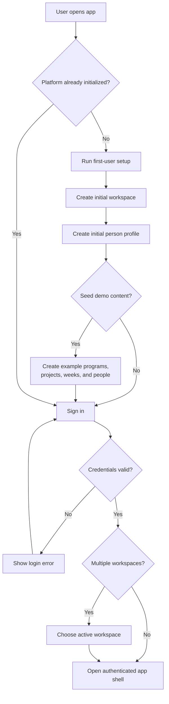

**Screens implied**

- first-user setup screen
- login screen
- optional workspace picker
- post-login dashboard or docs landing screen

## Flow 2: Global Navigation To Canonical Document Pages

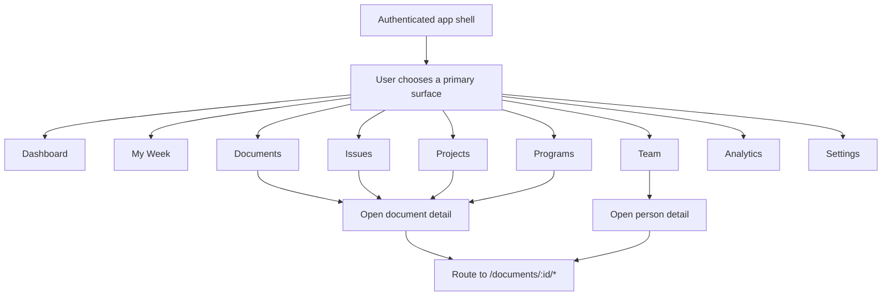

**Screens implied**

- persistent left navigation
- list or board surfaces for each module
- shared canonical document page frame
- route-aware breadcrumb or current-view header

## Flow 3: Create, Edit, And Collaborate On Any Document

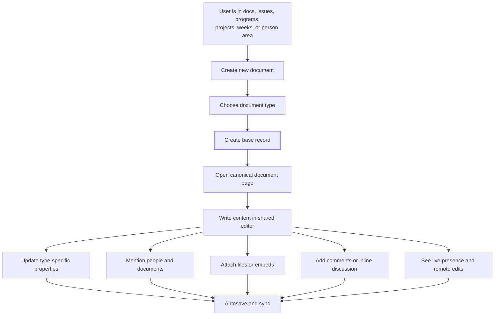

**Screens implied**

- new-document modal or command palette action
- shared editor shell
- property sidebar or metadata panel
- comments rail
- attachment UI
- realtime presence affordances

## Flow 4: Issue Intake, Prioritization, And Promotion

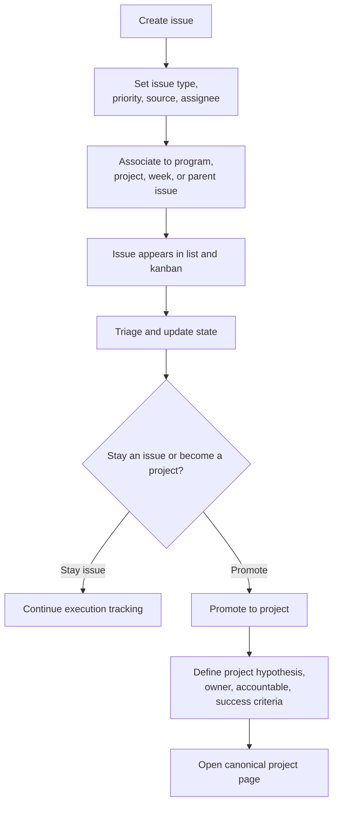

**Screens implied**

- issue create form
- issue list and kanban views
- issue detail page
- promote-to-project action
- project setup screen or sidebar

## Flow 5: Program To Project To Week Execution Chain

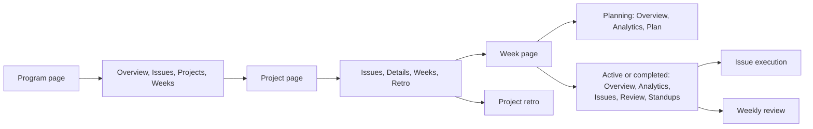

**Screens implied**

- program overview with linked issues, projects, and weeks
- project details with value scoring and success criteria
- week detail with changing tab set by status
- linked issue drill-downs

## Flow 6: Weekly Planning, Execution, Review, And Retro Cadence

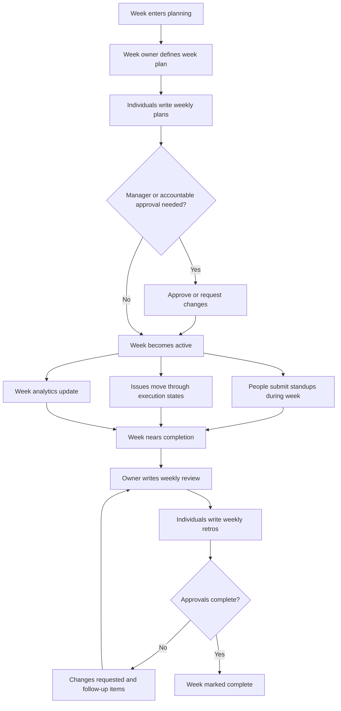

**Screens implied**

- week planning tab
- my-week plan and retro forms
- standup stream
- week analytics tab
- weekly review surface
- changes-requested states and action items

## Flow 7: Manager Review And Accountability Escalation

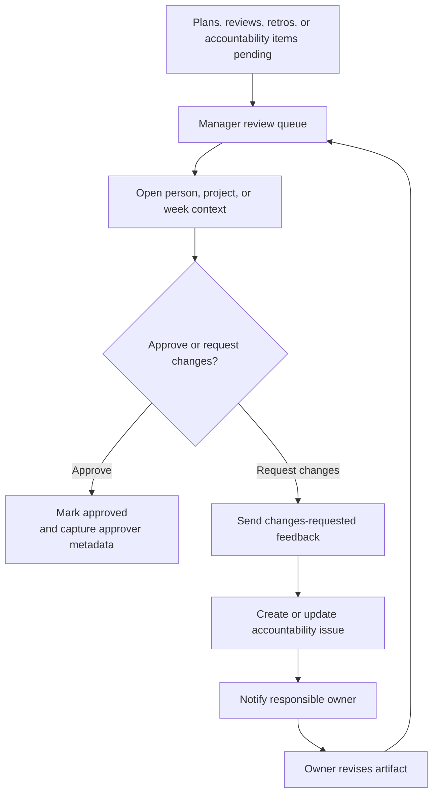

**Screens implied**

- manager review queue
- review detail panel with context
- approve and request-changes controls
- accountability issue surfaces
- notification or toast states

## Flow 8: Team Allocation And People Management

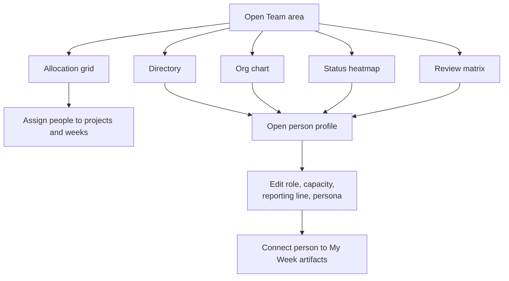

**Screens implied**

- team allocation grid
- people directory table
- reporting-structure view
- person profile editor
- status and review matrix views

## Flow 9: Public Feedback Intake To Internal Work

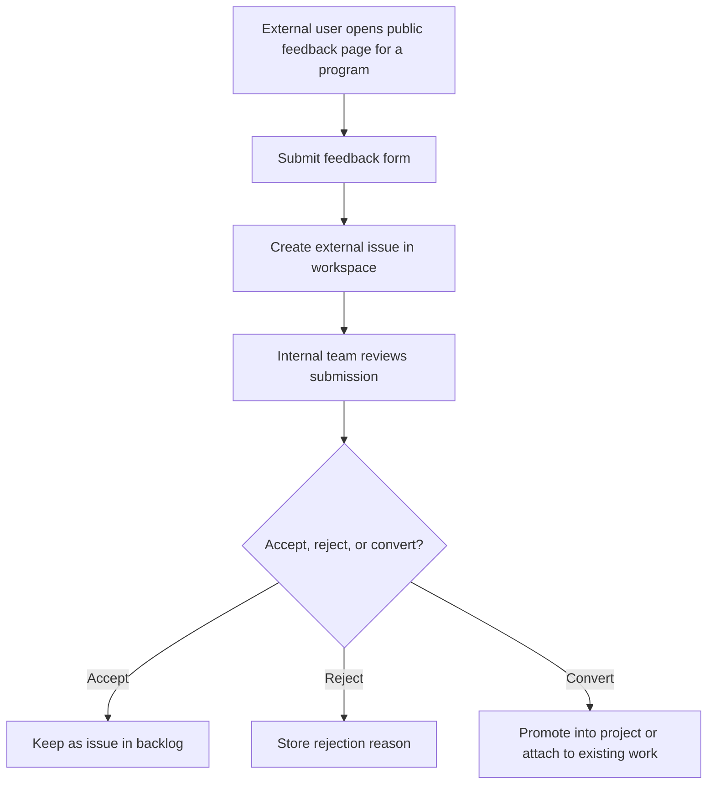

**Screens implied**

- public feedback form
- internal moderation or triage screen
- external-issue badges and provenance
- promote-or-link actions

## Flow 10: FleetGraph On-Demand Assistance

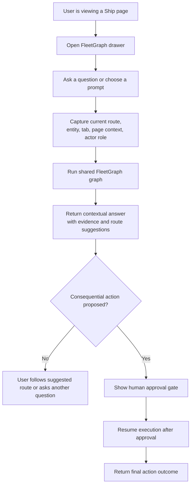

**Screens implied**

- FleetGraph drawer
- starter prompts and freeform question input
- evidence-backed response card
- route buttons
- human-approval UI when required

## Flow 11: FleetGraph Proactive Push Flow

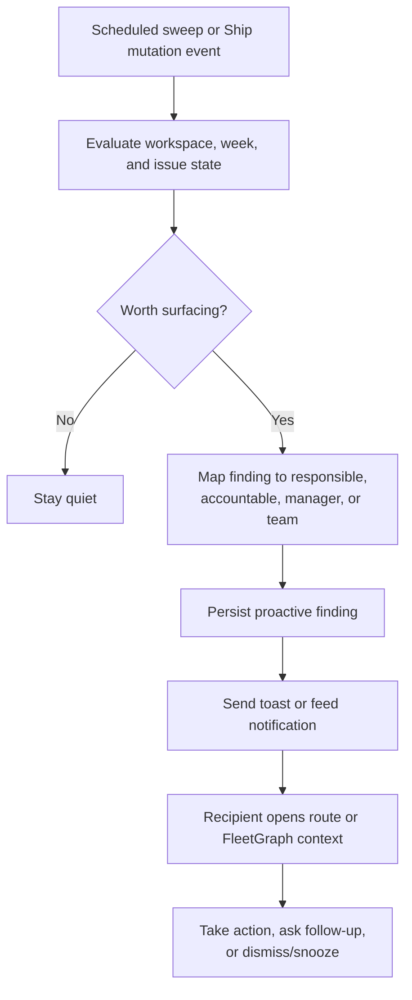

**Screens implied**

- proactive toast
- findings feed or inbox area
- contextual deep-link destination
- dismiss and snooze controls

## Flow 12: Wireframe Priority Order

The factory should wireframe these flows in this order:

1. authenticated app shell and navigation
2. canonical document page
3. documents, issues, programs, projects, and weeks list surfaces
4. week planning and review experience
5. team allocation and review surfaces
6. public feedback intake
7. FleetGraph on-demand drawer
8. proactive findings and notifications
