# API Middleware Chain Explainer

## What “App-Level Middleware Chain” Means

The app-level middleware chain is the set of global Express middlewares that run before a request reaches a specific API route handler.

So the flow is:

1. request enters the Express app
2. global middleware runs
3. route-specific middleware runs
4. the route handler executes

## What Runs Before Every `/api/*` Request

- `helmet`
- `/api` rate limiter
- `cors`
- `express.json()`
- `express.urlencoded()`
- `cookieParser()`
- `express-session`
- production-only CloudFront/proxy normalization

## What These Do

- `helmet` adds security headers
- rate limiting controls request volume
- `cors` controls which origins may call the API
- `express.json()` parses JSON request bodies
- `express.urlencoded()` parses form bodies
- `cookieParser()` reads cookies from the request
- `express-session` loads/manages session state
- proxy normalization fixes forwarded host/protocol behavior in production

## After the App-Level Chain

Many protected routes then run route-level middleware such as:

- `conditionalCsrf`
- `authMiddleware`
- `superAdminMiddleware`
- `workspaceAdminMiddleware`

## Mermaid Diagram

```mermaid
flowchart LR
    A["Incoming /api request"] --> B["App-level middleware chain"]
    B --> B1["helmet"]
    B1 --> B2["rate limiter"]
    B2 --> B3["cors"]
    B3 --> B4["express.json()"]
    B4 --> B5["express.urlencoded()"]
    B5 --> B6["cookieParser()"]
    B6 --> B7["express-session"]
    B7 --> B8["proxy normalization (prod only)"]
    B8 --> C["Route-level middleware"]
    C --> C1["conditionalCsrf / auth / admin checks"]
    C1 --> D["Route handler"]
```

## One-Sentence Mental Model

Every API request first passes through a shared global middleware pipeline, and only after that does it reach route-specific auth/CSRF checks and the final handler.
