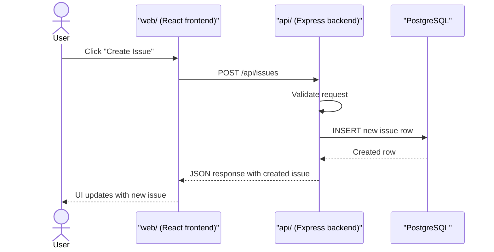

# Create Issue Request Flow

## Plain English

More clearly:

1. User clicks **Create Issue**
2. Frontend sends a **POST** request to the API
3. Backend validates the request
4. Backend inserts a new row in the database, usually into `documents`
5. Backend returns the created issue as JSON
6. Frontend uses that response to update the UI

So:

- frontend requests the creation
- backend performs the creation
- database stores it
- backend returns the result
- frontend re-renders from that returned data

## Mermaid Diagram

## Mental Model

The frontend does **not** write to the database directly.

The frontend asks the backend to create the issue.
The backend is the layer that validates, writes to the database, and returns the result.
