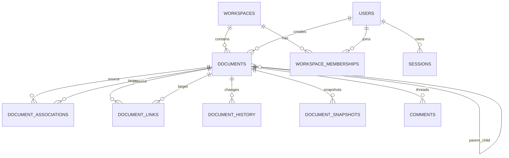
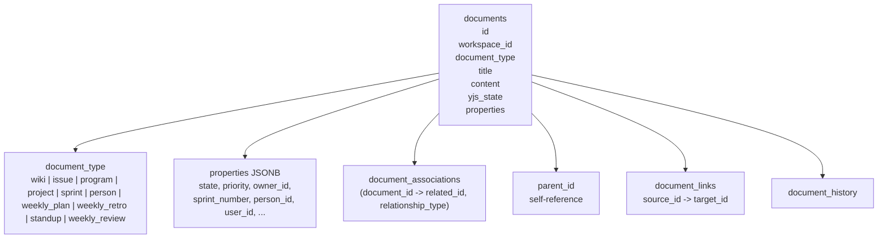

# Ship Data Model

This document describes the repository’s actual database structure and the domain model built on top of it, with emphasis on the unified document system.

## Source Anchors

- Current schema: `api/src/db/schema.sql:1-420`
- Migration runner: `api/src/db/migrate.ts:1-117`
- Seed behavior: `api/src/db/seed.ts:19-220`
- Association migration: `api/src/db/migrations/020_document_associations.sql:1-56`
- Shared TS document model: `shared/src/types/document.ts:1-344`
- Association helpers: `api/src/utils/document-crud.ts:14-455`
- Example issue queries: `api/src/routes/issues.ts:115-233`, `api/src/routes/issues.ts:563-664`

## Conceptual Model



## Core Tables

### `documents`

The `documents` table is the domain center of the application in `api/src/db/schema.sql:105-162`.

Important columns:

- `id`
- `workspace_id`
- `document_type`
- `title`
- `content` JSONB
- `yjs_state` BYTEA
- `parent_id`
- `position`
- `properties` JSONB
- `ticket_number`
- `archived_at`
- `deleted_at`
- issue lifecycle timestamps like `started_at`, `completed_at`, `cancelled_at`, `reopened_at`
- conversion fields like `converted_to_id`, `converted_from_id`, `converted_at`
- `created_at`, `updated_at`, `created_by`
- `visibility`

What this means in practice:

- wiki pages, issues, programs, projects, weeks, people, weekly plans, retros, standups, and weekly reviews all live in the same table
- type-specific fields are pushed into `properties` JSONB instead of separate per-type tables
- collaborative editor state is stored in `yjs_state`, while `content` remains a JSON fallback/REST representation

### `document_associations`

`document_associations` is the main junction table for program/project/week membership and some parent-style relationships in `api/src/db/schema.sql:199-222`.

Important columns:

- `document_id`
- `related_id`
- `relationship_type`
- `metadata`

Relationship types are enum-backed:

- `parent`
- `project`
- `sprint`
- `program`

This table was introduced as a replacement for direct relationship columns in `api/src/db/migrations/020_document_associations.sql:1-56`.

### Other supporting tables

| Table | Purpose |
| --- | --- |
| `workspaces` | tenancy boundary and week start date |
| `users` | global identities |
| `workspace_memberships` | authorization in a workspace |
| `workspace_invites` | invite flow |
| `sessions` | cookie-backed session auth |
| `oauth_state` | OAuth PKCE state |
| `document_history` | audit trail |
| `document_snapshots` | preserved state before conversion |
| `api_tokens` | bearer-token auth for tooling |
| `sprint_iterations` | week iteration logs |
| `issue_iterations` | issue iteration logs |
| `files` | uploaded assets metadata |
| `document_links` | backlinks model |
| `comments` | threaded inline comments |

## Unified Document Model

### `document_type` discriminator

The discriminator is the PostgreSQL enum column `documents.document_type` in `api/src/db/schema.sql:98-109`.

The corresponding TypeScript union is `DocumentType` in `shared/src/types/document.ts:33-44`.

Allowed values:

- `wiki`
- `issue`
- `program`
- `project`
- `sprint`
- `person`
- `weekly_plan`
- `weekly_retro`
- `standup`
- `weekly_review`

### How the discriminator is used

The same physical table is filtered into logical entity types by query conditions like:

```sql
SELECT d.id, d.title, d.properties, d.ticket_number
FROM documents d
WHERE d.workspace_id = $1
  AND d.document_type = 'issue'
```

Source: `api/src/routes/issues.ts:125-146`

The same pattern appears throughout routes like:

- `api/src/routes/issues.ts`
- `api/src/routes/programs.ts`
- `api/src/routes/projects.ts`
- `api/src/routes/weeks.ts`
- `api/src/routes/dashboard.ts`

Why this likely exists:

- it allows shared editor/storage/lifecycle behavior across many entity types
- it makes conversion between some types, especially issue <-> project, easier because both are already documents

Tradeoff:

- type-specific semantics move out of the relational schema and into `document_type`, `properties`, and route logic

## Relationships Between Issues, Projects, Weeks, Docs

Ship uses more than one relationship mechanism.

### 1. `parent_id` for direct hierarchy

`documents.parent_id` is a self-reference in `api/src/db/schema.sql:118-120`.

The schema also includes a trigger to prevent circular parent references in `api/src/db/schema.sql:164-197`.

Best interpretation from the code:

- this is the hard containment tree
- it is mostly used for document nesting

### 2. `document_associations` for membership/organizational links

This is the main mechanism for:

- issue belongs to project
- issue belongs to week
- project belongs to program
- week belongs to program

The backend helper that reads these into response objects is `getBelongsToAssociations()` in `api/src/utils/document-crud.ts:116-134`.

The batch version used to avoid N+1 queries is `getBelongsToAssociationsBatch()` in `api/src/utils/document-crud.ts:148-181`.

### 3. `document_links` for backlinks

`document_links` in `api/src/db/schema.sql:312-319` models explicit source-to-target document links.

This is separate from membership and hierarchy.

### 4. `properties` JSONB for some type-local references

Some document types still carry IDs inside JSONB:

- people use `properties.user_id`
- weekly plans/retros keep `person_id` and a legacy `project_id`
- standups store `author_id`
- weekly reviews store `sprint_id`

This means the relationship model is not purely one-table-plus-one-junction-table.

## `belongs_to` In Code

At the TypeScript level, the association model is exposed as `BelongsTo` in `shared/src/types/document.ts:6-16`.

```ts
export interface BelongsTo {
  id: string;
  type: BelongsToType;
  title?: string;
  color?: string;
}
```

That shape is what the frontend consumes in issue/document UIs and what backend helpers return from `document_associations`.

Examples:

- frontend issue type: `web/src/hooks/useIssuesQuery.ts:25-48`
- association helper accessors: `web/src/hooks/useIssuesQuery.ts:50-90`
- backend association queries: `api/src/utils/document-crud.ts:116-181`

## Example Queries

### Create an issue as a document

```sql
INSERT INTO documents (workspace_id, document_type, title, properties, ticket_number, created_by)
VALUES ($1, 'issue', $2, $3, $4, $5)
RETURNING *
```

Source: `api/src/routes/issues.ts:617-622`

### Attach issue membership links

```sql
INSERT INTO document_associations (document_id, related_id, relationship_type)
VALUES ($1, $2, $3)
ON CONFLICT (document_id, related_id, relationship_type) DO NOTHING
```

Source: `api/src/routes/issues.ts:626-633`

### Read an issue’s `belongs_to` links with display metadata

```sql
SELECT da.related_id as id, da.relationship_type as type,
       d.title, d.properties->>'color' as color
FROM document_associations da
LEFT JOIN documents d ON da.related_id = d.id
WHERE da.document_id = $1
ORDER BY da.relationship_type, da.created_at
```

Source: `api/src/utils/document-crud.ts:119-127`

### Batch association lookup to avoid N+1

```sql
SELECT da.document_id, da.related_id as id, da.relationship_type as type,
       d.title, d.properties->>'color' as color
FROM document_associations da
LEFT JOIN documents d ON da.related_id = d.id
WHERE da.document_id = ANY($1)
ORDER BY da.document_id, da.relationship_type, da.created_at
```

Source: `api/src/utils/document-crud.ts:155-163`

## Unified Model Diagram



## Design Notes And Risks

### Strengths

- the model is consistent around one main entity
- editor/collaboration support can work across many document types
- batch association helpers show awareness of N+1 risk

### Risks

- JSONB-heavy type-specific fields make contracts looser than table-per-entity schemas
- relationship logic is split across `parent_id`, `document_associations`, `document_links`, and some `properties.*_id` fields
- a few frontend query paths still compensate for API gaps, for example project filtering is done client-side in `web/src/hooks/useIssuesQuery.ts:123-143`

## Bottom Line

The mental model to use is:

- **one main table for all domain entities**
- **`document_type` decides what kind of thing a row is**
- **`properties` holds type-specific data**
- **`document_associations` builds most of the working graph**
- **`parent_id` and `document_links` handle other kinds of relationships**
