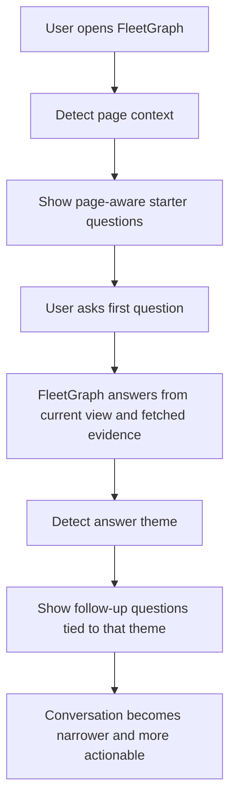

# FleetGraph Conversational Questioning Capability

## What

This capability gives FleetGraph a better question model for chat inside Ship.

Instead of offering generic prompts, FleetGraph should offer:

- page-aware starting questions when a conversation is new
- sharper follow-up questions after the first answer

The goal is to make the assistant sound like a strong product manager or engineering lead working through sprint delivery, blockers, dependencies, scope, capacity, and status.

## Why

The current assistant can answer from page context, but its questions are still too generic.

That creates two problems:

- the first prompt does not always match how real teams talk about delivery risk
- the chat does not narrow naturally as the conversation gets more specific

In real scrum work, PMs and engineers usually ask practical questions like:

- Are we on track?
- What changed after sprint start?
- What is blocked?
- Are we overloaded?
- What should happen next?

FleetGraph needs to meet that standard so the assistant feels useful in the same way Jira, sprint reviews, standups, and project follow-ups are useful.

## How

This capability uses a two-layer question model.

### Layer 1: Fresh conversation

When the drawer first opens, FleetGraph should offer 3 to 5 starter questions based on the page the user is on.

Examples:

- sprint or week page: risk, blockers, scope, capacity
- issue list page: triage, stale work, dependencies, attention
- project page: delivery health, drift, follow-up, recent change
- team page: overload, staffing, ownership, bottlenecks

### Layer 2: Evolving conversation

After the assistant answers, FleetGraph should offer follow-up questions based on the theme of that answer.

Examples:

- if the answer is about risk: ask about scope, blockers, capacity, or what changed
- if the answer is about blockers: ask who is blocked, by what, for how long, and what should escalate
- if the answer is about capacity: ask who is overloaded, whether scope should be cut, and whether this is a trend

Implementation path:

- use page kind and active view to choose first-question chips
- use answer theme to choose follow-up chips
- keep all questions grounded in real page data and fetched Ship data

## Purpose

The purpose of this capability is to make FleetGraph feel like a real work assistant, not a generic summary tool.

It should help users:

- ask better first questions
- move faster from broad context to concrete action
- reason about sprint and project delivery in normal team language
- stay inside Ship instead of mentally translating raw page data into the next question themselves

## Outcome

When this capability is in place:

- FleetGraph will open with better prompts for the page the user is on
- conversations will become more natural and specific after each answer
- PMs and engineers will get more useful guidance about risk, blockers, dependencies, scope, and next steps
- the assistant will feel more aligned with real scrum and Jira-style workflows

Important accuracy note:

This document describes the capability and how it should work. The detailed research behind it lives in [fleetgraph-pm-engineering-question-research.md](/Users/stefanocaruso/Desktop/Gauntlet/ShipShape/artifacts-documentation/fleetgraph-pm-engineering-question-research.md). The full UI behavior is not fully implemented yet.
