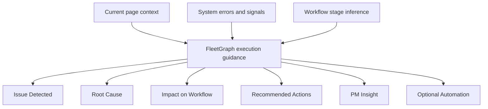

# FleetGraph Execution Guidance Capability

## What

This capability defines how FleetGraph should respond when a user asks for help and the current page includes a failure, blocker, or workflow risk.

The assistant should not just summarize what is on the page.

It should:

- read the current page context
- detect system failures or product signals
- infer the user’s workflow stage
- give a structured response that helps the team move work forward

The response format is:

1. `Issue Detected`
2. `Root Cause`
3. `Impact on Workflow`
4. `Recommended Actions`
5. `PM Insight`
6. `Optional Automation`

This turns FleetGraph from a passive page explainer into an execution-oriented work assistant.

## Why

A plain summary is not enough when the user is blocked.

In a work management system, the important question is usually not:

- "What does this page say?"

It is:

- "What failed?"
- "Why did it fail?"
- "How does that affect the work right now?"
- "What should happen next?"

Without this capability, FleetGraph can surface a raw error like `403`, but still fail to help the PM or engineer decide what to do.

That creates friction in exactly the moments when the assistant should be most valuable:

- weekly plan submission
- sprint execution
- issue triage
- collaboration and approvals
- blocked document actions

## How

FleetGraph should build the answer from three inputs.

### 1. Current Page Context

It should use the current surface to understand:

- which page the user is on
- which project, sprint, person, or document is involved
- what action the user is likely trying to complete

Examples:

- `My Week` means the user is planning or executing weekly work
- `Project Issues` means the user is triaging or managing delivery
- `Weekly Plan` means the user is in planning or submission flow

### 2. System Signals

It should interpret failures and signals such as:

- API status codes
- missing data
- save failures
- permission errors
- stale or partial UI state
- missing associations or missing context

The assistant should translate these into plain English, not repeat raw logs.

### 3. Workflow Stage

It should infer where the user is in the work cycle:

- planning
- execution
- review

This matters because the same error means different things depending on when it happens.

For example:

- a comment-post `403` during planning blocks weekly coordination
- a comment-post `403` during review blocks evidence capture and decision quality

## Purpose

The purpose of this capability is to help teams recover faster when something interrupts execution.

FleetGraph should act like a PM and engineering partner by:

- translating technical failures into work impact
- helping the team choose the next action
- showing whether the problem is local, systemic, or process-related
- surfacing product lessons, not just technical diagnosis

This makes the assistant useful in the exact moment when work is at risk of stopping.

## Outcome

When this capability is working well:

- a blocked user gets a clear explanation of what failed
- the team understands the likely cause quickly
- the workflow impact is tied to the exact page and task in front of them
- immediate, short-term, and long-term actions are clear
- FleetGraph becomes a system-design and execution assistant, not just a chat layer

## Response Contract

FleetGraph should answer in this structure when a failure or execution risk is present.

### 1. Issue Detected

State what failed in plain English.

Good example:

- `FleetGraph could not post a comment to this weekly plan. The system rejected the request instead of saving the follow-up message.`

Not good:

- `POST /api/documents/:id/comments failed with status 403`

### 2. Root Cause

Give the best current inference.

If certainty is low, rank the top likely causes:

- permission mismatch
- stale auth or CSRF/session issue
- workspace role mismatch
- backend route policy mismatch
- page context pointing to a document the user cannot mutate

### 3. Impact on Workflow

Explain the work impact in terms of the current page.

Example for `My Week`:

- `You can still view the weekly plan, but you cannot leave a comment or follow-up on the current document, which blocks coordination and review feedback on this week’s work.`

### 4. Recommended Actions

Split into:

- `Immediate fix`
- `Short-term fix`
- `Long-term fix`

This keeps the response useful for both the user and the product team.

### 5. PM Insight

Explain what the failure reveals about the product.

Examples:

- permissions are too opaque
- write failures are not tied clearly enough to workflow impact
- the UI allows an action that the backend is likely to reject
- collaboration actions need better guardrails before submit

### 6. Optional Automation

Suggest what FleetGraph could do automatically.

Examples:

- retry with fresh CSRF token
- open the target document
- log an engineering bug with page context
- notify the owner or admin
- offer a fallback action such as copying the failed comment locally

## Example Applied To The Screenshot

Page context in the screenshot:

- `My Week`
- `Week 2`
- project context appears to be `API Platform - Core Features`
- user is likely in the `planning` or early `execution` stage
- FleetGraph surfaced a failed comment post with `403`

Better answer shape:

1. `Issue Detected`
   - FleetGraph could not post a comment on the current weekly work item. The request was rejected before the comment could be saved.

2. `Root Cause`
   - Most likely: the current user does not have write permission on the target document or the request is using stale auth/CSRF state.
   - Next most likely: FleetGraph is targeting a related document that is visible in My Week but not writable from this session.

3. `Impact on Workflow`
   - This blocks collaboration on the current weekly plan. You can still review the plan, but you cannot leave the follow-up or coordination note that would move the work forward.

4. `Recommended Actions`
   - Immediate: refresh auth/session state and retry the comment action once.
   - Short-term: verify whether the weekly plan document is writable for this user and whether FleetGraph is posting to the right document.
   - Long-term: prevent the UI from offering comment actions when write permission is likely to fail.

5. `PM Insight`
   - The product currently exposes a collaboration action without clearly proving that the user can complete it. That is a workflow break, not just a backend error.

6. `Optional Automation`
   - Retry once with fresh CSRF/session state, then offer to log the failure or copy the unsent comment draft.

## Where This Connects To The Current Code

Relevant current files:

- [FleetGraphOnDemandPanel.tsx](/Users/stefanocaruso/Desktop/Gauntlet/ShipShape/web/src/components/fleetgraph/FleetGraphOnDemandPanel.tsx)
  - current drawer UI and answer rendering
- [fleetgraph.ts](/Users/stefanocaruso/Desktop/Gauntlet/ShipShape/web/src/lib/fleetgraph.ts)
  - on-demand request plumbing
- [fleetgraph.ts](/Users/stefanocaruso/Desktop/Gauntlet/ShipShape/api/src/routes/fleetgraph.ts)
  - request and response shape for on-demand runs
- [api.ts](/Users/stefanocaruso/Desktop/Gauntlet/ShipShape/web/src/lib/api.ts)
  - current client-side handling for `401`, `403`, CSRF, and non-JSON error responses
- [reason-about-current-view.ts](/Users/stefanocaruso/Desktop/Gauntlet/ShipShape/fleetgraph/src/nodes/reason-about-current-view.ts)
  - current deterministic current-view reasoning path

## Accuracy Note

This document describes the capability FleetGraph should support.

It does not claim that the full structured response contract above is already implemented everywhere in the product today.
