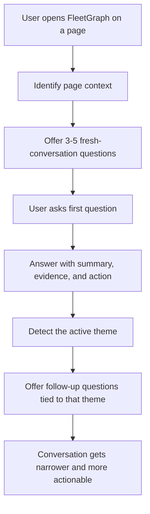

# FleetGraph PM and Engineering Question Research

## Goal

Define the kinds of questions FleetGraph should help a product manager and engineering team ask in a Scrum-style workflow, especially when the team is working from Jira-like views of sprints, issues, dependencies, blockers, status, capacity, and delivery risk.

This is meant to improve:

- the first questions FleetGraph offers in a fresh conversation
- the follow-up questions FleetGraph should suggest as the chat becomes more specific
- the tone of those questions so they sound like a real PM or engineer, not a generic analytics bot

## Research Basis

This question model is based on:

- the [Scrum Guide](https://scrumguides.org/docs/scrumguide/v2020/2020-Scrum-Guide-US.pdf)
- Atlassian’s guidance on [Sprint Planning](https://www.atlassian.com/agile/scrum/sprint-planning)
- Atlassian’s guidance on [Scrum sprints](https://www.atlassian.com/agile/scrum/sprints)
- Atlassian’s guidance on [Sprint reviews](https://www.atlassian.com/agile/scrum/sprint-reviews)
- Atlassian’s guidance on [velocity](https://support.atlassian.com/jira-software-cloud/docs/view-and-understand-the-velocity-chart/)
- Atlassian’s guidance on [agile metrics](https://www.atlassian.com/agile/project-management/metrics)
- Atlassian’s guidance on [burndown charts](https://www.atlassian.com/agile/tutorials/burndown-charts)
- Atlassian’s guidance on [cumulative flow diagrams](https://support.atlassian.com/jira-software-cloud/docs/view-and-understand-the-team-managed-cumulative-flow-diagram/)
- Atlassian’s guidance on [linked work items and blockers](https://support.atlassian.com/jira-software-cloud/docs/link-issues/)

Important note:

The exact question lists below are an inference from those sources plus Ship’s current data model and FleetGraph UI. They are not direct quotes from Atlassian or the Scrum Guide.

## What PMs and Engineers Actually Ask

In a real scrum workflow, teams usually do not ask one giant abstract question like "analyze this sprint."

They ask practical questions like:

- Are we still on track to hit the sprint goal?
- What changed since planning?
- Which issue is actually blocking us?
- Is this a scope problem, a capacity problem, or a dependency problem?
- What should we cut, escalate, or follow up on right now?
- Is this team overloaded, or are we just not finishing work?
- Which unfinished work is still important enough to carry over?

The sources above point to the same pattern:

- Sprint Planning focuses on sprint goal, backlog selection, and capacity.
- Daily Scrum focuses on progress toward the sprint goal and impediments.
- Sprint Review focuses on what was accomplished, what changed, and what to do next.
- Jira reports focus on velocity, scope change, work in progress, bottlenecks, cycle time, and linked work dependencies.

That means FleetGraph should feel less like:

- "Summarize this page."

And more like:

- "What is most likely to slip?"
- "What changed after sprint start?"
- "Which dependency is driving this risk?"
- "Who is overloaded?"
- "What should we do next?"

## Two-Layer Question Model

## Layer 1: Fresh-Conversation Questions

These are the first questions FleetGraph should offer when the drawer opens and the chat is still empty.

### Sprint or Week View

Best when the page is a sprint, weekly plan, weekly retro, or My Week surface tied to a sprint.

- Are we on track to hit the sprint goal?
- What is most at risk this week?
- What changed since this sprint started?
- Which work is blocked or not moving?
- Are we carrying too much for this sprint?

### Project Issue View

Best when the user is on a project issue list or project issue tab.

- Which issues need attention first?
- What is blocking delivery in this project?
- Which issues are stale or stuck?
- What should be triaged, moved, or cut?
- Are there dependency risks in this issue set?

### Project Overview or Details View

- Is this project healthy right now?
- What is the biggest delivery risk in this project?
- What should the PM follow up on next?
- Is this project under-scoped, over-scoped, or drifting?
- What changed recently that matters?

### Program or Portfolio View

- Which project needs attention first?
- Where are the biggest dependency risks?
- Which teams are overloaded?
- Which work is drifting across projects?
- What should leadership know right now?

### My Week or Person View

- What needs my attention today?
- What am I at risk of missing this week?
- What follow-up should I send now?
- Which planned work is not moving?
- What should I finish before I start new work?

### Team or Allocation View

- Who is overloaded right now?
- Which important work has no clear owner?
- Where are the likely bottlenecks on the team?
- Which projects are under-staffed this week?
- Where do we have single points of failure?

### Document or Wiki View

- What matters in this document?
- What decision or follow-up does this document imply?
- What is still unclear or missing here?
- Which related work should I open next?
- Is this document still aligned with the current sprint or project state?

## Layer 2: Follow-Up Questions As The Chat Evolves

These should appear after FleetGraph answers the first question and has a better sense of the user's intent.

### If The Theme Is Sprint Risk

- Is the risk coming from scope, blockers, or capacity?
- Which exact issues are driving the risk?
- What changed after sprint planning?
- What can we cut and still hit the goal?
- Who should be pulled in now?

### If The Theme Is Blockers Or Dependencies

- What is blocked, by whom, and for how long?
- Is this blocked by another team, a missing decision, or missing review?
- Which dependency has the highest impact on delivery?
- What can move forward without waiting?
- Should this be escalated now or watched for another day?

### If The Theme Is Capacity Or Velocity

- Are we overcommitted compared to recent velocity?
- Is this a one-off load spike or a trend?
- Who is carrying too much active work?
- Are we starting too much and finishing too little?
- Should we reduce scope this sprint?

### If The Theme Is Scope Change

- What was added after sprint start?
- Why was this added mid-sprint?
- Which planned work got displaced?
- Is this change worth the delivery risk it adds?
- Should this stay in sprint or move out?

### If The Theme Is Status Or Progress

- What has not moved recently?
- Which "in progress" issues are actually stalled?
- Where are we waiting on review or approval?
- What is done but not reflected clearly?
- What is the next milestone that matters?

### If The Theme Is Review Or Outcome Quality

- What evidence says the sprint goal is actually met?
- Which completed work still lacks proof or review?
- What did we ship versus what we planned?
- What should be called out in the sprint review?
- What should change next sprint?

### If The Theme Is Team Coordination

- Who owns the next action?
- Which handoff is unclear?
- Where do we have hidden cross-team coordination risk?
- Which person needs help or relief?
- Which follow-up conversation should happen today?

## Conversational Style Rules

FleetGraph should sound like a strong PM or engineering lead, not like a dashboard export.

Prefer:

- "What changed since the sprint started?"
- "What is blocked right now?"
- "What should we cut if we need to de-risk this sprint?"
- "Who needs a follow-up today?"
- "Are we overloaded or just not finishing work?"

Avoid:

- "Analyze sprint variance against baseline commitment."
- "Assess throughput degradation across delivery cohorts."
- "Enumerate capacity deltas versus nominal forecast."

Good prompts are:

- short
- concrete
- tied to a real decision
- phrased in normal team language

## What The Response Should Include

For these questions, a useful FleetGraph answer should usually include:

- a one-paragraph direct answer
- named evidence from the page or fetched data
- the top 1-3 drivers of risk or progress
- a clear next move
- 2-4 follow-up questions

Good answer shape:

1. `Summary`
2. `Why`
3. `What needs attention`
4. `Next step`
5. `Suggested follow-up questions`

## Data FleetGraph Needs To Support These Questions

To answer these well, FleetGraph needs more than raw issue counts.

It should have access to:

- sprint goal or sprint plan
- work committed at sprint start
- work added after sprint start
- completed versus incomplete issues
- issue age and last updated time
- issue status mix and WIP concentration
- blocked and linked work
- project and cross-project dependencies
- owner and assignee data
- team allocation and weekly capacity signals
- recent velocity or throughput history
- weekly plans, retros, standups, and review state

Without these inputs, FleetGraph will keep falling back to generic page summaries instead of decision-quality guidance.

## What This Means For FleetGraph UI

The current static prompts in [FleetGraphOnDemandPanel.tsx](/Users/stefanocaruso/Desktop/Gauntlet/ShipShape/web/src/components/fleetgraph/FleetGraphOnDemandPanel.tsx) are a starting point, but they are too generic for a real scrum workflow.

The better model is:

- fresh-conversation prompt chips vary by page kind
- first answer includes 2-4 follow-up chips
- follow-up chips are based on the answer theme, not just the page type

Examples:

- On `Sprint`: offer risk, scope change, blockers, and capacity questions.
- On `Issues`: offer triage, blockers, stale work, and dependency questions.
- On `Team`: offer overload, unowned work, bottleneck, and staffing questions.
- On `My Week`: offer attention, blockers, follow-up, and delivery-confidence questions.

## Where To Wire This In The Code

Current likely touchpoints:

- [FleetGraphOnDemandPanel.tsx](/Users/stefanocaruso/Desktop/Gauntlet/ShipShape/web/src/components/fleetgraph/FleetGraphOnDemandPanel.tsx)
  - replace static quick prompt arrays with context-specific prompt generators
- [useFleetGraphPageContext.ts](/Users/stefanocaruso/Desktop/Gauntlet/ShipShape/web/src/hooks/useFleetGraphPageContext.ts)
  - enrich page snapshots with the facts needed for better prompt selection
- [reason-about-current-view.ts](/Users/stefanocaruso/Desktop/Gauntlet/ShipShape/fleetgraph/src/nodes/reason-about-current-view.ts)
  - improve deterministic summaries and suggested follow-up questions for non-sprint pages
- [claude.ts](/Users/stefanocaruso/Desktop/Gauntlet/ShipShape/api/src/routes/claude.ts)
  - existing standup, review, and retro question generators are a good precedent for context-aware follow-up prompts

## Recommended Next Implementation Step

Implement prompt generation in two passes:

1. `Fresh conversation`
   - Generate 3-5 page-specific opening questions from `pageContext.kind` and `activeView`.

2. `Conversation evolution`
   - After each answer, generate 2-4 follow-up chips from the detected answer theme:
     - risk
     - blockers
     - dependencies
     - scope change
     - capacity
     - review quality

That should happen before deeper reasoning changes, because better questions will immediately make the assistant feel more useful even on pages where the reasoning is still partly deterministic.
