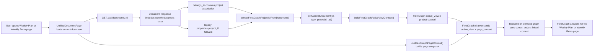

# FleetGraph Weekly Document Context Fix

## What

This fix makes FleetGraph correctly understand `weekly_plan` and `weekly_retro` pages as project-linked work surfaces.

Before this change, FleetGraph could lose the owning project for those pages and show the fallback "unavailable here" state even when the user was on a valid Weekly Plan or Weekly Retro document.

## Why

FleetGraph needs the current page's real scope to answer correctly.

Weekly documents were being mapped back to project scope through `properties.project_id`, but that field is legacy and can be missing on newer documents. The app had already moved toward document associations for source-of-truth relationships, so the AI context path was lagging behind the data model.

## How

The fix has two parts:

1. The document API now returns `belongs_to` associations for `weekly_plan` and `weekly_retro` documents.
2. FleetGraph now derives the weekly document's `projectId` from the real `belongs_to` project association first, then falls back to the legacy `properties.project_id` only if needed.

Key files:

- `api/src/routes/documents.ts`
- `web/src/lib/fleetgraph.ts`
- `web/src/pages/UnifiedDocumentPage.tsx`
- `web/src/lib/fleetgraph.test.ts`
- `api/src/routes/documents.test.ts`

## Purpose

The purpose of this change is to keep FleetGraph aligned with the page the user is actually viewing.

That means:

- the assistant should follow Weekly Plan and Weekly Retro pages
- the assistant should understand which project that page belongs to
- the assistant should use the same relationship model the rest of the app is moving toward

## Outcome

After this fix:

- Weekly Plan and Weekly Retro pages provide stable project context to FleetGraph
- FleetGraph can treat those pages as real work context instead of unsupported fallback surfaces
- the page-to-AI mapping is more reliable because it uses document associations instead of depending only on a legacy field

Validation completed:

- `pnpm --filter @ship/web test -- src/lib/fleetgraph.test.ts`
- `pnpm --filter @ship/web type-check`
- `pnpm --filter @ship/api build`

Additional API regression coverage was added, but local API test execution on this machine is still blocked when PostgreSQL is not running on `127.0.0.1:5432`.
