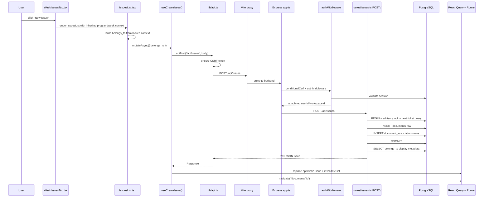

# Ship Request Flow

This document traces one real user flow through the repository: creating a new issue from a week-scoped issues view.

It uses the actual frontend component tree, API client, middleware chain, route handler, SQL writes, and UI update path found in the repository.

## Source Anchors

- Week issues tab: `web/src/components/document-tabs/WeekIssuesTab.tsx:13-55`
- Issues list create flow: `web/src/components/IssuesList.tsx:294-307`, `web/src/components/IssuesList.tsx:585-601`
- Issue mutation hook: `web/src/hooks/useIssuesQuery.ts:148-259`
- HTTP/CSRF client: `web/src/lib/api.ts:1-156`
- Vite proxy: `web/vite.config.ts:28-44`
- App middleware and route mount: `api/src/app.ts:110-245`
- Auth middleware: `api/src/middleware/auth.ts:65-180`
- Issue creation route: `api/src/routes/issues.ts:563-664`
- Association helper for response formatting: `api/src/utils/document-crud.ts:116-134`

## End-To-End Sequence



## Flow Walkthrough

### 1. User action and frontend entry point

The week-specific issues tab renders `IssuesList` with locked week context in `web/src/components/document-tabs/WeekIssuesTab.tsx:18-43`.

Important behavior:

- `lockedSprintId={documentId}`
- `lockedProgramId={programId}`
- `inheritedContext={{ programId, sprintId: documentId }}`

That means the create action does not ask the user for program/week membership later. The context is already known.

### 2. `IssuesList` builds the issue associations

`web/src/components/IssuesList.tsx:294-307` builds a `belongs_to` array from the effective context:

```ts
const buildBelongsTo = useCallback((): BelongsTo[] => {
  const belongs_to: BelongsTo[] = [];
  if (effectiveContext.programId) {
    belongs_to.push({ id: effectiveContext.programId, type: 'program' });
  }
  if (effectiveContext.projectId) {
    belongs_to.push({ id: effectiveContext.projectId, type: 'project' });
  }
  if (effectiveContext.sprintId) {
    belongs_to.push({ id: effectiveContext.sprintId, type: 'sprint' });
  }
  return belongs_to;
}, [effectiveContext]);
```

When the user clicks create, `handleCreateIssue()` calls the mutation and then navigates to the new document in `web/src/components/IssuesList.tsx:585-601`.

### 3. Mutation hook and optimistic UI

`useCreateIssue()` in `web/src/hooks/useIssuesQuery.ts:206-259` performs three things:

1. sends the API request
2. inserts an optimistic placeholder issue into the query cache
3. replaces the optimistic issue with the real server response and invalidates the list

The actual network function is `createIssueApi()` in `web/src/hooks/useIssuesQuery.ts:154-168`.

## API Client And Middleware

### 4. Browser request and CSRF

The frontend sends state-changing requests through `apiPost()` in `web/src/lib/api.ts:146-148`, which delegates to `fetchWithCsrf()` in `web/src/lib/api.ts:78-116`.

That client:

- fetches `/api/csrf-token` if needed
- includes `X-CSRF-Token`
- includes cookies with `credentials: 'include'`

### 5. Dev proxy routing

In local development, Vite proxies `/api` to the API server in `web/vite.config.ts:28-44`.

This matters because frontend code can call `/api/issues` without hard-coding backend ports.

### 6. App-level middleware chain

Before the request reaches the issue route, it passes through `api/src/app.ts`.

For this flow, the important chain is:

1. `helmet`
2. `/api` rate limiter
3. `cors`
4. `express.json` / `express.urlencoded`
5. `cookieParser`
6. `express-session`
7. `conditionalCsrf`
8. mounted `issuesRoutes`
9. `authMiddleware` on the route itself

Relevant mounts:

- app middleware: `api/src/app.ts:110-157`
- route mount: `api/src/app.ts:181-188`

### 7. Authentication

`authMiddleware` in `api/src/middleware/auth.ts:65-180` validates either:

- a Bearer API token
- or the `session_id` cookie against the `sessions` table

On success it attaches:

- `req.userId`
- `req.workspaceId`
- `req.isSuperAdmin`

That context is what the issue creation route uses for multi-workspace writes.

## Route Handler And Database Writes

### 8. Input validation and transaction

The create route is `router.post('/', authMiddleware, ...)` in `api/src/routes/issues.ts:563-664`.

What it does:

1. validates the request body with `createIssueSchema.safeParse`
2. starts a transaction
3. acquires a workspace-scoped advisory lock to serialize ticket number generation
4. computes the next `ticket_number`

The lock and next-ticket query are in `api/src/routes/issues.ts:587-601`.

### 9. Insert into `documents`

The route builds the issue’s JSONB `properties` and inserts one `documents` row in `api/src/routes/issues.ts:603-622`.

Core insert:

```sql
INSERT INTO documents (workspace_id, document_type, title, properties, ticket_number, created_by)
VALUES ($1, 'issue', $2, $3, $4, $5)
RETURNING *
```

This is the core proof that an “issue” is just a document row with `document_type = 'issue'`.

### 10. Insert association rows

The same route loops over the incoming `belongs_to` array and writes `document_associations` rows in `api/src/routes/issues.ts:626-633`.

That is how the new issue becomes attached to its program/project/week context.

### 11. Format response

After commit, the route loads display metadata for the associations via `getBelongsToAssociations()` from `api/src/utils/document-crud.ts:116-134`.

Then it responds with:

- base issue fields
- `display_id`
- `belongs_to`

Response formatting happens in `api/src/routes/issues.ts:655-664`.

## UI Update Path

### 12. React Query replacement and navigation

Back in the client:

- `useCreateIssue()` swaps the optimistic `temp-*` issue with the real response in `web/src/hooks/useIssuesQuery.ts:248-255`
- it invalidates issue lists in `web/src/hooks/useIssuesQuery.ts:256-258`
- `IssuesList` then navigates to `/documents/${issue.id}` in `web/src/components/IssuesList.tsx:589-592`

That lands the user in the unified document page, not a separate issue-only screen. This matches the repo’s “everything is a document” architecture.

## Service Layer Note

This flow does **not** go through a distinct service layer between the route and the database.

What exists instead:

- route-local transaction and SQL in `api/src/routes/issues.ts`
- a small reusable SQL helper for response associations in `api/src/utils/document-crud.ts`

That is an important architectural fact of this repo: most request flows are route-driven and SQL-explicit rather than controller -> service -> repository layered.

## Design Notes And Risks

### Why this flow likely looks this way

- the route owns the transaction because ticket generation and association writes must commit together
- `belongs_to` keeps the frontend and backend aligned on a shared association format
- optimistic cache updates keep the UI feeling immediate

### Risks surfaced by this flow

- the route handler is doing validation, ticket sequencing, inserts, and some post-commit side effects itself, so it is a dense file
- the frontend still compensates for some API limitations; for example, project filtering is client-side in `web/src/hooks/useIssuesQuery.ts:123-143`
- issue creation invalidates the full issues list cache, which is simple but can become noisy under heavy usage

## Mental Model For New Engineers

For this flow, the fastest accurate mental model is:

- user action happens in a context-aware React list
- frontend sends `belongs_to` as the canonical relationship payload
- Express route writes one `documents` row plus several `document_associations` rows
- response comes back as a document-shaped issue object
- the UI updates cache optimistically and routes to the canonical `/documents/:id` page
