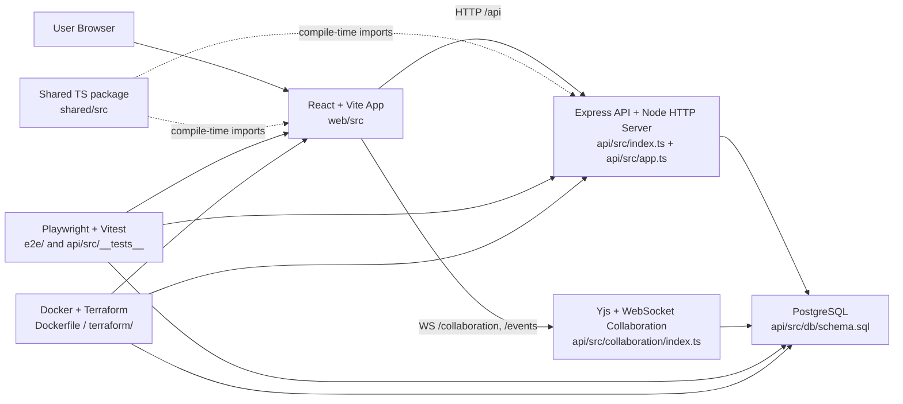
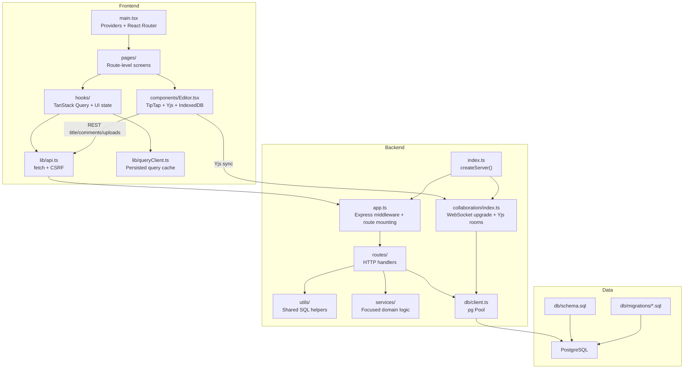

# Ship System Architecture

This document summarizes the Ship codebase as it exists in this repository. It is grounded in the runtime entry points, data access code, infrastructure definitions, and test wiring that are checked into the repo.

## Source Anchors

- Monorepo/workspace wiring: `package.json:1-50`, `pnpm-workspace.yaml:1-4`
- Frontend entry and routing: `web/src/main.tsx:1-220`
- Frontend dev/proxy config: `web/vite.config.ts:1-95`
- Frontend cached data layer: `web/src/lib/queryClient.ts:1-190`
- Backend server entry: `api/src/index.ts:1-48`
- Backend app and middleware: `api/src/app.ts:1-245`
- Database connection: `api/src/db/client.ts:1-43`
- Collaboration server: `api/src/collaboration/index.ts:1-260`, `api/src/collaboration/index.ts:606-760`
- Shared package exports: `shared/src/index.ts:1-3`, `shared/src/types/index.ts:1-6`, `shared/src/constants.ts:1-29`, `shared/src/types/document.ts:1-344`
- Docker: `Dockerfile:1-35`, `docker-compose.yml:1-35`, `docker-compose.local.yml:1-63`
- Terraform: `terraform/elastic-beanstalk.tf:1-260`, `terraform/database.tf:1-90`, `terraform/s3-cloudfront.tf:1-260`, `terraform/waf.tf:1-220`
- Playwright: `playwright.config.ts:1-85`, `e2e/fixtures/isolated-env.ts:1-320`

## High-Level System Diagram

## Component Interaction Diagram

## Major Components

### Frontend Architecture

The frontend is a Vite React application in `web/`.

- `web/src/main.tsx` is the browser entry point. It mounts `BrowserRouter`, TanStack Query, auth/workspace providers, and the protected application layout.
- `web/vite.config.ts` proxies `/api`, `/collaboration`, and `/events` to the backend during local development, which keeps browser code on one origin even though the API is a separate process.
- `web/src/lib/queryClient.ts` persists TanStack Query data into IndexedDB via `idb-keyval`, which gives the app a cached stale-while-revalidate behavior.
- `web/src/components/Editor.tsx` is the heaviest frontend component. It combines TipTap, `y-websocket`, and `y-indexeddb` to load cached collaborative content first and then sync it over WebSockets.

Why this likely exists:

- the provider-heavy `main.tsx` setup suggests the app is optimized around shared client state and route-driven document views
- the Vite proxy keeps development ergonomics simple
- the IndexedDB-backed query cache and editor cache reduce perceived latency and support offline-tolerant reads

Potential risks:

- the editor has multiple state layers at once: React state, IndexedDB cache, Yjs doc state, and server state
- persisted query state can go stale if API contracts drift

### Backend Architecture

The backend is a Node/Express application in `api/`.

- `api/src/index.ts` creates one HTTP server and attaches both the Express app and the WebSocket collaboration server.
- `api/src/app.ts` defines global middleware and mounts route modules under `/api/*`.
- Route handlers in `api/src/routes/` generally execute SQL directly through `pg` rather than going through a large service abstraction.
- Focused service modules exist for narrower concerns like accountability, CAIA, and secrets loading in `api/src/services/`.

Why this likely exists:

- the code favors explicit route-local SQL and a small number of abstractions
- keeping WebSockets on the same HTTP server simplifies deployment and authentication

Potential risks:

- the same Node process handles REST and collaboration traffic
- route-local SQL makes behavior explicit, but it also spreads query logic across many files

### Database Layer

The database layer uses PostgreSQL and the `pg` driver.

- `api/src/db/client.ts` exports a shared `pg.Pool`
- `api/src/db/schema.sql` defines the current full schema
- `api/src/db/migrate.ts` applies `schema.sql`, then numbered migrations from `api/src/db/migrations/`
- `api/src/db/seed.ts` loads demo users, workspaces, documents, and associations

The schema is deliberately centered on a unified `documents` table plus supporting tables like `document_associations`, `document_links`, `document_history`, and `comments`.

Why this likely exists:

- one core table lets the app reuse editor, routing, and association logic across many document types
- `pg` plus hand-written SQL keeps query behavior visible

Potential risks:

- one large multi-purpose table pushes type-specific behavior into JSONB and route conventions
- relationship logic is split across `parent_id`, `document_associations`, and `document_links`

### Real-Time Collaboration

Collaboration is implemented by the editor and backend collaboration server together.

- frontend room setup and local cache: `web/src/components/Editor.tsx:285-503`
- backend WebSocket upgrade and room management: `api/src/collaboration/index.ts:606-760`
- backend Yjs persistence and room loading: `api/src/collaboration/index.ts:111-260`
- separate presence/event channel: `web/src/hooks/useRealtimeEvents.tsx:29-184`

The pattern is:

1. editor creates a `Y.Doc`
2. load cached content from IndexedDB
3. connect to `/collaboration/{roomPrefix}:{documentId}`
4. sync Yjs updates and awareness state
5. persist Yjs state back into `documents.yjs_state` and `documents.content`

Why this likely exists:

- cached-first load improves perceived speed
- Yjs avoids explicit merge conflicts for concurrent rich-text editing
- a second `/events` socket separates global notifications from per-document editing

Potential risks:

- collaboration room state lives in process memory (`docs`, `awareness`, `conns` maps)
- scaling across multiple instances will need sticky routing or a separate shared collaboration tier

### Shared Types Package

The `shared/` package is the compile-time contract layer for both frontend and backend.

- exports: `shared/src/index.ts`, `shared/src/types/index.ts`
- common constants: `shared/src/constants.ts`
- document types and `BelongsTo` model: `shared/src/types/document.ts`

Real imports show both layers using it:

- frontend: `web/src/hooks/useSessionTimeout.ts`, `web/src/hooks/useIssuesQuery.ts`, `web/src/hooks/useProjectsQuery.ts`
- backend: `api/src/middleware/auth.ts`, `api/src/routes/auth.ts`, `api/src/routes/projects.ts`, `api/src/collaboration/index.ts`

Why this likely exists:

- shared enums/constants reduce frontend-backend drift for document types, session policy, and status codes

Potential risks:

- `shared/` is useful but not fully authoritative; some API types are still duplicated locally, for example `web/src/lib/api.ts`

### Infrastructure

The repository contains both local-dev and production infrastructure definitions.

- local DB only: `docker-compose.yml`
- local full stack: `docker-compose.local.yml`
- production API image: `Dockerfile`
- AWS deployment: Terraform in `terraform/`

Production Terraform expects:

- Elastic Beanstalk for the API and collaboration server: `terraform/elastic-beanstalk.tf`
- Aurora PostgreSQL Serverless v2: `terraform/database.tf`
- S3 + CloudFront for the frontend and request routing to the API and WebSocket paths: `terraform/s3-cloudfront.tf`
- WAF at CloudFront: `terraform/waf.tf`

Why this likely exists:

- static frontend and stateful API are deployed separately
- CloudFront centralizes SPA routing and edge protection
- Elastic Beanstalk keeps the Node/WebSocket deployment relatively simple

Potential risks:

- CloudFront plus WebSockets adds operational complexity
- the current EB sizing in code is modest (`t3.small`, min 1 max 4)

### Testing

Testing is split by layer:

- API/unit/integration tests under `api/src/__tests__/` and route-specific `*.test.ts`
- frontend/component tests in `web/src/**/*.test.tsx`
- end-to-end tests in `e2e/`

Playwright is the most opinionated part:

- `playwright.config.ts` uses worker-level isolation
- `e2e/fixtures/isolated-env.ts` provisions a PostgreSQL container, API process, and Vite preview server per worker

Why this likely exists:

- per-worker isolation avoids shared DB-state flakiness
- Vite preview is used instead of Vite dev to reduce memory usage during parallel E2E runs

Potential risks:

- E2E is resource-heavy and depends on Docker
- there is meaningful operational complexity in the custom fixture

## Key Directories And Responsibilities

| Path | Responsibility |
| --- | --- |
| `web/src` | React UI, routes, client-side state, editor, query hooks |
| `api/src` | Express app, route handlers, collaboration server, services, SQL helpers |
| `api/src/db` | Schema, migrations, seed logic, database pool |
| `api/src/routes` | HTTP route handlers, request validation, JSON responses |
| `api/src/collaboration` | WebSocket upgrade handling, Yjs sync, awareness, persistence |
| `shared/src` | Shared TypeScript types, constants, small helpers |
| `e2e` | Playwright suites, fixture layer, global setup |
| `scripts` | Local dev bootstrapping and deployment helpers |
| `terraform` | AWS infrastructure definitions |
| `docs` | Additional architecture and project notes |

## Architecture Summary

Ship is a monorepo with a simple package split but a non-trivial runtime model:

- one frontend package
- one backend package
- one shared types package
- one unified document-centric database model
- one same-process WebSocket collaboration server attached to the API

That combination makes the codebase easier to enter than a microservice system, but it also means a lot of complexity is concentrated in two places:

- the unified `documents` model
- the collaboration/editor stack
