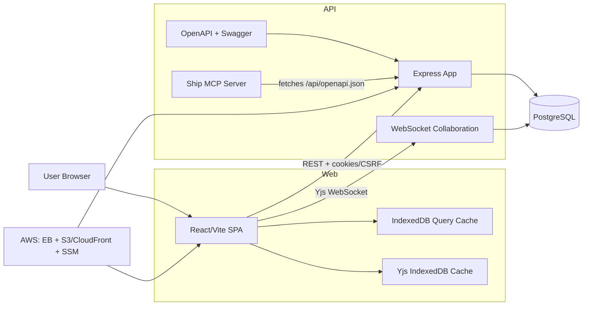
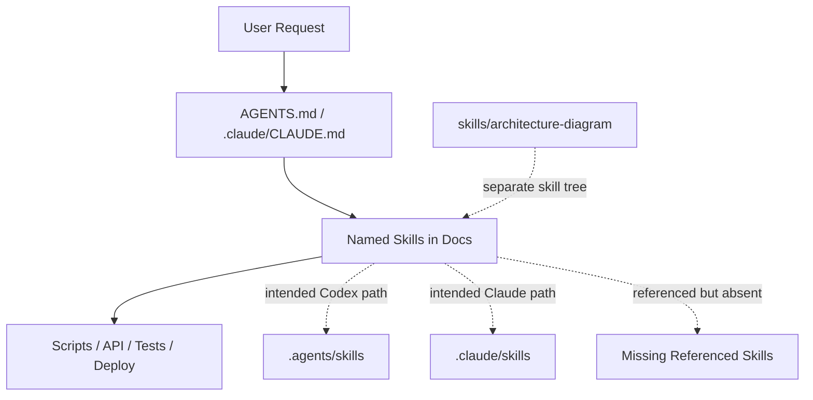
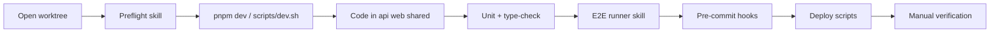

# Repository Architecture Review

## 1. Repo Overview

This is a `pnpm` monorepo centered on one product: Ship. The core runtime is cleanly split into `api`, `web`, and `shared`, with PostgreSQL, Yjs/WebSocket collaboration, OpenAPI generation, and AWS deployment infrastructure around it. The strongest architectural through-line is the unified document model: most product concepts are stored as document variants rather than separate entity systems. Refs: [package.json](../package.json), [pnpm-workspace.yaml](../pnpm-workspace.yaml), [unified-document-model.md](./unified-document-model.md), [schema.sql](../api/src/db/schema.sql), [README.md](../README.md).

What this repo appears to be trying to become: a document-centric work operating system for planning, execution, retrospectives, and accountability, with AI-assisted development workflows layered on top. Refs: [README.md](../README.md), [ship-claude-cli-integration.md](./ship-claude-cli-integration.md), [application-architecture.md](./application-architecture.md).

What is already well structured: the runtime package split, the DB/migration story, OpenAPI-backed API docs, the shared editor/collaboration model, and env-specific deployment scripts. Refs: [app.ts](../api/src/app.ts), [collaboration/index.ts](../api/src/collaboration/index.ts), [openapi/index.ts](../api/src/openapi/index.ts), [Editor.tsx](../web/src/components/Editor.tsx), [deploy.sh](../scripts/deploy.sh).

What is still missing for a strong multi-agent setup: one canonical skill registry, missing required skills, checked-in CI workflow automation, and clear wiring between repo-local skills and the active agent loaders. Refs: [AGENTS.md](../AGENTS.md), [CLAUDE.md](../.claude/CLAUDE.md), [ship-worktree-preflight](../.agents/skills/ship-worktree-preflight/SKILL.md), [claude ship-worktree-preflight](../.claude/skills/ship-worktree-preflight/SKILL.md), [.mcp.json](../.mcp.json).

## 2. Folder-by-Folder Explanation

- `api/`: Express app, REST routes, auth/session middleware, DB schema and migrations, Yjs collaboration server, OpenAPI generation, and a Ship-specific MCP server. Refs: [app.ts](../api/src/app.ts), [schema.sql](../api/src/db/schema.sql), [collaboration/index.ts](../api/src/collaboration/index.ts), [mcp/server.ts](../api/src/mcp/server.ts).
- `web/`: React/Vite SPA with React Router, TanStack Query, IndexedDB persistence, and the shared TipTap/Yjs editor. Refs: [main.tsx](../web/src/main.tsx), [App.tsx](../web/src/pages/App.tsx), [UnifiedDocumentPage.tsx](../web/src/pages/UnifiedDocumentPage.tsx), [queryClient.ts](../web/src/lib/queryClient.ts).
- `shared/`: shared TypeScript contracts and constants used by both runtime packages. Refs: [index.ts](../shared/src/index.ts), [document.ts](../shared/src/types/document.ts), [constants.ts](../shared/src/constants.ts).
- `scripts/`: the real operational workflow layer for dev, worktrees, deployment, API coverage checks, and test guardrails. Refs: [dev.sh](../scripts/dev.sh), [worktree-init.sh](../scripts/worktree-init.sh), [deploy.sh](../scripts/deploy.sh), [deploy-frontend.sh](../scripts/deploy-frontend.sh), [check-api-coverage.sh](../scripts/check-api-coverage.sh).
- `terraform/`: AWS infra definition, split by `dev`, `shadow`, and `prod`, with shared modules and SSM-backed configuration. Refs: [dev/main.tf](../terraform/environments/dev/main.tf), [shadow/main.tf](../terraform/environments/shadow/main.tf), [prod/main.tf](../terraform/environments/prod/main.tf).
- `e2e/`: Playwright suite with isolated per-worker environments and explicit flake-avoidance guidance. Refs: [playwright.config.ts](../playwright.config.ts), [isolated-env.ts](../e2e/fixtures/isolated-env.ts), [e2e/AGENTS.md](../e2e/AGENTS.md).
- `docs/`: primary architecture, philosophy, workflow, onboarding, and Claude integration docs. Refs: [application-architecture.md](./application-architecture.md), [document-model-conventions.md](./document-model-conventions.md), [local-development-setup.md](./local-development-setup.md).
- `.claude/`: Claude-specific repo instructions and local skill copies; this looks like the intended active Claude integration path. Refs: [CLAUDE.md](../.claude/CLAUDE.md), [claude ship-worktree-preflight](../.claude/skills/ship-worktree-preflight/SKILL.md).
- `.agents/`: Codex-oriented local skill folder; structurally improved, but not obviously wired into the rest of the repo. Refs: [AGENTS.md](../AGENTS.md), [ship-worktree-preflight](../.agents/skills/ship-worktree-preflight/SKILL.md).
- `skills/`: a separate generic skill package area; currently contains a well-formed `architecture-diagram` skill, but it is not surfaced in the checked-in AGENTS skill list. Refs: [architecture-diagram/SKILL.md](../skills/architecture-diagram/SKILL.md), [architecture-diagram/evals.json](../skills/architecture-diagram/evals/evals.json).
- `benchmarks/`, `audit-results/`, `stage-2/`, `final-report/`, `artifacts-documentation/`, `artifacts-diagrams/`, `research/`: non-runtime evidence, audit, performance, and onboarding material. These are useful, but they materially increase repo noise. Refs: [stage-2/index.md](../stage-2/index.md), [type-safety.md](../audit-results/type-safety.md), [repo-map.md](../artifacts-documentation/repo-map.md).
- `docs/internal/`: internal notes and snapshot-style documentation that should stay out of the root. Refs: [ship-changelog-72h.md](./internal/ship-changelog-72h.md).

## 3. Runtime Architecture

The runtime is a classic SPA + monolithic API shape, but with two important additions: collaborative editing over Yjs/WebSocket and OpenAPI-driven tool generation. The browser app uses REST for metadata and mutations, IndexedDB for cached queries and Yjs state, and WebSocket rooms for collaborative document editing. The API process mounts all HTTP routes and the collaboration server, and persists both document JSON and Yjs binary state into PostgreSQL. Refs: [api.ts](../web/src/lib/api.ts), [Editor.tsx](../web/src/components/Editor.tsx), [index.ts](../api/src/index.ts), [app.ts](../api/src/app.ts), [collaboration/index.ts](../api/src/collaboration/index.ts), [schema.sql](../api/src/db/schema.sql).

## 4. Agent/Skill Workflow

`.agents/skills` is now structurally closer to correct because the three `SKILL.md` files have YAML frontmatter, but operationally the repo still does not have one coherent skill system. `AGENTS.md` names repo-specific skills, `.claude/CLAUDE.md` mirrors those names for Claude, `.claude/skills` contains duplicate skill bodies without frontmatter, and the repo also has a separate `skills/architecture-diagram` tree. There is no single checked-in registry that clearly says which loader consumes which tree. Refs: [AGENTS.md](../AGENTS.md), [CLAUDE.md](../.claude/CLAUDE.md), [ship-deploy](../.agents/skills/ship-deploy/SKILL.md), [claude ship-deploy](../.claude/skills/ship-deploy/SKILL.md), [architecture-diagram/SKILL.md](../skills/architecture-diagram/SKILL.md).

Skill-by-skill intended role:

- `ship-worktree-preflight`: first step in any worktree session before coding or tests. Refs: [ship-worktree-preflight](../.agents/skills/ship-worktree-preflight/SKILL.md), [AGENTS.md](../AGENTS.md).
- `ship-philosophy-reviewer`: design-review guardrail for schema changes, new components, routes, or editor changes. Refs: [ship-philosophy-reviewer](../.agents/skills/ship-philosophy-reviewer/SKILL.md), [AGENTS.md](../AGENTS.md).
- `ship-deploy`: final coordinated deployment wrapper for API plus frontend, not one side only. Refs: [ship-deploy](../.agents/skills/ship-deploy/SKILL.md), [deploy.sh](../scripts/deploy.sh), [deploy-frontend.sh](../scripts/deploy-frontend.sh).

What is missing for a real multi-agent setup:

- mandatory referenced skills are absent: `/e2e-test-runner`, `/ship-openapi-endpoints`, `/ship-security-compliance`. Refs: [AGENTS.md](../AGENTS.md), [commands.md](./claude-reference/commands.md).
- Claude interview skills are referenced in docs but not present here: `ship-standup`, `ship-review`, `ship-retro`. Refs: [claude-context-api-for-ai-skills.md](./solutions/integration-issues/claude-context-api-for-ai-skills.md), [claude.ts](../api/src/routes/claude.ts).
- Ship MCP exists but is not wired into root MCP config; `.mcp.json` only declares Playwright MCP. Refs: [mcp/server.ts](../api/src/mcp/server.ts), [.mcp.json](../.mcp.json).

Bottom line on `.agents/skills`: structurally better now, but not "used correctly" end to end yet because loader wiring, duplication, and missing companion skills are unresolved.

## 5. Build/Test/Deploy Workflow

The intended developer path is: start in a worktree, run preflight, use `pnpm dev`, work in the `api`/`web`/`shared` packages, run unit tests and type-checks, use a specialized E2E runner skill for Playwright, and deploy via the provided scripts. The workflow is mostly script-driven rather than CI-driven. Refs: [dev.sh](../scripts/dev.sh), [local-development-setup.md](./local-development-setup.md), [api/vitest.config.ts](../api/vitest.config.ts), [web/vitest.config.ts](../web/vitest.config.ts), [playwright.config.ts](../playwright.config.ts), [pre-commit](../.husky/pre-commit).

## 6. Risks and Structural Issues

- Agent configuration is fragmented across four places: [AGENTS.md](../AGENTS.md), [.claude/CLAUDE.md](../.claude/CLAUDE.md), `.agents/skills`, and `.claude/skills`, plus a separate `skills/` tree.
- Required skills are referenced but absent, so the documented workflow cannot be followed literally. Refs: [AGENTS.md](../AGENTS.md), [commands.md](./claude-reference/commands.md).
- The most likely active Claude skill path, `.claude/skills`, still has invalid `SKILL.md` structure, while the newly fixed `.agents/skills` path is not referenced elsewhere. Refs: [claude ship-worktree-preflight](../.claude/skills/ship-worktree-preflight/SKILL.md), [ship-worktree-preflight](../.agents/skills/ship-worktree-preflight/SKILL.md).
- Docs are out of sync with code in several places:
- `AGENTS.md` points to `docs/sprint-documentation-philosophy.md`, but the repo has [week-documentation-philosophy.md](./week-documentation-philosophy.md).
- `AGENTS.md` says legacy `program_id` and `project_id` columns still exist, but [schema.sql](../api/src/db/schema.sql) and [document-model-conventions.md](./document-model-conventions.md) say they were dropped.
- [README.md](../README.md) is outdated versus [local-development-setup.md](./local-development-setup.md) and [dev.sh](../scripts/dev.sh).
- [developer-workflow-guide.md](./developer-workflow-guide.md) says `weekly_plan` and `weekly_retro` are missing, but schema, routes, and shared types already include them.
- The association model is only partially simplified: docs present `parent_id` as canonical containment, but code and schema still use `document_associations` with `relationship_type='parent'` for some issue/sub-issue flows. Refs: [schema.sql](../api/src/db/schema.sql), [issues.ts](../api/src/routes/issues.ts), [document-model-conventions.md](./document-model-conventions.md).
- There is no checked-in `.github/workflows`, despite multiple docs referring to CI and GitHub Actions. Refs: [CONTRIBUTING.md](../CONTRIBUTING.md), [security.md](./claude-reference/security.md).
- The repo tracks a large amount of audit, benchmark, and report material, which muddies the boundary between source-of-truth runtime code and project evidence. Refs: [final-audit.md](../final-report/final-audit.md), [stage-2/index.md](../stage-2/index.md), [PRESEARCH.pdf](../artifacts-documentation/PRESEARCH.pdf).

## 7. Recommended Next Steps

- Choose one canonical agent layout. Best option: keep shared skill source under `skills/`, generate or sync agent-specific views into `.agents/` and `.claude/`, and stop hand-maintaining duplicates.
- Add or remove every referenced skill intentionally. At minimum, implement `e2e-test-runner`, `ship-openapi-endpoints`, and `ship-security-compliance`, or stop telling agents they are required.
- Fix `.claude/skills` the same way `.agents/skills` was fixed, because the docs and Claude integration material point there more often than to `.agents/skills`.
- Add a small checked-in skill registry or manifest so agent loaders can discover repo-local skills deterministically. A per-skill `agents/openai.yaml` layer would help too.
- Reconcile the docs with the code: fix the broken doc path in [AGENTS.md](../AGENTS.md), update README setup, and remove stale references to dropped columns and missing features.
- Wire Ship's own MCP server into the repo's root MCP config or document its setup beside Playwright, so the agent tooling story includes both browser automation and Ship API tooling. Refs: [.mcp.json](../.mcp.json), [mcp/server.ts](../api/src/mcp/server.ts).
- Move heavy audit/evidence material into a dedicated `reports/` or `ops/` namespace, or externalize generated/binary artifacts, so the product repo is easier for both humans and agents to navigate.
