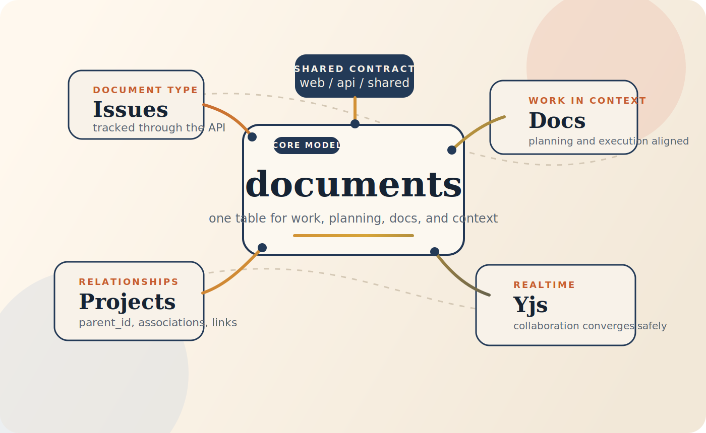

# ShipShape

Stefano Caruso

AI Product Engineer

Understanding the architecture, audit findings, and improvement strategy

---

# Demo Goal

- Explain how I built a mental model of Ship before changing code
- Show the strongest architectural decisions and the biggest risks
- Summarize the audit findings across the codebase
- Propose a practical strategy for improvement

---

# How I Approached The Codebase

- My first goal was not to change code
- My first goal was to understand the system well enough to change it safely
- I traced request flow, data flow, collaboration flow, and package boundaries
- I used that model to frame the audit findings and improvement priorities

<!-- Presenter note: Emphasize that the process was intentional. You are showing engineering judgment, not just observations. -->

---

# System Shape

- ShipShape is a unified-document monolith
- `web/` is the React frontend
- `api/` is the Express and TypeScript backend
- `shared/` is the contract layer used by both sides
- The frontend uses REST for normal app data and WebSocket for realtime collaboration

---

# Why `shared/` Matters

- `shared/` keeps frontend and backend aligned on the same types, enums, constants, and helpers
- It reduces contract drift between API producers and API consumers
- It is one of the cleanest structural decisions in the codebase
- It is useful today, but not yet fully authoritative

---

# Core Data Model

- The most important design choice is the unified document model
- Instead of separate main tables for issues, projects, docs, and sprints, Ship stores them in one `documents` table
- `document_type` identifies what each row represents
- Queries filter that central table down to the subset they need

---

# How Relationships Work

- `parent_id` handles hierarchy
- `document_associations` handles membership such as program or project
- `document_links` handles explicit linking
- This model is flexible, but it also raises the cost of relationship-heavy queries

---

# Example Runtime Flow: Create Issue

- User clicks `Create Issue`
- Frontend sends a `POST` request
- Backend validates the payload
- Backend inserts a row into `documents`
- API returns JSON
- Frontend re-renders from the response

Key point: the frontend never writes directly to the database

---

# Realtime Collaboration Flow

- The editor opens a document-specific WebSocket room
- The backend authenticates the connection using the existing session cookie
- The connection is upgraded and attached to that document room
- Yjs synchronizes concurrent edits across clients
- The server periodically persists Yjs state back into Postgres

---

# Why The Collaboration Model Is Strong

- Yjs gives Ship a serious collaboration capability
- Concurrent edits converge automatically through CRDT merging
- The user experience is stronger when work, docs, and editing stay in one system
- This is one of the clearest differentiators in the architecture

---

# Strongest Architectural Decisions

- Unified document model
- Clear `web` / `api` / `shared` separation
- Yjs-based realtime collaboration

Why these matter:

- They create a coherent full-stack shape
- They support shared context across planning, execution, and documentation
- They give the product a differentiated core

---

# Weakest Architectural Points

- Relationship consistency is too fragile
- Collaborative state has too many sources of truth
- `shared/` helps, but it is not yet the single authoritative contract

Impact:

- More edge cases
- More coordination cost across layers
- Higher risk as the system scales

---

# Audit Snapshot

| Area | Main Finding | Why It Matters |
| --- | --- | --- |
| Type safety | Strict mode is on, but API routes rely heavily on casts | Weakens TypeScript guarantees |
| Frontend performance | Bundle is too large up front | Slower initial load |
| Database | Graph-heavy flows raise query cost | Scalability risk |
| API latency | Baseline is acceptable, but graph-heavy endpoints are the likely bottlenecks | Risk grows with data volume |
| Testing | Coverage exists, but reliability and full-suite completion are weak | Poor safety net |
| Runtime behavior | Recovery and user feedback are not strong enough in failure cases | Hurts trust |
| Accessibility | Serious violations remain despite decent scores | Blocks real usability |

---

# Frontend Performance Finding

- Code splitting exists
- The initial frontend payload is still too large
- The main app chunk is oversized
- Heavy dependencies are still landing in the critical path

Main opportunity:

- Reduce how much the browser has to download up front

---

# Database And API Finding

- The unified document model is workable
- The cost rises in relationship-heavy and graph-heavy flows
- The biggest optimization opportunity is reducing query fan-out
- Relationship access patterns around `documents` need to be tighter and more consistent

---

# Testing, Runtime, And Accessibility

- Testing has meaningful coverage, but not enough reliability to act as a strong safety net
- Runtime quality is not only about errors happening, but about whether users can recover safely
- Accessibility remains a serious gap even if Lighthouse scores look respectable

Current accessibility concerns:

- 5 serious violations
- Partial keyboard completeness
- 28 contrast failures
- Documented ARIA gaps

---

# LLM Layer And Product Positioning

- Ship has an LLM layer, but it is narrow and optional
- Today it mainly supports advisory analysis for plans and retros plus Claude context APIs
- It depends on Bedrock credentials, so it is not a guaranteed core capability

Positioning:

- Jira is stronger today as a mature PM operating system
- Ship is stronger as a unified work-and-context system

---

# Where Ship Can Win

- Ship can outperform Jira if it doubles down on the unified model
- The advantage is not just simplicity
- The advantage is keeping docs, planning, execution, and collaboration close together
- To win there, the integrated experience must become more robust, consistent, and scalable

---

# Strategy Forward

- First, consolidate relationship handling
- Second, strengthen the shared contract layer
- Third, harden realtime behavior and scaling
- Fourth, improve test reliability and accessibility

Why this order:

- It fixes structural consistency first
- Then it improves correctness between layers
- Then it hardens scale and operational quality

---

# Main Conclusion

- Ship has a strong architectural core
- The core idea is credible and differentiated
- The main gap is not vision
- The main gap is consistency and operational maturity

Ship does not need a new architecture first

Ship needs to fully realize the one it already has

---

# Q&A

Questions on architecture, audit findings, or improvement strategy
