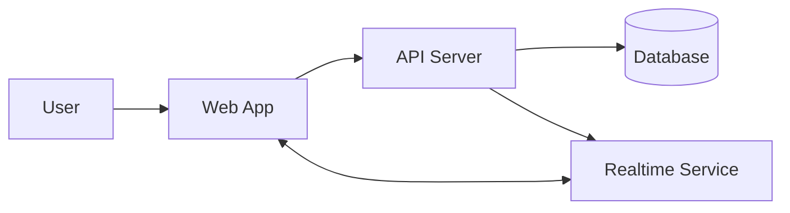
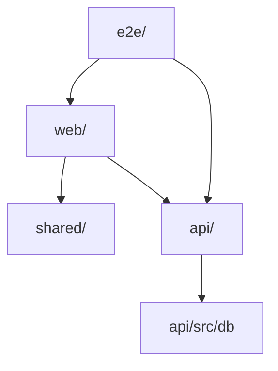
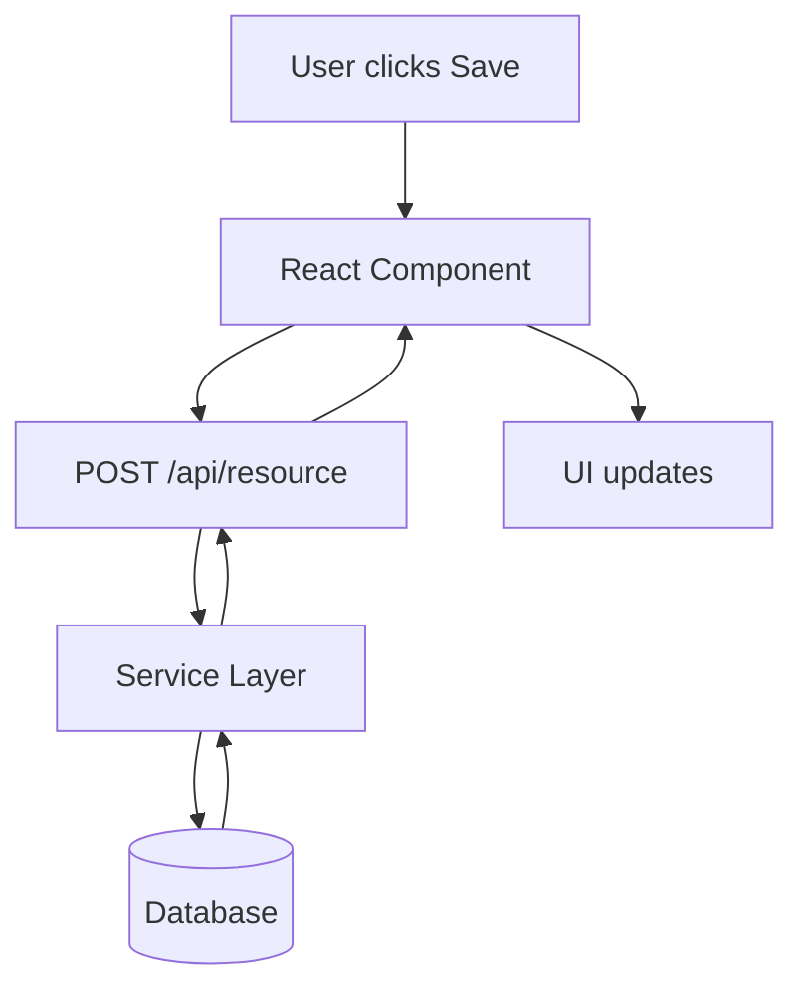
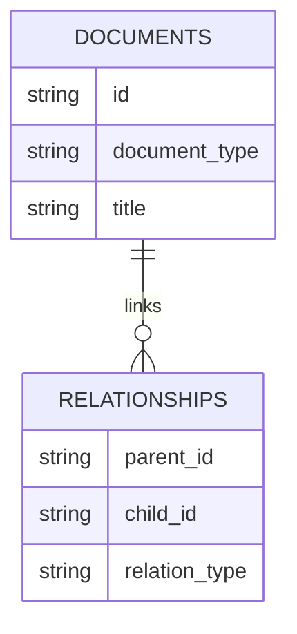
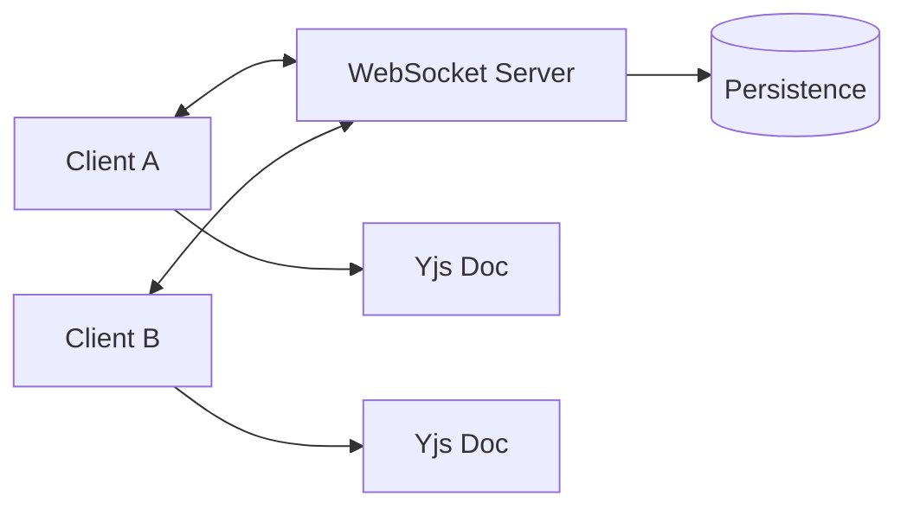

# Mermaid Patterns Reference

## System architecture template

## Package relationship template

## Request flow template

## Data model template

## Realtime flow template

## Style guidance
- Use `flowchart TD` for step-by-step flows.
- Use `flowchart LR` for high-level component maps.
- Use `erDiagram` only when entities and relationships are well supported.
- Keep node labels consistent with repo terminology.
- Prefer 5-12 nodes per diagram.
